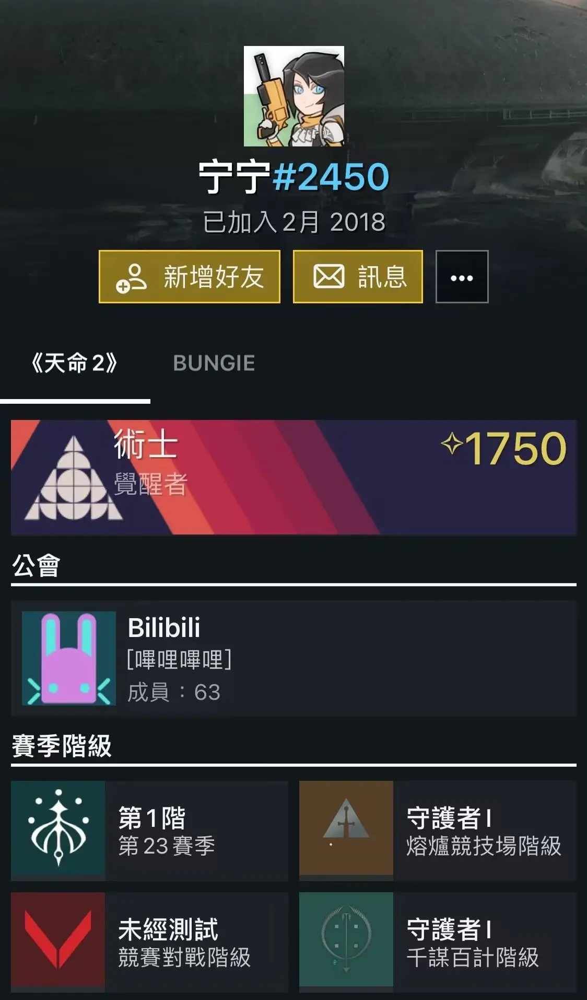
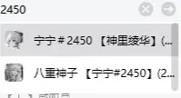
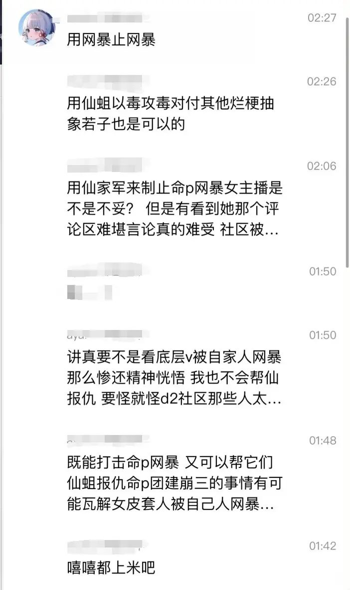
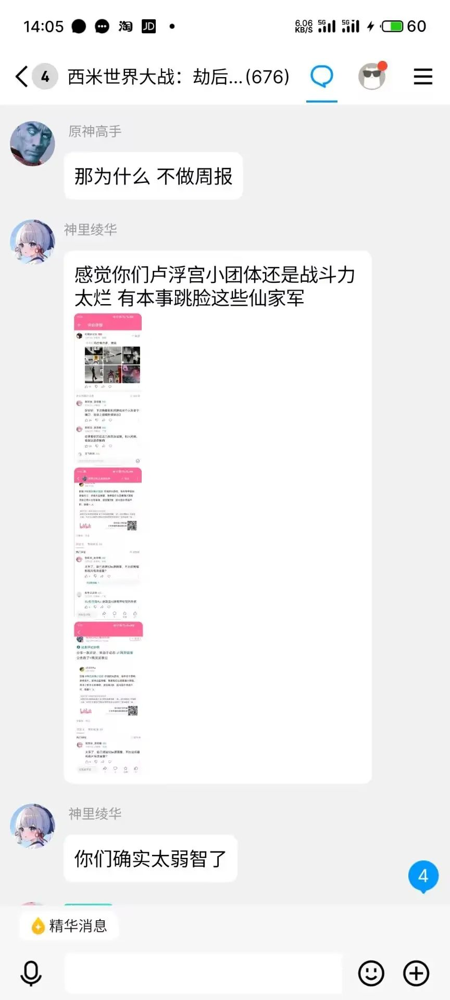
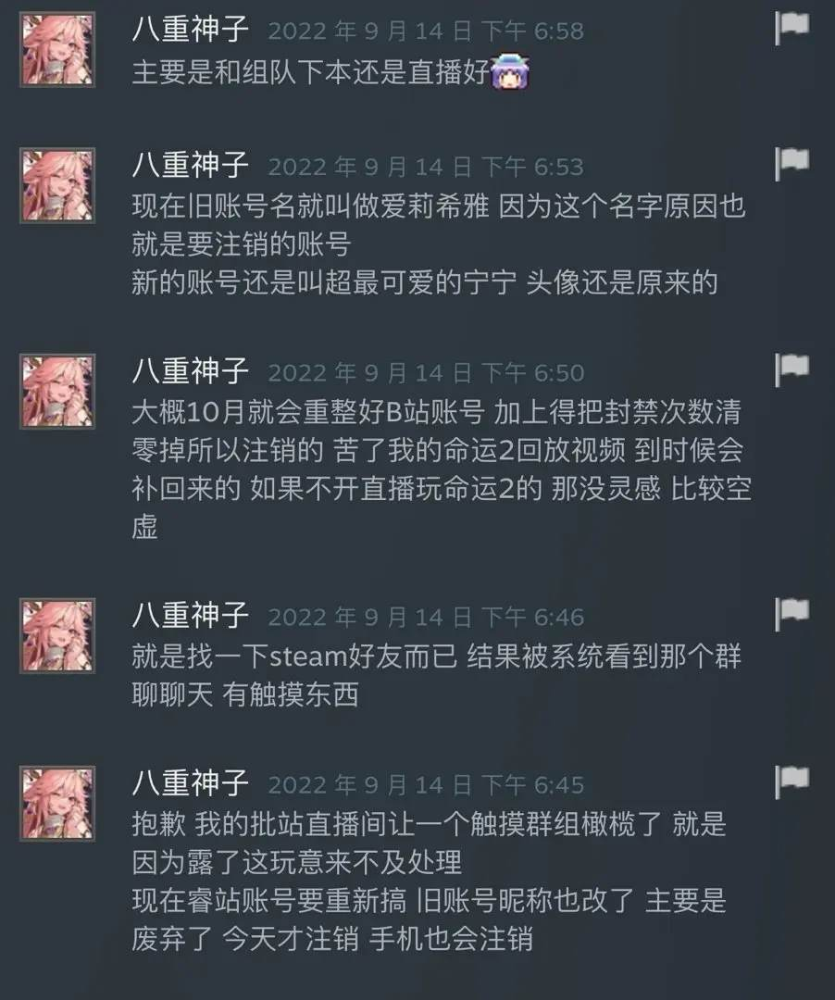

# 仙家军开盒命运2攻略UP

## 概述
仙家军开盒了一位游戏《命运2》(Destiny 2)社区的攻略UP[Sayalarry](https://space.bilibili.com/31485472/)，并在评论区以UP真实姓名称呼。

## 过程
仙家军在评论区直呼其名对其进行网暴。

UP主在哔哩哔哩空间[动态](https://www.bilibili.com/opus/877974981297832004)回应此事，以为是命运2网由对其开盒。经过粉丝朋友的分析，发现其是一群恶俗网暴粉丝仙家军。

该事发生后，这个仙家军迅速锁定了其粉丝和关注列表。但已经被行动迅速的网友留档备案。

## 后续
该UP已经报警。
> 来源:[Sayalarry的个人动态](https://www.bilibili.com/opus/878246809748635657)

## 账号分析1
> 来源: [小黑盒社区](https://api.xiaoheihe.cn/v3/bbs/app/api/web/share?link_id=113952821)
>
> 原标题:《姐姐我很尊敬Sayalarry，但只能迫害一下》

2023年12月22日，B站ID为“丰饶_全自动藿藿Official”的用户，开盒Sayalarry老师，激起社区玩家公愤，对当事人造成了重大影响。

而后为了找出开盒之人，社区玩家开始寻找蛛丝马迹。

首先，该账号主页显示IP：安徽，粉丝列表中，有如下几个账号：

截至目前“丰饶_全自动藿藿Official”已隐私粉丝列表。

然后逐一观察，发现大号与小号1、2处于互关状态，如下图：

并且根据个性签名内容来看，很大概率为同一人所拥有的账号，IP地址均为广东。大号在B站发言后，小号3的IP就从安徽变成了广东（大号显示学校是蚌埠医学院）这一下就更加坐实了同属一人的事实。

紧接着在“超最可爱的柠柠”投稿内容中，找到了此人的棒鸡ID：宁宁#2450

我在昨晚将该内容发在了小黑盒。

在12/23日这天，此人直接也开始跳脸不装了

以及此人的黑盒账号[@八重神子巫女](https://api.xiaoheihe.cn/open_inapp/#heybox://%7B%22protocol_type%22%3A%22openUser%22%2C%22user_id%22%3A%2221696627%22%7D) 也开始后备隐藏能源，此人的Steam留言板充斥逆天翻动言论（看得出你真的喜欢二次元大扔子）

最后再补充一点，此人与最近正处于风口浪尖的B站皮套人“火火心里冒火火”有过互动。

至此，这场开盒网暴事件已经基本水落石出，B站用户“超最爱睡的柠柠”，棒鸡ID：宁宁#2450，就是罪魁祸首。

顺便插一句题外话，称呼Sayalarry老师为病危哥的账户，也可以合理怀疑为此人。
Sayalarry老师年纪比我大一轮，我作为命运2玩家是十分尊敬他的，每周尽职尽责更新周报以及赛季内容。

而此人却公然开盒Sayalarry老师，和你 @八重神子巫女 这种吃里扒外的东西同处一个社区，真让人感到不耻。

## 账号分析2
> 来源: [小黑盒社区](https://api.xiaoheihe.cn/v3/bbs/app/api/web/share?link_id=113939506)
>
> 原标题:《你虽然跑的快》

