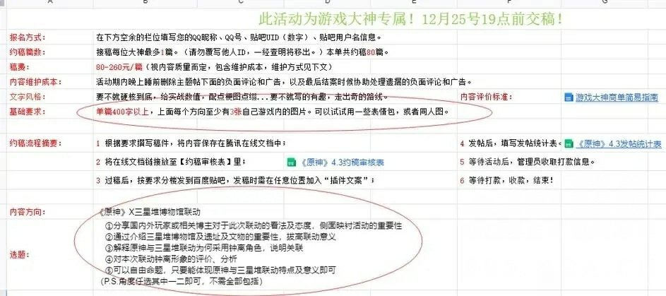
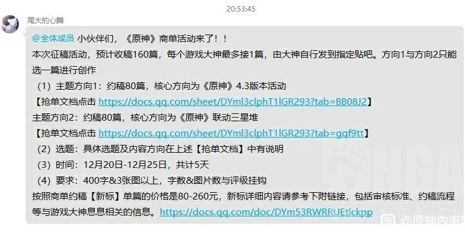
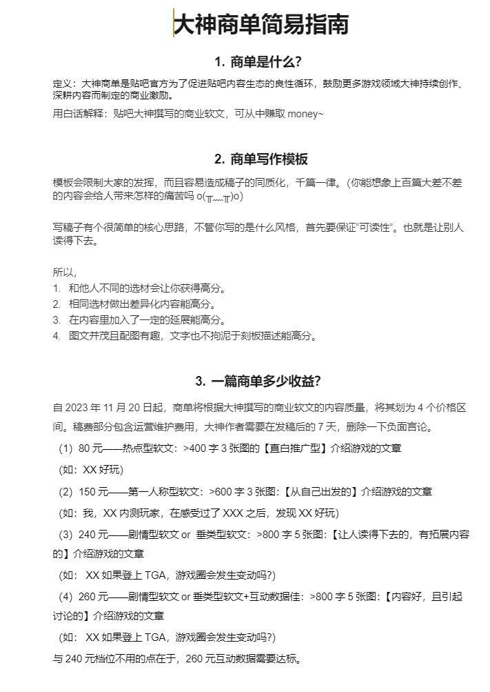

# 三星堆联动贴吧商单
> 来源：[这些商单在哪里可以接的?](https://ngabbs.com/read.php?tid=38758198)

## 概述
原神4.2版本向百度贴吧提交了一份游戏领域大神的帖子商单详情。

## 游戏领域大神
> 来源：[贴吧大神](https://baike.baidu.com/item/%E8%B4%B4%E5%90%A7%E5%A4%A7%E7%A5%9E/19828736)

**贴吧高创作力用户群体**

贴吧大神是贴吧为了激励优质创作者，推出的区分领域的认证身份。成为大神后，能享有专享权益. 对应领域里独有的“神标”. 更多的曝光机会和专享权益。大神会按照领域进行区分，一个创作者只可以成为一个领域的大神。

### 获取条件
获得大神认证有以下两种方式：
1. 接受官方邀请函：符合要求的创作者会收到贴吧APP内弹出的大神邀请函及短信通知，点击按钮接受邀请即可成为大神。
2. 主动申请：登录贴吧APP→点击“我的”→点击创作中心→选择“大神认证”来申请。

### 大神权益
1. 大神标识：贴吧优质创作者大神认证，独有“神”标彰显身
2. 官方推荐：大神发布的优质内容能够得到更多流量分发，收获更多曝光
3. 粉丝召唤：每周可以选取最优质的一条内容进行粉丝召唤
4. 绿色通道：大神的账号申诉信息会优先处理
5. 专属的创作数据展示：数据统计每天中午12：00更新数据，及时了解最新数据；：
6. 大神学院：为不同阶段创作者提供与其创作阶段相符的创作教程及学习指南，分为萌新专区. 进阶专区. 定制专区
7. 贴吧官方定期会举办的各种精彩活动，福利周边大放送
8. 优先体验贴吧的各种产品功能，例如本地视频上传. 在线直播. 商品橱窗等

## 详情

