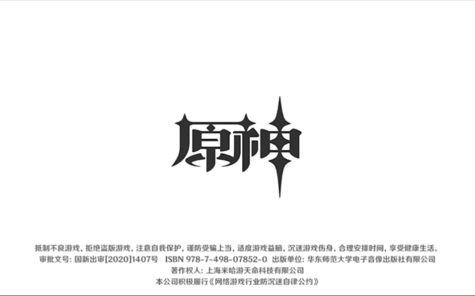

# 原神启动

## 早期版本
**“原神，启动”** 这个梗出自《王者荣耀》主播“国服第一孙策”树叶。

树叶曾与虎牙签下了王者荣耀的直播合同，需要直播王者荣耀足够的时间才可以播其他的。但当时树叶沉迷原神，于是某次树叶终于播满王者荣耀时长后，迫不及待打开原神时，喊出了最初的名言: **“王者，下班。原神，启动！”** 。

## 流行版本
现在流行的 **“原神，启动”** 扬名于视频博主`@门失士`(又称门酱)的短视频[《原神,启动！》](https://www.bilibili.com/video/BV1NP41127r7).

该版本因为短,平,快,易于传播，加上门酱的长相比较"诙谐"，符合部分反原人士的想象，部分米卫兵或者仙家军感觉受到侵犯，在正面和负面的双重加持下，门酱版本的 **“原神，启动”** 传播更加广泛.

在抽象与鬼畜的双重推流下， **“原神，启动”** 的梗逐渐从恶搞门酱本人短视频，走向为 **代号** 性质的话语，在广大视频中成为名台词。

## XX,启动！
在诸多热爱不同手游的玩家中，不少玩家发明更多形式的视频。 **XX启动** 也是常见的形式

+ 例如视频[《见识一下人数到达极限的「启动！」》](https://www.bilibili.com/video/BV1JM4y1H7a2/)，[《我说你们成分也太复杂了！》](https://www.bilibili.com/video/av871183548)，[《你说他启动了吗？启动！》](https://www.bilibili.com/video/av529668961)为例的线下玩家团建，众多手游同时开启的 **XX启动** 录像；

+ 或者带有讽刺意味的[《一战原神，启动！》](https://www.bilibili.com/video/av401525165)，[《塔防原神，启动！！！》](https://www.bilibili.com/video/av784446199)的将XX游戏和原神有共同点的地方剪辑出来，将XX游戏强行宣称为XX界中的原神,例如`APEX原神，一战原神，塔防原神，美国原神，舰娘原神`等。

## 转场原神启动
即哔哩哔哩弹幕网(即B站)出现的一些游戏或者现实中有白色要素的画面，会被放大或者扭曲等各种变换到`整个屏幕`变成白色的时候，在画面出现原神启动界面.
例如：
+ [《原神启动》](https://www.bilibili.com/video/BV1hP411r7Lo/)
+ [《原神，启动！》](https://www.bilibili.com/video/av998901793)
+ [《原神：好好好，你这么转场是吧》](https://www.bilibili.com/video/av358916107)
+ [《艾尔登原神，启动！》](https://www.bilibili.com/video/av744040279)
+ [《总结：好闪》](https://www.bilibili.com/video/BV1nz4y1t7wk/)
+ [《原神，启动！》](https://www.bilibili.com/video/av274102883)

## 小结
其实本质这个梗相对于其他相对恶意的原梗来说恶意较少，更加温和，而且在传播中也达到了比较广泛的效果，编辑希望使用这个梗的时候能够友好使用。