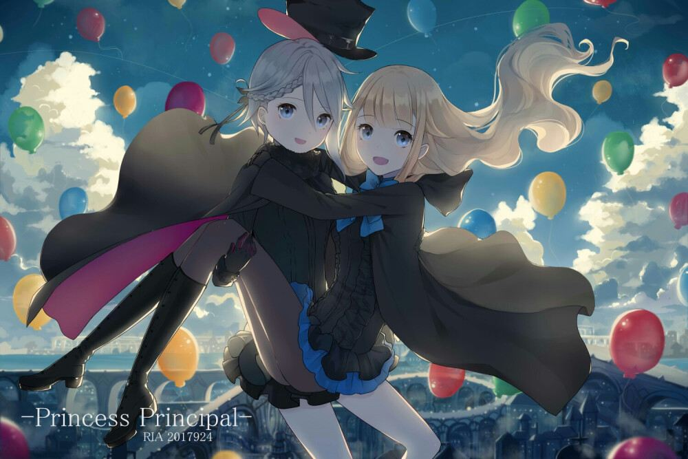
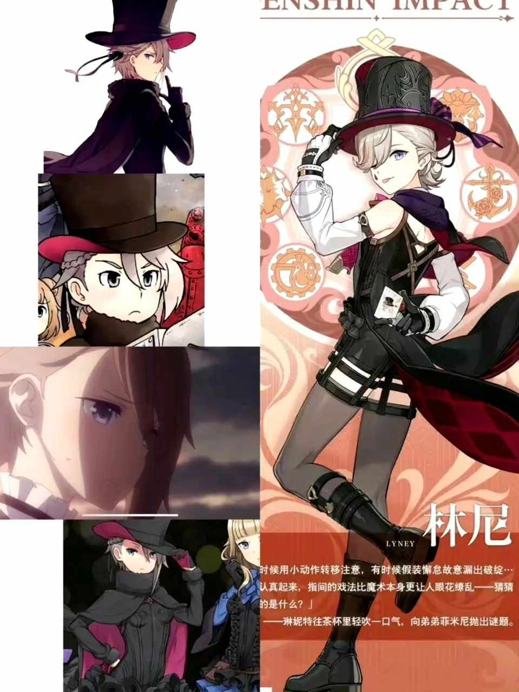
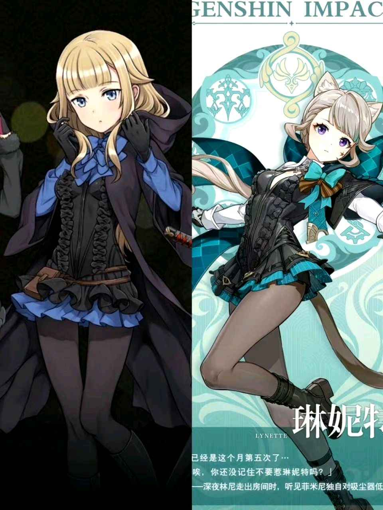

# 原神角色林尼疑似抄袭
## 概述
原神角色林尼与琳妮特形象涉嫌抄袭电视动画《Princess Principal》中的人物.

Princess Principal是由橘正纪指导，大河内一楼系列构成，Studio 3Hz和Actas共同制作的原创电视动画片，于2017年7月9日起每周日在TOKYO MX首播。

林尼与琳妮特是原神4.0版本更新的五星火系角色与四星风系角色。

## 动漫形象

## 相关对比

