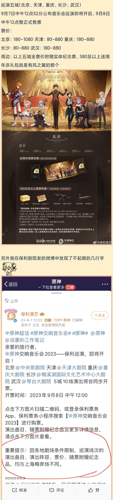
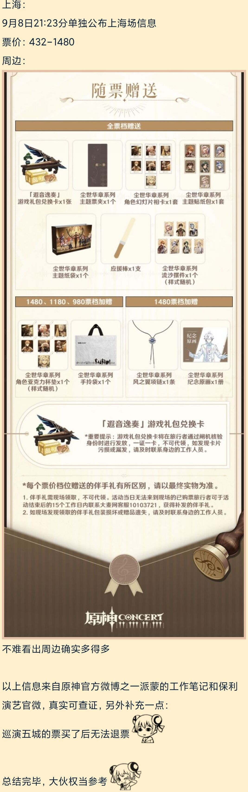
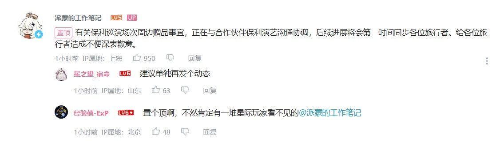
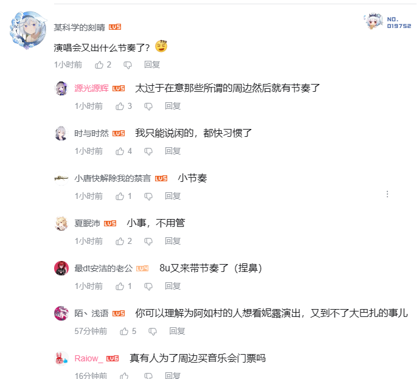
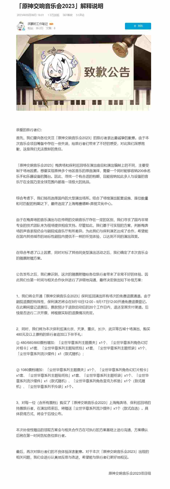

# 原神音乐会差别对待

## 概述
原神2023年音乐会公告中的配置指出，上海400+的票就能领取普通档赠品，随着档次提升还赠送其他周边，其他地方价格为1080的票只有兑换码和一张纸片票根。
同时其他地区的乐团配置，曲目选择相对较差，部分需要地区特色民族乐器演奏的曲子被更换。

官方最初宣布音乐会时各地的乐团配置不清晰，只写了上海的乐团配置，官方所谓的“巡演”，其实各地的乐团配置不一样。上海一个乐团，北京一个乐团，天津和其他地方一个乐团，（根据情报，天津乐团的的指挥似乎研究生还没毕业）。

## 情报整理
::: details

:::

## 官方宣布可能整改（未完整公布）

## 社会回应

## 官方道歉公告
[「原神交响音乐会2023」解释说明](https://www.bilibili.com/read/cv26418941/)
### 最终决定做出如下补偿方案：

1、我们将会开通「原神交响音乐会2023」保利巡回演出所有场次的免费退票通道。由于剧院退票的特殊性，保利演艺将会在9月10日12:00 - 9月17日12:00开通免费退票登记。在此期间登记退票后，票款预计于退款启动后的20个工作日内，退还至原支付渠道。后续是否进行二次开票，将根据实际的退票情况而定。

2、同时，我们将为本次保利巡演北京、天津、重庆、长沙、武汉等五城十场演出，购买480元及以上票档的旅行者追加以下伴手礼：

① 480/680/880票档增加：「尘世华章系列主题票夹」x1个、「尘世华章系列角色幻灯片相卡」x1套、「尘世华章系列主题贴纸包」x1套、「尘世华章系列主题纸袋」x1个、「尘世华章系列流沙摆件」x1（款式随机）；

② 1080票档增加：「尘世华章系列主题票夹」x1个、「尘世华章系列角色幻灯片相卡」x1套、「尘世华章系列主题贴纸包」x1套、「尘世华章系列主题纸袋」x1个、「尘世华章系列流沙摆件」x1（款式随机）、「尘世华章系列角色亚克力杯垫」x1个（款式随机）、「尘世华章系列手拎袋」x1个。

3、对每一位（含所有票档）购买了「原神交响音乐会2023」上海梅奔场、保利巡回场的持票旅行者，在演出结束后，将赠送「尘世华章系列流沙摆件」x1个（款式自选）。具体获得方式，将会于后续公布。

::: details

:::