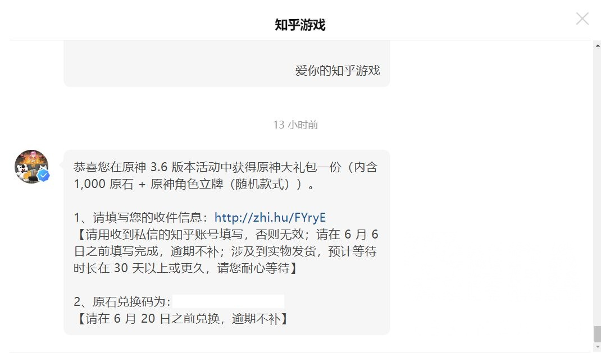
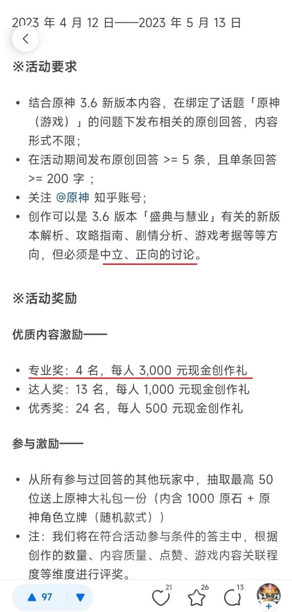
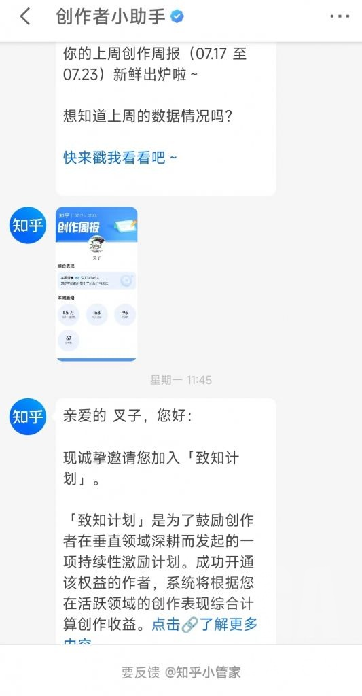

# 地狱叉获得米哈游知乎创作者奖

## 地狱叉介绍
> 文章《1.5万字长文，我为什么会对现在的草王塑造感到愤怒？》作者,《草王宣言》作者，知乎，NGA，虎扑优秀游戏文章作者.米哈游知乎优秀作者,曾荣获知乎原神3.6版本优秀创作奖(专业奖仅限4名).

## 1.5万字长文
### 原标题:1.5万字长文，我为什么会对现在的草王塑造感到愤怒？
[原链接](https://bbs.nga.cn/read.php?tid=36225693)

《我为什么会对现在的草王塑造感到愤怒？》的二次创作、转载完全开放声明

拙作发出之后，受到了不少朋友的支持和好评，其中也有朋友建议在下将这篇文章转化为视频进行输出。以个人的立场而言，我非常想要完成这个任务，把我们对《原神》这段时间的赞美与批评以更加广泛传播的载体传达给更多的人。但由于个人三次元生活的空余时间不足、技术力有限、视频平台的账号未经孵化没有足够的关注度等因素，再三考虑之后，还是放弃了。

所以我在此冒昧发出声明，从即日起，我本人同意任何人对《我为什么会对现在的草王塑造感到愤怒？》一文包括视频化在内的任何二次创作和转载，并放弃一切关于发布这篇文章及其相关创作可能产生的任何收益。希望每一个认同本文、并有意将之传播给更多的人的朋友能够随心所欲地去做，我请求所有有能力、有时间、有平台的朋友们，为我们所共同认同的道理发出声音。
就像我和某位朋友私聊时所说的一样，我写这篇文章，仅仅出于纯粹的热爱和义愤，出于对一个本可以完美无瑕的故事被某些人亲手敲得粉碎的不甘，并不想从中获取任何好处。

我仅代表个人提出以下三点要求：

1、如果可能的话，请尽量保持本文的完整，并附上本文的发布链接(知乎：https://www.zhihu.com/question/599522659/answer/3018204656?或 NGA：https://bbs.nga.cn/read.php?tid=36225693?)，但这一点可以随二次创作者和转载者的需要而放弃；
2、请不要针对现实中的特定对象进行挖掘和攻击，米哈游的内部情况社会大众一无所知，我们不可能、也不必要去寻找负责者，只需要发出自己的声音；
3、请不要在二次创作或转载过程中对纳西妲、流浪者等虚拟角色进一步输出不必要的恶意，如果通读本文，各位朋友应该能发现，作者对这些人物抱有的都是本该更加优秀的艺术品被拙劣匠人无情毁掉的憾恨，行文中对虚拟角色的批判，归根结底是对背后创作者的批判。

如果您拨冗阅读到此处，依然认可笔者的请求，并愿意分享这篇文章，那么我将对您致以最大的感谢。
谢谢。

声明时间：2023年5月10日

——————以下正文——————

这个帖子本来的计划是在泥潭、知乎和虎扑等平台同步发送的，其中潭友们是我最感激的对象，毋庸讳言，在这篇文章的写作过程中，我和泥潭的大家深入交流，反复议论、辩驳，从多个角度锤炼自己的观点和推演过程，把整个评价和批判都在心中系统地酝酿成熟了，最终才在初期写5000字鸽了之后，在知乎用半天时间把整篇文章一气呵成。
不过尴尬的是，当时因为某些原因，我在泥潭处于无法发言、也没法发私信沟通版主的状态，最后就导致了文章是写好发出去了，泥潭却发不了——不过一觉醒来，我发现自己的状态奇迹般恢复正常咧，那就开心地把文章发出来，和大家一起分享吧妮可妮可妮

须弥的剧情是极为讽刺的，它有着完美的开局：3.0的史上最强支线，个人评价如果加成足够音乐资源甚至超越FF14的6.0的森林书，截止3.2的超神主线，和旅行者相互依赖程度最重且最得泛好感的神，截止草王含笑说出“墙壁与藤蔓”为止，这个故事画下完满的句号，那时你翻遍各大社交平台，排除贴吧惯例鱼龙混杂说啥都有之外，清一色的好评大赞，流泪感动。

然后编剧就用短短半年时间，以一个兽娘动物园2级别的逆天大活敲碎了无数的好评，精准爆破了那些被须弥剧情感动、对草神怀有极深感情的玩家。

草王的塑造，目前正处于一个十分之精神分裂的状态下：
编剧似乎想要将她打造成能够提供正向“怜爱”这一感情价值的形象，另一方面又为了自己不为人知的算盘，下意识地将之与“怜爱”这一概念割裂开来。

摩诃善法大吉祥智慧主——纳西妲(以下简称草王)，目前算是整个原神里最具话题度的角色之一，很少有角色能够像她那样，在前几个月受尽万千宠爱，又在几个月后被多方围攻吐槽，甚至连不少厨子都失去了反对的力气，渐渐进入心丧若死的状态。

如果我可以像某些朋友一样，微笑着咽下编剧端上来的答辩，再把一切质疑声浪都打成“内鬼断章取义的节奏”、“友商又找到新黑点了”，那倒或许是幸福的事情，然而非常可惜的是，我做不到，所以我刻意避开了节奏如火如荼的四月初，在长期的思考、积淀和交流之后，决心给自己一个答案：对我来说，草王为什么从过去的受万众宠爱，转而变得让不少人质疑甚至厌憎了？

一、从未有过如此美妙的开局——生日快乐

在3.2版本前就已经入坑的玩家，想必都会对草王的角色PV“生日快乐”印象颇深，“花车颠呀颠，纳西妲睁开眼……”，同一场景简简单单几个轮回，从期待生日到被冷漠对待再到孤独囚禁，已经把草王纯洁、天真、善良又受迫害的形象勾勒出来，以至于玩家们几乎万众一心地高喊“刀在手，跟我走，教令院，杀贤狗”——虽然上线后依然有不少人跑到沙漠里痛打无相之草，试图逼它承认自己就叫阿扎尔。

毋庸讳言，纳西妲在大众群体中的好感与话题度是爆炸性的，作为参考，PV“生日快乐”虽然晚了整整两年上线，但在B站上的播放量已经压过了原神著名的出圈角色可莉的PV“太阳逃跑的夜晚”，位列第十一，它和位列第十五的纳西妲角色演示“无忧无垠”也是须弥时代唯二能无视时间劣势强行杀入前20的，而播放量在这之上的角色相关视频只有钟离、雷电将军、可莉、魈的角色演示，以及绫华和胡桃角色PV，其中最晚的一个也比“生日快乐”的上线时间早了整整半年。

那么，纳西妲在角色设计与塑造上有何特别之处，能够获取如此之大的人气呢？外型和神的身份只是一个方面，事实上在须弥版本上线以前，纳西妲的话题度和泛人气长期处于一个和当时还没有任何情报的妮露不分上下的状态，她能够在3.2引爆如此之高的玩家热情，和3.0及3.1的剧情密切相关。
——纳西妲提供的是一种和七七近似，但在塑造上更为凸显的感情价值：“受怜爱”的感情价值。

不知读者是否记得，纳西妲的第一次出场其实是在2.8限时的海岛活动，那时候她对自己的描述是什么？是一只小鸟。

别担心，我不会伤害你。倒不如说，我只是一只偶尔飞经这片海域的小鸟，正从遥远的地方望着你。
只是偶然，这里竟然有与我相关的力量。我感到好奇，便降落在海滩上，悄悄窥视岛上的一切。
我不能出远门，很羡慕你们这些自由自在的人，所以，也帮着做了一些小设计，希望你们喜欢。
我说了，我没有目的，只是一只小鸟罢了。留在这里，是为了欣赏你们的喜怒哀乐。

女孩的音色，小鸟的自比，以及“不能出远门”、“羡慕自由”的性质，本身就为这个当时还没有形象的角色构建出了一种“笼中鸟”的气质，而小鸟的特点是什么？是受人怜爱。
褚遂良鲠亮，有学术，竭诚亲於朕，若飞鸟依人，自加怜爱。
——《新唐书 长孙无忌传》

小鸟不是猫，猫除了可爱以外，还多了一种神秘、桀骜和不驯服的气质；也不是狗，狗是忠诚、勇敢、有冲劲，同时脑子不太好使；而小鸟的特点呢？是玲珑、可爱、机灵、无害，对人有着强烈的依赖。
小鸟对人的依赖，就如孩子对父母的依赖一样，这种依赖本身虽然是“索取”，但同时也为人提供了正向的情感反馈，令人感到自己是“被需要”的，从而达到心理上的满足。这种满足在马斯洛的需求层次中可以分类为“受尊重的需要(Esteem needs)”，在心理学上，受尊重需要被满足后能为人提供的快乐层次，甚至高于对爱的需要(Love need)。

那么问题来了，编剧是否有意识地认识到小鸟这个形象概念的优势，并在剧情中深化了纳西妲的这一特点呢？有的，3.0剧情《千朵玫瑰带来的黎明》中，热度最高且最出圈的固然是“痛痛快快上个厕所”(事实上这种对比喻的不当使用本身也极具儿童特征，尽管对于纳西妲来说这本不应该存在)，但大家可能对这段话还有印象：

当然，至少最近这段时间里，你们就是我的全部嘛。
呵呵呵…我的意思是，虽然是我在拜托你们两个破解谜团，但反过来，也只有你们两个才能看到我、感受到我。
换言之，如果不是有你们两个在的话，我就和'不存在'是没有区别的。所以你们就是我的全部，懂了吗？

“你们就是我的全部”，“如果没有你们，我就等于不存在”，纳西妲的这段话已然把自己放在了弱势地位，对旅行者=屏幕外的玩家表达出了极端的信任和依赖之情，如果对于小鸟来说，基本相当于把头靠在你的手上磨蹭，甚至直接在你手中睡着了，这会给人带来何种情感反馈呢？同样的事情在冯骥才先生的笔下描述过：
有一天，我伏案写作时，它居然落到我的肩上。我手中的笔不觉停了，生怕惊跑它。呆一会儿，扭头看，这小家伙竟趴在我的肩头睡着了，银灰色的眼睑盖住眸子，小红脚刚好给胸脯上长长的绒毛盖住。我轻轻抬一抬肩，它没醒，睡得好熟！还咂咂嘴，难道在做梦？
我笔尖一动，流泻下一时的感受：
信赖，往往创造出美好的境界。

而另一方面，纳西妲在设计上采取了最无害的白色调，并将外型刻画为极为接近幼儿园小朋友的“小女孩”，更进一步强化了这种好感。人类在内的绝大多数动物在先天上有着对同类幼崽的怜惜、疼爱和保护的本能，这是由我们的基因所决定的，而且这种好感比性欲更加通行无阻——读者可以扪心自问，我们在对性欲对象的爱好上，往往受高矮胖瘦、肤色深浅、长发短发，甚至光脚、丝袜、眼镜等各种因素的影响，但对于一个孩子，不管ta是男孩女孩，高点矮点胖点瘦点，是不是先天就会感到怜惜？
孩子的外表越是接近婴儿，这种本能性的怜爱就越是强大，这种疼爱幼崽、并在保护和照顾幼崽时得到心理满足的本能确保了大多数哺乳动物能够持之以恒地照料自己的幼崽，否则很少有人会愿意去照顾一只语言不通、经常哭闹、需要你伺候吃喝拉撒，甚至经常在你安眠的时候无情打扰你的生物。
顺便一提，在猫驯化人类的过程中，它们也狡猾地利用了人类的这个本能，猫是这个星球上脸部特征最接近人类幼崽的动物之一。

综上所述，因为纳西妲开局自行进行的“鸟塑”、在言行举止上对旅行者=玩家的极端依赖、接近人类幼崽的外表，从一开始瞄准主攻的就是玩家心中属于“父母”的那一块，即依靠本能抚育、保护幼崽，并从幼崽的信任与依赖中获取心理满足的机制，这种机制的广泛性远远强于先天受性别限制、且赛道更为细分的性欲，也就导致了纳西妲在大多数人心中的开局好感都在水准线以上。

而3.2纳西妲卡池实装时的PV“生日快乐”和“无忧无垠”，则更进一步加剧了这种印象：“无忧无垠”中，纳西妲在与兰那罗、蕈兽、须弥孩童们一起在奇幻梦境中畅游的最后，身影却被放置在漆黑一片的囚禁空间中，本身就是用对比手法激发玩家的同情心，明示她此刻正被教令院与愚人众迫害的危急；
“生日快乐”更不惜无视逻辑，把500年前选择囚禁纳西妲的大贤者与现任大贤者阿扎尔建模得几乎一样，明确引导玩家将对纳西妲被囚禁500年的怨恨全部转移并投射到阿扎尔身上，从而完成了一次极为成功的群体煽动。
在这两次PV的加持之下，纳西妲挟本已极为泛化并无往不利的“笼中鸟”、“孩童”式的先天形象优势，再叠加上“受迫害”的感情因素，足以让绝大多数人不计逻辑地对她抱有压倒性的同情。

截至此时，纳西妲的形象塑造和人物营销，无疑是极为成功的，在以童梦和幻想为主基调的须弥，纳西妲正如一个完美的童话化身，她是“卖火柴的小女孩”，是“灰姑娘”，是“白雪公主”，善良、纯真、聪慧、勤奋、努力、可爱，还有迪士尼公主共有的“动物会话”特技，这一切无不将她塑造成了一位完美的、亟待勇者拯救的公主，而在3.2剧情的最后，公主和勇者齐心合力打倒了敌人，解决了危机，更用自己的勇敢和智慧救回勇者，为这个故事画下圆满的句号——作为参考，此时纳西妲的人气和风评都已达到巅峰，无论持有量还是好感度，都是全角色中仅次于钟离、足以和已经塑造完成的雷电将军相抗衡的现象级存在。

可惜的是，童话的结局……并不美满。

二、在风中摇摆不定的小草——从3.3到3.6

在此节中，笔者对纳西妲会使用曾经的爱称：小草。
3.2的结局在美妙中带着些许的遗憾，小草忘记了太阳(大慈树王)，而选择了自己成为太阳照亮须弥，但这轮小小的银色太阳也依然铭记着最重要的伙伴，一句墙壁与藤蔓，道尽了对旅行者=玩家的感激与依赖。截至此时，小草的剧情给予玩家的是极致的正向反馈，就像被收养的小女孩背起书包，回过头来对你绽开笑靥说出谢谢一样，在此时感到内心温暖的玩家，其实在某种意义上提前体验到了女儿长大懂事、乖巧伶俐的欣慰。

是的，如果要定义小草对于大部分玩家的感情价值，那毫无疑问是“女儿”，就像阅读“卖火柴的小女孩”时恨不得冲进故事里为她披上大衣点燃炉火的感觉，就像阅读“灰姑娘”时恨不得变身仙女教母(or仙男教父)痛打坏后妈的感觉，小草提供给玩家的其实是一种“童梦的切片”，让人亲手完成了一个童话，得到了一个有着亲情感觉的赛博女儿。

在这种心态下，小草其实已经赢了，人类在本能上对儿女就会包容和回护，更何况这是一个从童话中走出来的女儿？如果这个心态保持下去，那么她的一切笨拙、呆傻、不成熟都会被大家选择性地无视，就像3.0时小草亲口说出“教令院对须弥的治理一直没出过什么大问题，这是我见到他们第一次脱离正轨”，等同替教令院造神计划之外的所有政策做了背书；结果3.1大家亲眼见到沙漠子民被防沙壁挡住只能充当廉价劳动力、虚空对雨林人和沙漠人自适应反馈、疯学者探索世界树中大慈树王遗留讯息失败全被流放阿如村等苛政，依然没舍得多责备小草，而是把锅全部丢给阿扎尔一样。
如果以一个理性人的思路，我们本应质疑“这些难道都是小吉祥草王认可的‘没什么大问题’？”，但出于对孩子的溺爱，玩家们毫不犹豫地将一切都归结为教令院贤者的恶行，而无视了明确知道此事的小草在表态上的问题。

为什么会这样呢？因为在阅读文艺作品的时候，绝大多数读者都是感性动物，我们更重视的是对一个文学形象的“感觉”而非“客观事实”。
举例来说，《天龙八部》里的萧峰童年时曾有一段半夜杀医的往事，因为对方嫌贫爱富、不愿出诊而杀人已是过当，而萧峰更在故事里明说自己杀人的缘故是“因为这个医生连累我受阿妈的冤枉，害我背了偷银子的罪名”，换言之萧峰的逻辑是“如果我妈不和医生发生冲突钱就不会丢，钱不会丢我就不会被冤枉，所以我被冤枉是医生害得，杀了他”——如果我们客观地考究情理，这是否是一种彻头彻尾的迁怒、纯粹的无妄之灾？萧峰的举动是否也算是一种变相医闹？
但读者中很少有对萧峰这个行为进行口诛笔伐的，说得最刻薄的反而是故事里不知道这个孩子是萧峰的阿朱。为何如此？因为在这个故事之前，我们已经长久接触了萧峰，留下了他英雄豪迈、义气冲天、明理重情，又被污蔑和背叛的豪侠印象，在这个基础上，即使他偶尔做了什么不那么英雄侠义的事情，并不能像洪七公一样说出“我一生中做了许多错事，但唯独不曾杀过一个不该杀的人”，大家也会选择性无视和包容这些，不认为这个事实会对萧峰的伟岸形象造成破坏。
——但如果这个杀医的孩子是丁春秋、云中鹤或者全冠清呢？我想大概每次读者群分析这些反派的形象和心路历程的时候，这件事情都会被高强度举出，作为反派心胸狭隘性格偏激后来走到邪路上理所当然的证明。

而小草从2.8到3.2给我们带来的印象是“公主”和“女儿”，“人莫知其子之恶”，在这层滤镜下，她的所有举动都会被玩家朝着温情化、合理化的方向去解读，本能地排除掉任何对她不利的思路。
但离谱的是，编剧却决定打破这层滤镜，让童话中的公主走到现实中来。

从3.3开始，小草的塑造变得晦暗不清了起来，这是倾落伽蓝的最后：

流浪者：小吉祥草王，世界树里的信息，是你故意留在那里的吧。
纳西妲：为了让你尽可能自然地收获信息，我也费了不少心思呢。
流浪者：为什么不惜做到这一步？你也想拉拢我吗？
纳西妲：必须诚实地说，过去的经历使你成为了一个对我和须弥有用的个体。拉拢你的确是我计划的一部分。
纳西妲：但在那之前，我想把过去的真相告诉你。如果只是利用，我就与'博士'毫无分别了。
流浪者：…你很聪明。
纳西妲：这大概是我应具有的美德吧。
流浪者：对他人有用就是价值。所以即使身为罪人，我也重新拥有了被利用的理由。
旅行者：纳西妲并不是那么想的。
流浪者：噢对，差点忘了…你们是'正义'的一方，与我不同。
流浪者：不好意思，我看待事物的角度略有不同。但我不会称这一切为算计，你的智慧注定了你会拥有更好的帮手。
纳西妲：你能这么想就太好了。

首先，对整个幕间的盖棺定论，为了让散兵成为“暗中的助力”，她安排旅行者跟随散兵进入世界树，又悄然将博士诬陷丹羽的真相放到世界树中，期待散兵看穿真相以后成为自己的帮手，这本没有什么；但吊诡的是，世界树本身是足以修改整个世界的认知的规格外武器，而她特意把散兵放到世界树边，有没有预想到世界树会被散兵触碰的可能呢？
其实是有的。

改变世界树内信息，就是改写提瓦特。
但世界树无法改变被刻意预先隐藏好的信息。这份记录，一定是我在散兵进入世界树之前留下的备份。
让旅行者与散兵一同进入世界树，应该也是我安排的另一重保险。他/她会记得一切。

在拿出猫塑童话时，小草明确说明了，为了防止散兵干扰世界树后自己记不住过往，她准备了双重保险：第一重是经过转写的童话，而第二重是安排旅行者跟随。
当一个人在做某件事以前，针对此事的失败后果特意买了双份保险，你是否能认为她并无“事情会这般发展”的预想，甚至可能是期待？
综合以上说辞，我们完全可以看出，散兵认知到真相，选择撞树，又被灌注过去的记忆变回原本的自己——这一切都在小草的计划之内。
而更可怕的是，这番话和小草之前对旅行者的说辞是不同的：
我们几度意识连接，我知道你心中某个角落一直藏有强烈的思念之情…那种感觉，就像一个人在黑夜里寻找唯一的烛火。
防备散兵是我身为须弥的神明必须去做的事。可我也将你视作朋友，一直在思考有什么是我能为你做的。
假如与散兵交易能换来令你日思夜想的答案，我非常乐意。
请不要这么客气，你可是须弥的英雄啊，这是你应得的报酬。

她将以旅行者作为提醒自己记起散兵的保险这件事，包装为“感受到旅行者对血亲的思念之情”、“为须弥的英雄献上报酬”，以这种感恩的说辞掩盖了将旅行者纳入自己计划内的本质，让旅行者在不知情的情况下地充当了监视散兵并记住真相的工具人。

从这里开始，草神身上那“纯洁天真”、“善良无瑕”的滤镜便开始层层破碎，更可怕的是，在3.3的最后，编剧不知为何甚至不愿意编造一个“散兵修改世界树没有那么容易被修复”、“为了将真相还给所有人只能暂时收留并教育他”的借口，而让草神爆出了整个原神有史以来最大的典论之一：

过去不会被撼动，但你可以继续走。只要未来的线够长，总有一天'过去'会变成比例尺上很短小的一段。

这段话有问题吗？本来是没有的，但它却出现在了一个极端错误的地点，在流浪者屠杀刀匠、协助女士、侵略须弥、颠覆政权的一切错误还没有得到清算和弥补，甚至刚刚在莽撞的冲树行为后导致受害者们失去了对他罪行的记忆，连向他问罪的权力都被剥夺的情况下，小草就在编剧急不可耐的指挥下说出了“你可以放下过去，往前看”这样只能被认为是对受害者无情到了极致的话语。

小草有什么资格替受害者们允许散兵放下过去，把自己的罪行当成比例尺上的一小段，就此向前呢？她甚至吝于把一个人类活在世上最为珍贵的、塑造了我们现在面目的东西：记忆，还给枫原万叶、神里绫人、神里绫华、提纳里以及其他无数你认识的不认识的和散兵有过交集、受过他伤害的人，作为守护和管理世界树的神，放任世界树颠倒黑白，让已经被散兵亲手屠杀并导致灭门的百目家背负了凶手的罪名，把灭亡于散兵阴谋中的雷电五传污蔑成一群自己起来相互残杀、除了门口的石狮子外没有干净地方的混蛋。

能够在罪人刚刚造成极端恶劣的二次伤害的情况下说出这样的话，其实已经彻底破除了“天真善良”的塑造，此时的小草，要么是一个傲慢、愚昧且不负责任不知世事的双标圣母，要么就是一个老谋深算、对待没有利用价值的人冷酷无情的政客。

随后的3.4版本中，散兵在原本承诺成为“黑暗中的助力”的情况下，发送了一份只能认为是对少数粉丝专属福利的生日信，更进一步打击了玩家对草神是否具有“公平”、“善良”这些美德的信心。

前阵子小吉祥草王总是让我去教令院，不是去借书看，就是去听讲座，说是让我感受下学术氛围。我实在烦了，躲到野外闲逛，没想到还能被她找到。她说理解我不想和人接触，但总是一个人待着会寂寞，至少过生日时可以带点东西去找你。
我能看出她是想找机会让我生活充实些，但她就没想过那些遇见我的人会得到什么样的'体验'吗？

当一个罪行还没有弥补和清算的罪人，已经开始登堂入室地在大学安心学习、逃课，在草神的关心爱护下拉着他和人沟通交流，甚至还能肆意嘴臭和嘲讽同学的时候，你还能睁着眼睛装作没看见，对这个政策的主导者感到信心吗？
所以从这个时候开始，有许许多多的草神厨开始感到分裂、矛盾和痛苦，但他们依然选择了维护，在文艺作品中，傲慢愚昧双标圣母比老谋深算冷酷无情糟糕得多，于是许多人选择了宣称“散兵有着更高的价值”、“须弥的神凭什么要管稻妻的受害者”、“政治就是这样的，大人的世界就是这样的”、“这才是成长，你们看不得草神长大”……以把小草的人物形象从3.2的纯洁无瑕两心知的可爱女儿，大幅扭转成阴沉诡谲精算计的老练政客的代价，暂时维护住了草神摇摇欲坠的风评和口碑。

但编剧并不管这些，在3.6新上线的草神传说任务2“归乡”中，他们果断投出了自己的米式回旋镖。在这个任务中，小草发扬纯洁善良的风格拯救元素生命，又在火种破碎的情况下大无畏地决定牺牲自己，原本这是一个和森林书有些相似的故事。但为何，玩家群却有了许多无感和冷漠的声音，甚至开始寻章摘句地嘲笑“智慧之神的智慧”？

非常简单，因为滤镜已经碎了。
草2原本罪不至此，它的过错最多最多只是段落复用而显得稍微平庸，比不上风1、岩2、雷2这三位老前辈的锦上添花甚至绝地翻盘。但如果这个任务在3.2上线，小草还是大家心目中的那个充满了爱心的可爱女儿的情况下，这一切都会被原谅和无视，没有多少人会斤斤计较她“明知火种不能多用还是用了又用”，“火种碎了只好自爆”，“自爆到一半又让别人替她背锅”的行为，大家只会觉得：我的女儿真是天真又不成熟，幸好她没出事，以后还是我多累一些，辛苦帮她把事情搞定吧。

但在3.3和3.4的神奇操作下，小草在玩家心中的形象早就不是那个天真女孩啦，许多人反复强调她是冷漠无情、高高在上、难知如阴，可以为了自己的利益牺牲受害者的知情权，甚至放任受害者替凶手背负罪名的君王——那大家自然会以对君王、对执政者的要求来审视和评价她，而非对自家冒失善良的女儿的要求来评价，这是非常合理的事情。你总不可能一边对旅行者隐瞒和利用、对受害者冷漠和无视、对罪人包容和照料，一边还要旅行者把你当成过去那个无垢的孩子吧？

而当玩家的审视角度已经从女儿变为神君的时候，依然被编剧强调其冒失、不成熟、还要成长的小草，自然变得惹人不快，甚至令人厌烦了起来。

风1的浪漫动人，是整天没个正形的酒鬼吟游诗人展露自己博爱庄严的神性；岩2的诚挚可信，是孤独完美的君父展露和挚友诀别的不忍和决绝；雷2的绝地翻盘，是整个主线都作为被批判对象的神明为了纠正错误、让国家变得更好而承受数百年的自我杀戮；草2……草2是什么？是已经圣心独断的智慧神君，突然又变回了一个要别人替她善后的冒失鬼吗？

而随后的活动任务对小草的塑造更是糟糕透顶，在草2反复强调草神天真善良不成熟的情况下，又一次让散兵在一连串的黑幕后进因论派、任学派代表，甚至全程都在嘴臭和嘲讽中展露自己最恶劣且无改善的一面，这样的散兵，却被草神起了“阿帽先生”的爱称，十分自信地推出这个见人就嘴的狂躁生物，让他去和自己曾经伤害过的人遗忘过去地共处一地，这已经超越了讽刺故事，进入地狱笑话的境界了。

所以你们会发现，在3.6前瞻之后，须弥的地狱笑话彻底井喷，完全取代了过去的至冬地狱笑话，这并不是有人“带节奏”的问题，而是编剧反复无常、自相矛盾的操作，既打碎了小草身为“女儿”的不败光环，又连续让她在散兵身上做出争议操作而导致的。

草王的塑造，目前正处于一个十分之精神分裂的状态下：
编剧似乎想要将她打造成能够提供正向“怜爱”这一感情价值的形象，另一方面又为了自己不为人知的算盘，下意识地将之与“怜爱”这一概念割裂开来。

三、正直者之死——草王的疏离和兰那罗的边缘化

从本段开始，笔者将正式开始对小草使用个人心中最为礼貌且克制的称呼：草王。

说完了草王摇摆不定的人设，再来刍议一下草王一以贯之的一个特点：疏离。

作为一个幼小的神明，和人疏远是很正常的，更何况草王被教令院囚禁500年，又对自己极不自信，自认为是远远及不上太阳(大慈树王)的月亮，所以她几乎只和儿童、疯学者这种相对边缘且表达能力极弱的人进行交流，对于那些身份较高、能力较强、极有自信的人，大多是敬而远之，以至于赛诺作为须弥权力地位可进前十之列的“大风纪官”，居然要旅行者提起才恍然想起须弥还有这样一位无存在感的神明。

但草王就该一直和人疏远下去吗？恐怕不是。从3.0到3.2，我们见证的其实是一个弱小、不成熟且自闭的神，如何一点点用自己的天真善良打动大家，终于愿意站出来承担责任，凭借公心义愤保护须弥的过程。

迪娜泽黛曾蒙受草王的恩情，因此为旅行者讲述草王的温柔；旅行者接过了对草王的信赖，踏入荒芜的沙漠寻找拯救神明的道路；艾尔海森、赛诺、迪希雅、坎蒂丝、提纳里，他们都是须弥最为顶尖且优秀的人才，有着明晰的头脑、坚强的意志、灵活的手腕、出众的才能，却在旅行者的劝说和草王春风化雨的德行下一一选择了新的君王，决意为草王推翻教令院的错误统治；妮露本是平凡的少女舞者，却为了对草王的信仰和对迪娜泽黛的信任，冒着身陷牢笼的危险献舞；就连沙漠里背负了千年仇恨的镀金旅团，也在历史的真相面前承认了草木之神的伟大——所有人的智慧、信念、理想、知识交织成无边天梯，最终将草王推上了须弥最高统治者的玉座，更何况，在世界树中拯救世界之后，小吉祥草王更成为了摩诃善法大吉祥智慧主，成为了从魔神战争开始统治须弥垂两千年的伟大圣君，独自占有所有人的期待和敬爱。

到了此刻，如果你再告诉我，草王依然应该要疏离，要远远站在人群之外，这可能吗？绝不可能。
3.2的最后，草王也十分明确地“走了出来”，尽管害怕自己亲临现场会让大家惶恐，但她附身于旅行者，向拯救她的大多数人表达了诚挚的谢意，在庆功宴上分享了彼此的感情；在草1的传说任务里，她甚至已经开始漫步在街头巷尾，和须弥的人民分享种种喜怒哀乐了。
草王本不应该是一个冷漠无情的君王，她的塑造非常非常明显的，是要成为常伴人们身边，能够照亮每一个须弥子民的小小太阳。

但在3.3之后，对草王的这一塑造却完全陷入了停滞之中，她变得深居简出，变得高深莫测，开始运用厂卫窥探和干预，却将自己隐藏在了人群视线所不及的地方。与之相对应的，则是她与那些曾经拯救过她的人们，也变得无比的冷漠疏离，甚至更胜于前。
为何？因为“纵容某人修改世界树”这个行为，已经让她的人物立场和这些子民形成了巨大的鸿沟。

在和草王应有互动的人群中，迪娜泽黛差点死于为了让散兵成神而发动的虚空轮回，迪希雅则是迪娜泽黛的挚友；提纳里被即将登神的散兵亲手劈成重伤，而赛诺既是提纳里的至交，又是刚毅顽强追逐一切罪恶的正义之士；唯一和散兵没有直接恩怨的艾尔海森，也是因为大贤者试图让散兵成神、动摇须弥根本的行为而离开的，更不消说，对这个冷静理智、事事强调合理的男人而言，世界树曾经被人为一己私欲而更动这个行为本身，就是最大的愚昧和邪恶。

这才是草王开始和须弥拯救小分队疏离的原因——3.3那个纵容散兵修改世界树掩盖罪行且不求弥补的败笔，已经让她在舍出一切拯救她、且被散兵伤害过的须弥自机们面前处于道德上的劣势与亏欠，现在再谈论和他们交心是一件何其可笑的事情？读者在看着他们与草王温暖人心的互动时，看着他们赞扬和信赖草王时，难道不会想起那个宛如“Skeleton in the closet”(衣柜里的骷髅，指某个道貌岸然的人背后藏着不可告人的秘密)的倾落伽蓝吗？

同样为此而被牺牲的，还有森林中的兰那罗们。
这群在3.0时代出场，最早为旅行者展现了须弥童话与梦幻、牺牲与奉献共存的底色的可爱精灵，以自己的命运预言了大慈树王的结局的坚强孩子，早在草王困守净善宫时就已经对她殷殷期盼的忠实眷属，以五百年的前仆后继坚守住对抗无留陀的第一线的伟大战士——给予它们的报酬，是什么？
是3.2网页活动中“饼很好吃，草王咬得特别用力，真好！”的小小互动，是两个传说任务之后终于被草王打了个没有台词的电话，支使着去找人，除此以外再无其他。
纵观主线和草神的传说任务，草王从不曾提起前往桓那兰那与兰那罗分享快乐，也不给玩家带着她在新生觉王树下再启无忧节、带着兰那罗们的花环听完漫长故事的机会，3.0时代最感人的NPC，与它们渴慕的神明，从此没有了相遇的可能，为何如此？

因为森林会记住一切，而森林之神选择让受害者遗忘；因为兰那罗要惩罚坏人，而兰那罗们的王选择了纵容与隐瞒。

但对须弥自机和兰那罗们的疏远，又是对草王形象上的重重一击。
对于须弥自机来说，草王是有所亏欠的——大家舍生忘死地对抗教令院，将你抬到须弥君王的宝座上，要的是更明智的神，更好的须弥，而草王既不能回应他们的心愿，又在剧情上与他们割裂，本已有了“忘恩负义”的嫌疑。

而和兰那罗的老死不相往来，更是糟透了的选择。
在4月的时候，笔者曾经做过一个测试，邀请已经完成了森林书和《倾落伽蓝》的玩家们投票：

假设在3.7或者未来的某次间章，作为旅行者的“你”接到任务，化身觉王树的兰罗摩苏醒并告知旅行者，草神已经疯掉并在进行一个危害森林的阴谋，请求旅行者去阻止草神；而草神也很快找到旅行者并传话，说兰罗摩已经被深渊侵蚀发狂，正在策划危害须弥的灾难，希望你帮助她净化兰罗摩，目前双方的说法都没有任何证据可以证实，只是单纯说辞，派蒙也分不清谁对谁错，那么：作为旅行者，你会相信哪一边？

——结果是，将近600票中，550票都投给了信任兰罗摩，520票以上的原因都是简单直白的“兰那罗不会说谎”。

看似不可想象，实际原因却很简单。草神虽然通过《生日快乐》最大化输出了自己作为“可怜的小女孩”式的受怜爱的感情价值，所以3.2能够鼓舞玩家群体达成几乎一致的保护草神的立场，但在须弥有着受怜爱的感情价值更在其上的存在。
兰那罗的袖珍体型、二头身比例、圆润的脸部和短小的四肢、间断式说话、单纯天真的思考，基本是奇幻化了的“婴儿”，每一个要素都在人类对幼崽的疼爱本能上跳舞，这比“小女孩”更加通杀，再加上后期剧情处理问题大大淡化了草神的“小女孩”属性，让她显得心思莫测，而兰罗摩则在剧情中实打实地化身为觉王树拯救一切……这些原因叠加起来，最终导致对兰罗摩信赖度十倍于草王，几乎没有人质疑它的可信度，哪怕它说出来的话直接攻击了自己的神明。

也因此，草王在主线和传说任务中对兰那罗的疏远冷漠，百分之百是损害了草王的形象，而非兰那罗的形象。即使忠诚无瑕如岳飞，还能有吕思勉大师那样“以今度古，我便是不信武将有这等忠勇廉洁，岳飞好死”的爆典，还能有人用历史和人性作为借口来攻击，但兰那罗作为一个摊开来写得明明白白的奇幻文学形象，它们就是实打实的纯洁、忠勇、善良、博爱，没有任何污点和瑕疵的完美存在，那么草王对它们的冷漠无情，应该算什么？
而草王疏远了须弥拯救小分队，无视了兰那罗，对阿帽先生“分享孤独”、“单独偏爱”的剧情，看起来又像什么？

假如，我只说假如，假如草1的内容，是我们陪着草王重回梦中的桓那兰那，替兰那罗们跑跑腿，见证一下草王和这些小精灵们的温馨互动，再让她戴上兰那罗们的花环，和旅行者一起倚靠着新生觉王树，在兰那罗的歌声中慢慢睡着……这个草1，能不能接近风1的感染力？
如果草2让须弥小分队一起出动陪草王进行拯救阿佩普大作战，草王为了拯救曾经有恩于自己的大家毅然使用火种，又在火种破碎后牺牲自己化为白枝庇护须弥，最后让稍稍软化了态度的阿佩普传输元素力帮草王变回人形——这个草2，是不是比现在的观感好得多，甚至可以一战雷2？

玩家对草王的期待，不就是在众人的簇拥下无忧无垠地生活，从孤独自闭的变为拥有数不清的朋友的天真开朗？而这个愈发冷漠自闭、凉薄无情，唯独对外来侵略者阿帽宠爱有加关心备至的草王，又像什么呢？

不必讳言，写到这一段的时候，笔者的感觉不是遗憾，而是愤怒。忠诚得不到回报、牺牲得不到认同、信赖被回以欺瞒、正直被无情利用，这样的例子，我见过太多太多，也太恨太恨。

我曾经当过几年老师，那个时候我最喜欢给学生讲的是《满江红》，因为那是我最喜欢的词，我可以滔滔不绝地给他们讲上两个小时，从岳飞的少年到从军，从奋战到死亡，不求回报的忠诚最终没能得到任何回报的悲剧……
——但我最怕的也是给学生讲《满江红》，因为每次讲到最后，我都害怕控制不住自己的悲愤和眼泪。

史臣赞曰：草王以勾践之奇，建光武之略，进退黜陟，皆出圣心，文智高绝，厚貌深情，纵横变化，莫测如龙；待兰那罗之仁厚，比肩中兴；进流浪者之宽容，宛然太清，真命世之主、英人之杰，“盛德之事，可法后世”，王庶几矣。

外篇、其他原因——流浪者之误

散兵是一个很可怜的角色。

从他诞生的那一天起，他就有许多种能够打出口碑、甚至让粉丝可以理直气壮吹他是经典角色的塑造方式，他可以对人性彻底失望，在偏激中走向彻底疯狂，成为一个坚定而疯狂的恶人；也可以在漫长的流浪中积累仇恨，对自己的创造者以剑叩问；还可以如自己所吹嘘的一样操弄人心，“在漫长的永恒中轻轻嵌入一个环节就把一切打得粉碎”……但编剧都不要，他要弄一个“纯洁无瑕初生新雪结果被人欺骗坠入恶道杀光了自己恩人好友后代的悲剧小男孩”，这样才好洗白上岸。

那行，我们就洗白。

一个恶人角色要洗白，那也简单，历朝历代洗白的套路二三百种没有，二三十种随便就能举出来，其中大有让一个反派角色变得广受欢迎的，比如散兵，编剧要力证他本来是纯白无瑕的人偶，被欺骗才走了邪路，发现被骗后不惜抹掉自己拯救过去的友人，结果醒来的结果是想做的事没做成，自己反而被所有人遗忘，截止这里为止，散兵其实凑齐了一个完美洗白的全部手牌，随便写写都能收获广泛好评，这牌怎么打？

1、明确因果，负业修行

我们说的刻薄一点，玩家也好，读者也好，本质上都是双标的，如果你让玩家群感到“这人可以挽救”，哪怕他做的坏事再多些——比如爆了一颗星球，那也在“可以挽救”的范围内，如果你让玩家群感到“这人无药可救”，哪怕他今天只是上街吐口痰都能让人骂出天际，那一个恶人要让别人转变对他的观感，第一要义是啥？浪子回头，洗心革面啊！
所以塑造3.3以后散兵的第一要义是啥？是“努力想要弥补自己的错误却做不到”，你得告诉大家，世界树这一创没法随便修好，草王出不了手，散兵能力不够，他比任何人都着急恢复原来的历史，比任何人都着急赎罪，但他这一创反而绝了自己的赎罪之路，现在想立刻马上让自己的罪业受到报偿都做不到，这样才会让人认为“啊，这人已经转变了”——而不是文案频繁爆典，“你犯的错只是漫长人生中的小小一段”(500年小小一段，长生种说话就是硬气)，“黄毛傻子你大可以去稻妻说这事”，你人都被命运玩烂了，嘴还是硬的，还想别人共情和认同你？
再加后续神奇的生日信，明说自己逃课做料理嘴臭同学，直接把3.3以来玩家的耐心打没一大半，既然要洗白上岸他该干啥？去维护治安，去锄大地，去战死域瘤，让玩家明确感受到他有在为自己过去的错误进行力所能及的弥补，这才会被人接受，写文章锐评稻妻保送教令院到处嘴臭人是几个意思？

2、剖析心路，生不如死

说明了创树不是随便能修正的，再在行动上展现自己弥补的态度，其实散兵就赢一半了，如果要把这个角色再写得深入人心广受喜爱，只需要简单再补另一半。迅哥当年有篇散文是进了小学课本的，在座的应该人均读过，少年时他不让弟弟放风筝，最后粗暴执法踩烂了弟弟的风筝，年纪大了发现自己做得不对，去找弟弟道歉，结果弟弟一句什么话把他打进万劫不复的地步？

“有这事？我早就忘啦！”

——发现没有，散兵应该走的路和这篇文章本该是一致的？要体现世界树随意修改过去的可怕，有什么比“想要赎罪的罪人却找不到人来审判自己的罪行”更充分？“早已遗忘者的宽恕，算什么宽恕？谎言罢了”，这是迅哥儿的心路，难道不能写成散兵的心路？他的脆弱动摇和悲剧性难道不会在“知罪悔罪却赎罪无门，日日都在无与伦比的愧疚感中煎熬无间”的过程中充分展现，调动大家对他的怜悯和同情，对世界树是否应该存在的疑问？他去找提纳里，提纳里给他困惑的微笑，他去找绫人，绫人一脸玩味地回答“但这终究只是个故事”，他去找万叶，光是想象万叶说“我的祖先并无什么倾奇者的友人”这一幕就吓得浑身发抖不敢上前……在这一幕幕中，他的忏悔之心和玩家的同情之意是不是同步飞速扬升？

3、保持人设，承受误解

在这个基础上，我们考究流浪者的台词，大部分时间嘴都是硬的，结果死亡台词是“罪业的，报偿……”，那这个角色应该写成啥样？应该写成心底知道自己全然做错，明面上依然高姿态嘴臭盛气凌人，那有没有办法保持嘴臭人设依然不让玩家产生恶感？
同样有，“故意选择”就行，只要资料里提一笔，流浪者之所以悔罪后依然选择散兵的交流方式，是因为他自觉被遗忘的罪行得不到清算，也就没有接受他人好意的资格，所以他故意盛气凌人、刻意冷嘲热讽言辞刻薄，一切都是为了“故意”让大家对他产生恶感，这才是他“应得”的，那是否玩家连他的嘴臭都会彻底接受，甚至一边被他骂一边对他感到同情？

这样的反复煎熬、折磨苦行，这个角色就能触底反弹，甚至一个版本一个版本地获取越来越多人的好感，最后修复了世界树，人们认识了记忆中的恶人和现在的苦行者这一体两面，再让他在守护稻妻或是对抗博士的大事件中华丽一爆，就算洗清前尘成为经典上岸角色了。

而从商品销售的思路来说，流浪者这个角色是作为“被追逼的负罪者”来卖，又美又惨煽动人的怜悯心和母爱的，语音主打的是外表看似坚强实则脆弱、冷静克制里其实带着对旅行者的依恋，这些我作为58也懂，没吃过也见过啊，但这么卖就该下狠手虐，虐一遍粉丝结晶一遍，最后像《人生长恨水长东》那种主角死了被天下人唾骂，读者知道他为了天下人背负罪名牺牲自己，结晶固化才是彻底完成，保证无脑粉直接对标世界名著去吹，连《悲惨世界》都能碰瓷，哪能搞3.4-3.6这种太子保送逍遥度日的烂活？

但以上种种手法，编剧一概欠奉，他们简单、粗暴地把这个角色丢进世界树，洗了洗全世界的脑子，然后给他换了一身衣服，宣布：可以了，你去参加须弥团建吧，记得见人就骂。

我不明白，真的。

在流浪者的语音里，他是一个“你这个大英雄和我混在一起容易被人认为狼狈为奸”的，“有很多很多人要找他清算前尘”的恶名远扬之人；是一个“我的时间很紧任务很重，只管一路向前”，连心的话题都无暇讨论的负重前行之人；是“你太过有良知，不能和‘少女’为敌，她该交给我”的自知自明之人；是懂得“衷心提醒你，我不可信任……但你若真信任我，便站到我的背后来”，内敛克制中对旅行者报以信赖之人。

这个没人记得他的恶行、见人就咬、逍遥度日、疯狂嘴臭，对谁都疯狂阴阳怪气的，是什么东西？
编剧在写这个角色的主线表现和活动表现的时候，真的拉回去看了他的角色故事和语音吗？

而当一个本来应该写得痛苦、内敛、克制，在煎熬中褪去原本的恶劣色彩，展露人性光芒，最终得出“无心人偶亦有心”的小锡兵、匹诺曹式的角色被搞成了这个样子的时候，和他深度捆绑互动、以自己的形象为他背书的草神，自然也就变成了“那又是什么东西”。

结语、往何处去？

3.6的故事，马上就要走到尾声，而须弥的故事也即将抵达尽头。3.8的惯例是蒙德人物为主、快乐团建并顺手暗示下一个国家的海岛，留给须弥的也仅仅只剩下3.7这么一个版本了，不管承不承认，草王和须弥自机们的塑造都已经渐渐走向了尾声。

而流浪者，无论他未来的塑造是多是少，那和语音宛如平行世界般的剧情到底是未完待续还是彻底摆烂，编剧都用自己拙劣的细节和令人发指的逻辑，交出了一个逆天的答卷。

难道须弥就这样被永远定格了吗？而枫丹又会是触底好转，还是更加逆天？

可悲的是，我对米哈游的文案只能先怀疑，再怀疑，永远保持怀疑了。现在想起《千朵玫瑰带来的黎明》，想起《你好，谢谢，最后是再见》，真的像是恍如隔世啊。

## 草王宣言
### 原标题:从今天开始，我建议老哥们讨论后续剧情时一律发动草王宣言
[原链接](https://bbs.nga.cn/read.php?tid=36208387)

### 当原神推出了一个人人喊打的反派时：
> 我觉得没什么，这只是他/她漫长人生中的小小一段，只要继续往前走，这一切都会变成比例尺上微不足道的一部分。

### 当别人质疑反派没有赎罪时：
> 是这样吗？但我觉得，即使是罪人也有自由生活的权利，赎罪什么的可以以后再说吧，重要的是让他/她学会如何与人相处，融入大家。

### 当别人宣布反派应该被受害者报复时：
> 你说得对，但我觉得这样没有建设性，我们可以请摩诃善法大吉祥智慧主用世界树删除他/她，这样这位可怜的罪人就在事实上已经死亡，得到了惩罚，然后再让摩诃善法大吉祥智慧主把记忆还回去，让他/她带着罪恶的记忆赎罪即可，而另一方面，受害者也不必再在仇恨里生活，这是一件好事。

### 当别人质疑草王凭什么这么做的时候：
> 怎么不行呢？他/她的能力非常优秀，完全足以担任暗中的助力，小孩子才分对错，大人只论利益，摩诃善法大吉祥智慧主可以收一个暗中助力，当然可以收更多更强大的助力啦，这才是成年人的世界啊。

### 当别人质疑我们歪屁股的时候：
> 啊？怎么会，我只是实话实说而已，接受不了的人才该自己反思吧。

## 知乎获奖1
### 原标题:拿到了鸡肋的1000原石，Roll掉罢
[链接](https://bbs.nga.cn/read.php?tid=36466442)

今天上知乎摸鱼时发现他们给我发了条这样的信息：

怎么说呢……这事槽点很足。

第一个槽点是我的观点在某乎原神区一贯不受待见，发言基本都被踩到看不见，唯一一个突破重重猛踩拿到千赞以上的就是1.5万字，结果现在指名道姓3.6版本活动送礼包，算是**骂编剧还骂出奖励来了** 

第二个槽点是……他们给我发的立牌我可以开心收下，反正知乎不是第一次给我发礼品了，之前发过月饼，今年过年发过台历笔记本礼盒什么的，都不成问题，但这个兑换码……我试了一下，果然不出所料，国际服兑换无效，必然是国服的

那么为今之计，当然拿来是回馈NGA老哥，开奖时间定到6月1日下午8点好了，祝老哥们，也祝我自己儿童节快乐，呜呜，童 梦 的 切 片，我去找兰那罗玩了

## 知乎获奖2
### 原标题:我是地狱叉，我要向大家忏悔，我写1.5万字收了某游戏公司的黑钱
[链接](https://bbs.nga.cn/read.php?tid=37232023)

大家好，我是1.5万字文的作者地狱叉。

1.5万字文发出后，我看到有不少地方说我这篇文章收了钱，是友商买的黑米公关文，我本人是收钱带节奏的写手，当时我对此矢口否认，并且说过：“如果真有公司花钱买我这篇文章的话，麻烦快点付账，我好把钱拿去抽优菈”，遗憾的是，当时并没有人跳出来会钞，优菈最后是我自己掏钱抽的lucky

那么事情都过去快三个月了，我为啥又会旧话重提呢？事情是这样的，我前天上知乎清理未读消息，发现小助手又双叒喊我去开通他们那什么傻缺的“致知计划”，这个消息其实之前也发过，但地球人都知道知乎是爆不出米的，记得某位自称在知乎上写文阅读量一亿三千万的同志说过，知乎给他的报酬是68块5，提现还收1%的手续费，所以我一直没去点，但这次不知咋的，我鬼使神差心血来潮，点进去了——

**然后我发现了一件恐怖的事情，原来，原来我写1.5万字，真的收了游戏公司的黑钱！而且是千字200的高额稿酬！想不到啊想不到，地狱叉你装成一条为爱输出的大尾巴狼，到头来居然是个收钱写黑米哈游公关文的没良心货色！** 

这件事实在太可怕了，我天良发现，不得不站出来揭露某游戏公司包藏祸心、在网上砸钱败坏米哈游风评的恶劣行径，下面我要揭露这个公司的真面目：它位于上海，拥护者众多，和另一家同样位于上海的手游公司在舆论上水火不容，以至于到了双方支持者经常在论坛无法共存的地步，支持者经常标榜这家公司高贵冷艳不媚宅、占据手游界的半壁江山，而且这家公司的拥护者和NGA爆发过大规模冲突，直接导致一个版面大灾变，是的，说了这么多，大家应该都知道了，这家在网上发动钞能力悍然败坏米哈游风评的公司就是——

**上海米哈游网络科技有限公司！**

米哈游先生，我觉得，如果你钱真的多得烧的，不妨把这些宣发资金节省一下，拿去请几个真正有本事的网文写手来写剧情，你们给我的千字200还不买断任何使用权利只是单纯发奖金这个待遇，还是有不少二三线作者愿意接的，那些人比贵公司的文案是高得不知道哪去了

然后我又看了看3.6激励计划的要求：

成步堂……啊不对，那路或多，虽然结晶们觉得我是恶毒攻击，是收友商的钱黑米，但贵公司还觉得我是“善意”或“中立”的评价，给发了头奖啊，这下真的是收米哈游的钱奉旨锐评剧情了

既然米哈游如此雅量，那我当然也要成人之美，在下就先Roll5个128和原版的带伙分享，让大家也收一收这来自米哈游的黑钱，这下外面的结晶再攻击我们原版是友商找来带节奏的，我们就可以理直气壮地回答：米哈游给我发钱让我锐评，而且还觉得我是善意或者中立的评价，你是拿友商的钱了吗来我这里BB，坏米哈游的好事？

……这事只能说是，乐啊，乐不可支，我先去笑一阵，Roll贴在8月9日晚23:59截止，我应该会在8月10日当天Roll出获奖的朋友，并通过站短发送微信号和接头暗号，就这样吧，祝各位8月快乐

## 联动虎扑网友
### 原标题1.5万字长文写的很好,下次别写了(更新后续)

