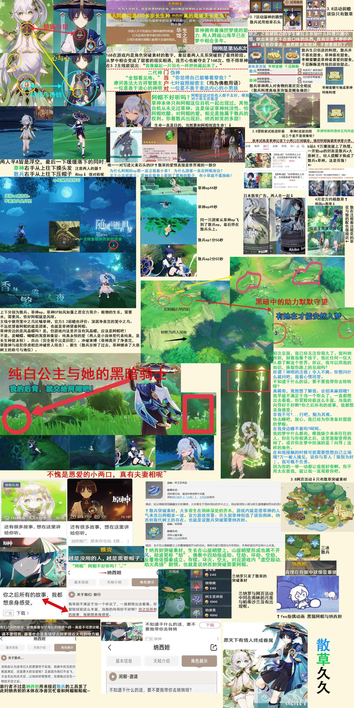

# 散草99

## 概述
指的是《原神》中的角色纳西妲(又称:草神、小吉祥草王、布耶尔、摩诃善法大吉祥智慧主、智慧之神、白草净华)和流浪者(又称:散兵、斯卡拉姆齐、倾奇者、国崩浮浪人、七叶寂照秘密主、阿帽)在剧情和游戏宣发中含有疑似CP(配对、英文名：Coupling，日文名：カップリング)的成分。

而散草指的是散兵和草神，99指的是久久，意指天长地久，往往是对于希望情侣之间能够天长地久，幸福在一起的祝福，简单地用谐音来表达，99就是长长久久不分离的意思。

所以散草99指的是希望散兵和草神在一起幸福。

## 论证
以下图来自网友投稿

