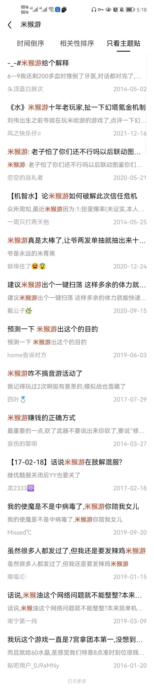

# 猴
> 本词条来自邮箱投稿

## 含义（多重）
+ AOE全体原神玩家的恶性词汇,对原神玩家群体的侮辱性质的统称词
+ 对一部分喜欢引战的原神玩家的概括性词汇,讽刺部分原神的无脑玩家群体
> （因该称谓曾与“OP”并用，因此以上两项复制自OP词条）
+ 对反原神群体的统称词，或指像猴子一样上蹿下跳闹个不停的人
+ 对崩坏学园2时期的米哈游的代词
+ 对古早小米狂热粉丝群体的统称词

## 起源（疑）
早期小米手机因产业链问题长期使用饥饿营销策略，这种行为被网民评价为耍猴，由此导致狂热米粉得到了“猴”、“米猴”的称呼。暂不确定与后期对原神玩家群体的代称有必然联系。
::: details

:::

## 起源
2014年年初，崩坏学园2发布，因米哈游英文名miHoYo中Ho的读音与hou相似，广大玩家对其致以“米猴油”、“米猴游”的称呼。注意，此称呼无贬义，属于玩家爱称。 
::: details

:::
## 发展
原神发布前后，“猴”一称呼因其与miHoYo的高相关度以及和原（猿）神的高相关度，逐渐与“OP”一起被广大反原反米群体用于称呼原神玩家。但随着“OP”使用率的提高，“猴”的使用率随之下降。推测是因为矛盾激化，侮辱性较低、适用面较窄的“猴”被侮辱性更高、适用面更广的“OP”所取代。

## 岁月史书
在反原反米群体弃用“猴”、转而开发“OP”的其他变种后，部分原神玩家捡起了“猴”这个称谓，并将其用作指代反原反米群体，猜测与当时贴吧反原反米主要根据地为miHoYo吧存在一定关系。这部分原神玩家将“猴”的定义解释为“像猴子一样上蹿下跳闹个不停的人”，以此表达对反原反米群体的蔑视。

