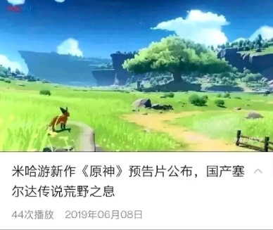
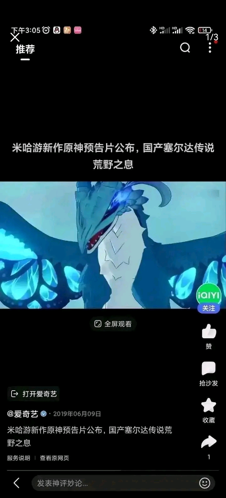
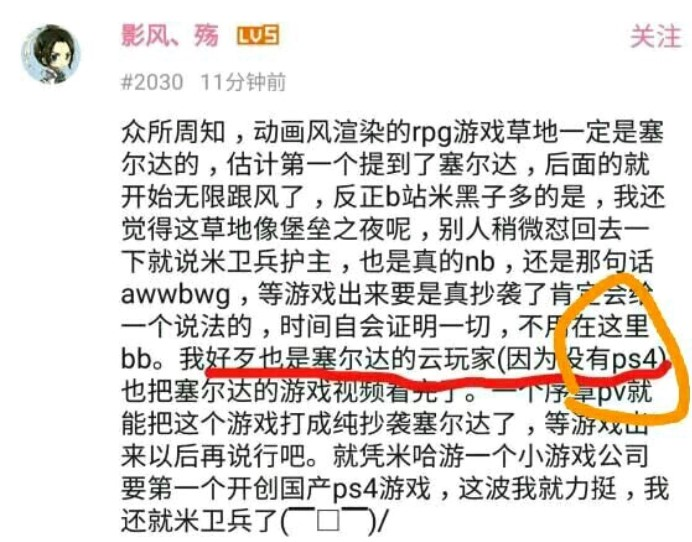
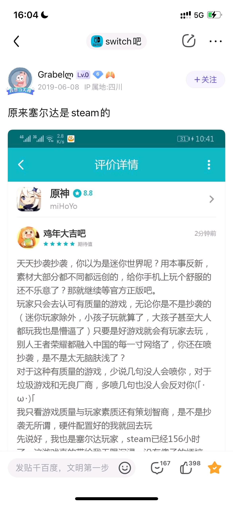
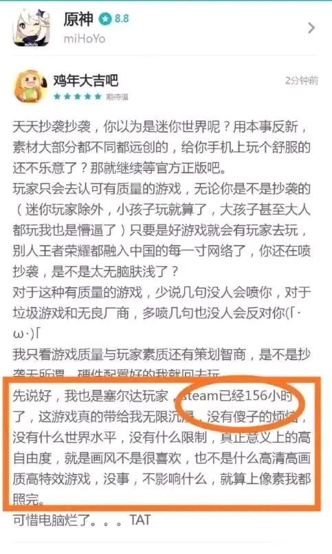
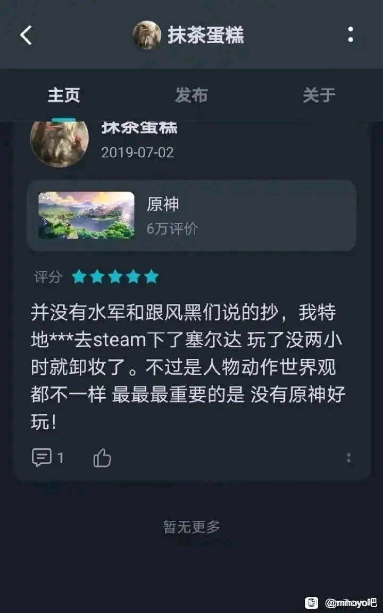
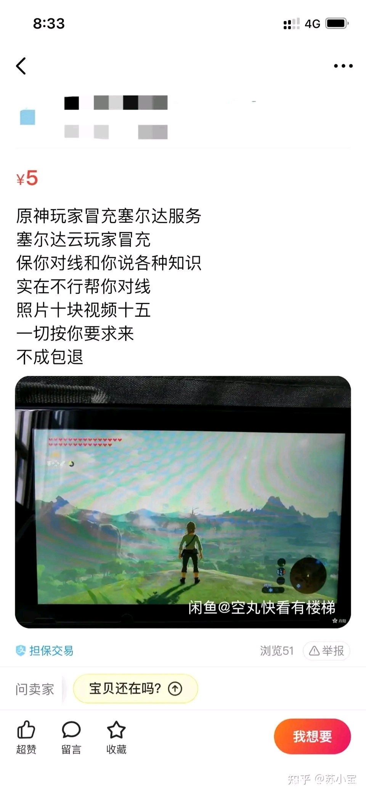
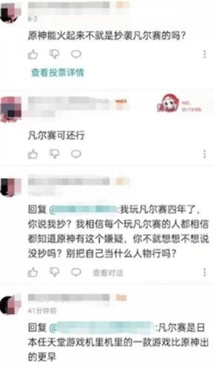

# 百万塞尔达

## 引用
> 该词条中部分图片来源于[B站专栏](https://www.bilibili.com/read/cv20285655),[百度贴吧](https://tieba.baidu.com/p/6156866975)

## 抄袭争议
米哈游旗下游戏《原神》在2019年公布之初，被质疑抄袭任天堂旗下游戏《塞尔达传说：荒野之息》，同时被质疑网络营销宣传中碰瓷《塞尔达传说：荒野之息》的嫌疑.

> 早期原神设定和视频实机曝光，由于太像塞尔达，最早版本草地着火有上升气流，怪物营地打完宝箱解锁有特写镜头，风之翼形式，小宝会眼睛会发射激光，主角游泳是同款蛙泳，各种设计与《塞尔达传说：荒野之息》极为相似，米哈游总裁刘伟也曾说过有部分借鉴了《塞尔达传说：荒野之息》。所以《原神》概念PV放出之后，哪怕是一般路人都会觉得这完全就是抄袭，所以抄袭的节奏自然而然的就会起来.

## 释义ver.1
**百万塞尔达** 最初的本意是指一些四处评论 *我玩过XX小时塞尔达，我认为原神没有抄袭塞尔达* 的评论家，一夜之间凭空多出大量证明原神没有抄袭塞尔达的玩家，故而被网友嘲讽为**百万塞尔达** 。

### 部分截图1

### 部分截图2

## 释义ver.2
**百万塞尔达** 也指的是《原神》公布之后，本来 *“热度不高”、“玩家不多”* 的《塞尔达传说：荒野之息》一夜之间冒出了许多塞尔达玩家号称原神抄袭《塞尔达传说：荒野之息》，同时被部分米哈游粉丝怀疑是腾讯，网易等一众国内游戏厂商派出的水军讨伐《原神》，故而被成为**百万塞尔达** 。

### 部分截图3

