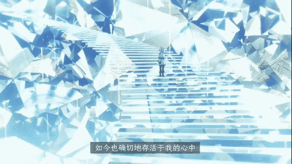
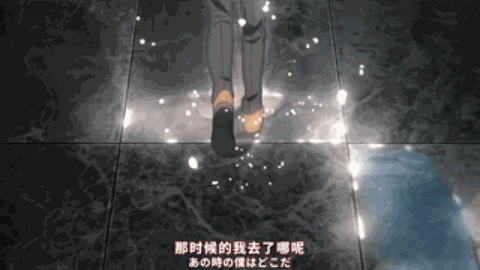
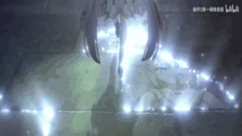
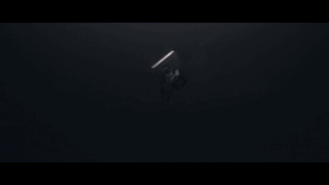
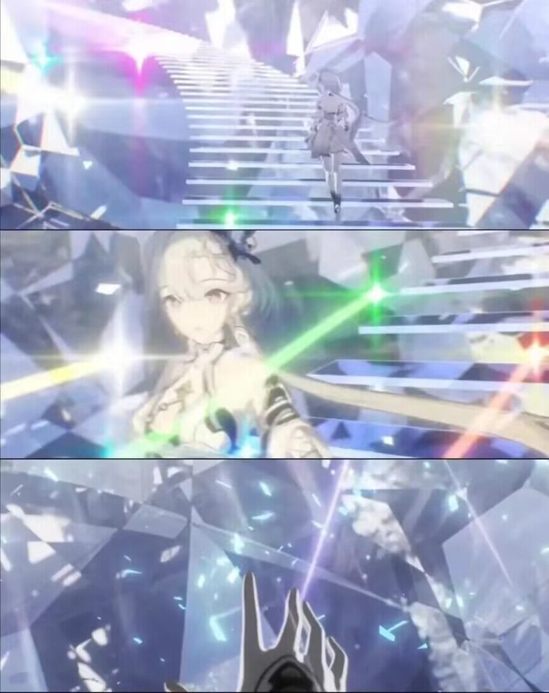

# 崩坏三7.1PV抄袭事件

## 概述
手游《崩坏三》的7.1版本PV涉嫌抄袭2023年10月新番《葬送的芙莉莲》等多个动漫分镜。

## 事态发展记录
+ 北京时间2023年11月5日16:36，韩国(南朝鲜)网友在其国内论坛上发布了疑似抄袭分镜的帖子。

+ 北京时间2023年11月5日23:44，该帖子被搬运到国内游戏社区NGA论坛和米哈游官方论坛米游社崩坏三专区。

+ 北京时间2023年11月6日0:00，崩坏三官方已屏蔽哔哩哔哩弹幕网上该PV其中涉嫌抄袭片段。[官方:《崩坏3》7.1版本「绝地绘星」宣传PV](https://www.bilibili.com/video/av577881517)

补充，后续PV也被扒出其他涉嫌抄袭片段，现已更新到本文下方.

+ 北京时间2023年11月6日3:00，官方删除米游社内的崩坏三7.1版本PV.

+ 北京时间2023年11月7日1:00，官方修改并重新上传了7.1版本PV，涉嫌抄袭《葬送的芙莉莲》等的三个部分已被替换。目前官方并未对此事发表声明。

## 对比动图1

## 对比动图2

## 对比动图3

## 对比图(请看动图)

## 对比视频1(请看动图)
[崩坏三7.1pv对比](https://www.bilibili.com/video/BV1Bu4y177yb/)

## 评论区

