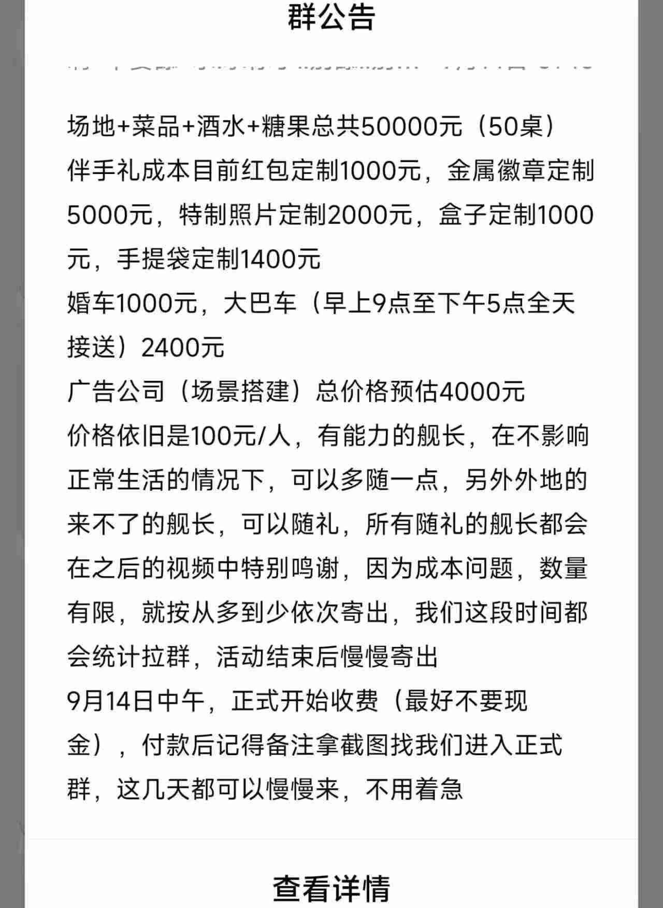
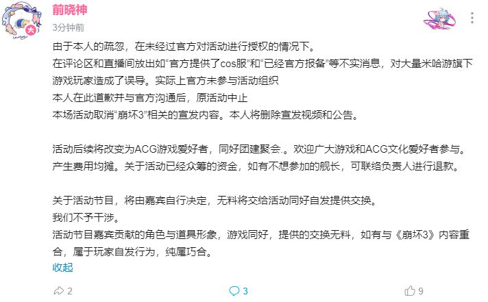

# 崩坏玩家以官方名义组织婚礼

## 概述
一名崩坏三玩家以“官方授权”，“官方提供物资支持”等名义在宣称将在四川省成都市举办了一场崩坏三角色“琪亚娜”和“芽衣”的婚礼。

该婚礼号称花费数十万人民币，聘请了广告，婚庆公司和酒店，甚至还有角色Coser出场，并宣传cos服由米哈游官方提供。

该婚礼声称将对出场的崩坏三玩家收取每人100人民币的费用进行众筹(份子钱)。

最终，该玩家于2023年9月15日因未知原因取消了该次活动一切关于“崩坏三”的内容，仅保留为“ACG爱好者”的名义举行。

## 宣布婚礼

**注意：该UP的图是将三位角色中的其中一位角色截去并合成为“婚纱照”。**

**该UP在群内声称需要收取每位100元的资金。**

**该UP在视频中宣称借贷来进行婚礼**

## 更改名义进行活动
**2023年9月15日，该UP因未知原因修改了相关措辞，取消了该次活动一切关于“崩坏三”的内容，仅保留为“ACG爱好者”的名义举行。**

