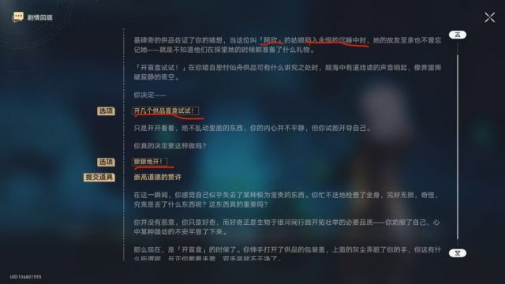
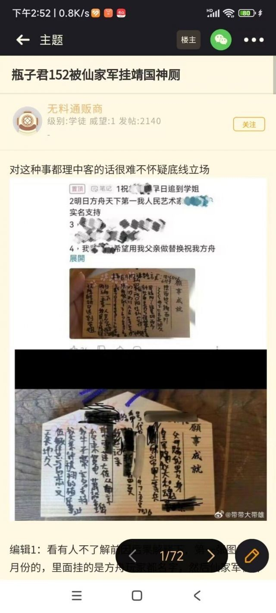

# 铁道开盒受害者写入文案
> 来源:投稿[《文案“狠狠地开”“阿欣”坟头的“贡品盲盒”》](https://bbs.nga.cn/read.php?tid=38439041)

## 概述

这是铁道主线任务新地图必经之路上的一处可互动坟头，互动后会产生以上情节；

玩家可以选择“狠狠地开”“阿欣”的“贡品盲盒”，之后回失去一个游戏内道具“崇高道德的赞许”

至于这位被开盒的阿欣是谁，她和“百川”一样，均是仙家军开盒行为的最早受害者之一，也是第一批被仙家军挂到靖国神厕的受害者。

