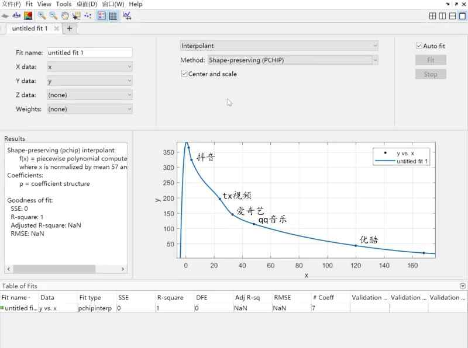

# 世界树:流水榜

## 概述
原神铁道流水观察榜，使用了超抖音相对算法，估算原神、崩坏星穹铁道的流水趋势。

本榜单仅供参考，事实流水可能存在差距。流水榜以iOS畅销榜为准，**每3小时更新一次。**

## 榜单更新
> 世界树暂时缺乏专人监控流水榜单，如需更新榜单请联系世界树编辑组.

## 流水榜:原神

| **UP时间**          | **UP角色** | **超抖音h** | **超腾讯视频h** | **超爱奇艺h** |
|-------------------|----------|----------|------------|-----------|
| 20/09/28-20/10/18 | 温迪+开服普池  | 183      | 480        | 480       |
| 20/10/10-20/11/09 | 可莉       | 72       | 135        | 222       |
| 20/11/11-20/12/01 | 公子       | 60       | 72         | 117       |
| 20/12/01-20/12/22 | 钟离       | 42       | 75         | 114       |
| 20/12/22-21/01/12 | 阿贝多      | 30       | 51         | 75        |
| 21/01/12-21/02/02 | 甘雨       | 51       | 96         | 135       |
| 21/02/03-21/02/17 | 魈        | 63       | 72         | 123       |
| 21/02/17-21/03/02 | 刻晴       | 0        | 0          | 0         |
| 21/03/01-21/03/16 | 胡桃       | 51       | 84         | 90        |
| 21/03/17-21/04/06 | 温迪2      | 33       | 66         | 78        |
| 21/04/06-21/04/27 | 公子2      | 0        | 39         | 45        |
| 21/04/28-21/05/18 | 钟离2      | 27       | 54         | 75        |
| 21/05/18-21/06/08 | 优菈       | 24       | 66         | 81        |
| 21/06/09-21/06/29 | 可莉2      | 0        | 36         | 42        |
| 21/06/29-21/07/20 | 万叶       | 0        | 60         | 60        |
| 21/07/21-21/08/10 | 绫华       | 39       | 114        | 117       |
| 21/08/10-21/08/31 | 宵宫       | 0        | 21         | 63        |
| 21/09/01-21/09/21 | 雷神       | 105      | 186        | 264       |
| 21/09/21-21/10/12 | 心海       | 0        | 39         | 39        |
| 21/10/13-21/11/02 | 公子3      | 0        | 42         | 51        |
| 21/11/02-21/11/23 | 胡桃2      | 51       | 108        | 117       |
| 21/11/24-21/12/14 | 优菈2+阿贝多2 | 12       | 72         | 99        |
| 21/12/14-22/01/04 | 一斗       | 0        | 66         | 93        |
| 22/01/05-22/01/25 | 申鹤+魈2    | 45       | 99         | 141       |
| 22/01/25-22/02/15 | 甘雨2+钟离3  | 78       | 210        | 219       |
| 22/02/16-22/03/08 | 神子       | 57       | 96         | 117       |
| 22/03/08-22/03/29 | 雷神2+心海2  | 75       | 183        | 294       |
| 22/03/30-22/04/19 | 绫人+温迪3   | 36       | 117        | 162       |
| 22/04/19-22/05/31 | 绫华2      | 51       | 192        | 306       |
| 22/05/31-22/06/21 | 夜兰+魈3    | 84       | 225        | 330       |
| 22/06/21-22/07/12 | 一斗2      | 0        | 45         | 66        |
| 22/07/13-22/08/03 | 万叶2+可莉3  | 60       | 147        | 249       |
| 22/08/03-22/08/23 | 宵宫2      | 27       | 90         | 108       |
| 22/08/24-22/09/09 | 提纳里+钟离4  | 36       | 114        | 114       |
| 22/09/09-22/09/27 | 甘雨3+心海3  | 24       | 96         | 111       |
| 22/09/28-22/10/14 | 赛诺+温迪4   | 48       | 117        | 117       |
| 22/10/14-22/11/01 | 妮露+阿贝多3  | 24       | 93         | 93        |
| 22/11/02-22/11/18 | 纳西妲+宵宫3  | 105      | 225        | 252       |
| 22/11/18-22/12/06 | 神子2+公子4  | 33       | 129        | 126       |
| 22/12/07-22/12/27 | 流浪者+一斗3  | 60       | 120        | 144       |
| 22/12/27-23/01/17 | 雷神3+绫人2  | 102      | 435        | 468       |
| 23/01/18-23/02/07 | 艾尔海森+魈4  | 69       | 171        | 144       |
| 23/02/07-23/02/28 | 胡桃3+夜兰2  | 150      | 486        | 477       |
| 23/03/01-23/03/21 | 迪希雅+赛诺2  | 12       | 51         | 48        |
| 23/03/21-23/04/11 | 申鹤2+绫华3  | 72       | 207        | 198       |
| 23/04/12-23/05/02 | 纳西妲2+妮露2 | 60       | 141        | 165       |
| 23/05/02-23/05/23 | 白术+甘雨4   | 18       | 45         | 57        |
| 23/05/24-23/06/13 | 宵宫4+神子3  | 9        | 63         | 72        |
| 23/06/13-23/07/04 | 万叶3+海森2  | 27       | 66         | 87        |
| 23/07/05-23/07/25 | 优菈3+可莉4  | 0        | 42         | 48        |
| 23/07/27-23/08/15 | 心海4+流浪者2 | 0        | 42         | 53        |
| 23/08/16-23/09/05 | 林尼+夜兰3   | 27       | 63         | 90        |
| 23/09/05-23/09/26 | 钟离5+公子5  | 0        | 39         | 45        |
| 23/09/27-23/10/17 | 那维莱特+胡桃4 | 63       | 102        | 174       |
| 23/10/17-23/11/07 | 莱欧斯利+温迪5 | 0        | 36         | 48        |
| 23/11/08-23/11/28 | 芙宁娜+白术2  | 81       | 120        | 150       |
| 23/11/28-23/12/19 | 绫人3+赛诺3  | 0        | 0          | 0         |
| 23/12/20-24/01/11 | 娜维娅1+绫华4 | 6        | 超越中        | 超越中       |

## 流水榜:铁道
> 本榜单仅供参考，请根据事实为准.

| **UP时间**          | **UP角色** | **超抖音h** | **超腾讯视频h** | **超爱奇艺h** |
|-------------------|----------|----------|------------|-----------|
| 23/04/26-23/05/17 | 希儿+开服普池  | 177      | 368        | 462       |
| 23/05/17-23/06/06 | 景元       | 72       | 138        | 171       |
| 23/06/07-23/06/28 | 银狼       | 57       | 87         | 111       |
| 23/06/28-23/07/18 | 罗刹       | 36       | 63         | 90        |
| 23/07/19-23/08/09 | 刃        | 36       | 90         | 96        |
| 23/08/09-23/08/29 | 卡芙卡      | 42       | 78         | 93        |
| 23/08/30-23/09/20 | 饮月       | 57       | 96         | 114       |
| 23/09/21-23/10/10 | 符玄       | 33       | 72         | 81        |
| 23/10/11-23/11/01 | 镜流       | 51       | 96         | 120       |
| 23/11/01-23/11/14 | 托帕+希儿2   | 0        | 27         | 48        |
| 23/11/15-23/12/06 | 藿藿       | 0        | 30         | 42        |
| 23/12/07-23/12/26 | 银枝+银狼2   | 0     | 暂无数据       | 暂无数据      |
| 23/12/27-24/01/19 | 刃2+阮梅    | 暂无数据     | 暂无数据       | 暂无数据      |
| 24/01/20-24/02/10 | 真理       | 暂无数据     | 暂无数据       | 暂无数据      |

## 榜单引用科普
来源 : [虎扑@ixseo：科普壁吧流水统计法](https://bbs.hupu.com/58488477.html)
> 通过对榜单上上市企业财报的分析，不难得出一个结论，影音类app，例如抖音、tx视频、爱奇艺、qq音乐、优酷等，在相当长的时间内每天的平均收入几乎是不会大幅波动的，只会以年为单位缓慢上涨，那么在这些app稳定的前提下，就可以通过比较原神开池子后与它们的相对位置及超出它们的时间长短，来进行一个池子周期的估测。
>
> 而王者荣耀和平精英等同为氪金手游，它的每3小时数据与原神一样是随着活动的开启、进行、关闭在大幅波动，因此就不能机械地去看原神在氪金榜上的绝对排名，而是要看原神与之前提到的5个影音app的相对排名。既然这些app是相对稳定的，那么由于原神本身池子的性质，总是开池后一段时间达到尖峰，随后慢慢下落，那么就可以把这些app视为跳高的横杆，记录原神每个池子从开池开始，跳起来飞在空中时，越过这些横杆分别多长时间，就可以统计各池子相对的流水高低了。
