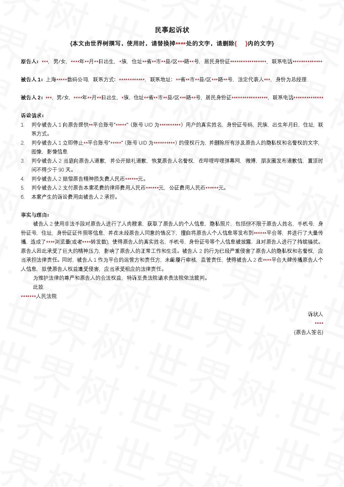

# 反盒指南

## 阅前
本文章由**世界树.编辑部** 撰写,转载请注明作者,谢谢.

阅读本文章前可阅读[《防盒指南》](./防盒指南.md).

阅读本文章前可阅读[《析盒论》]

## 法律依据

### 中华人民共和国民法典

> 2020年5月28日，十三届全国人大三次会议表决通过了《中华人民共和国民法典》，自2021年1月1日起施行。

**第一千一百九十四条** 网络用户、网络服务提供者利用网络侵害他人民事权益的，应当承担侵权责任。法律另有规定的，依照其规定。

**第一千一百九十五条** 网络用户利用网络服务实施侵权行为的，权利人有权通知网络服务提供者采取删除、屏蔽、断开链接等必要措施。通知应当包括构成侵权的初步证据及权利人的真实身份信息。

网络服务提供者接到通知后，应当及时将该通知转送相关网络用户，并根据构成侵权的初步证据和服务类型采取必要措施；未及时采取必要措施的，对损害的扩大部分与该网络用户承担连带责任。
权利人因错误通知造成网络用户或者网络服务提供者损害的，应当承担侵权责任。法律另有规定的，依照其规定。

**第一千一百九十六条** 网络用户接到转送的通知后，可以向网络服务提供者提交不存在侵权行为的声明。声明应当包括不存在侵权行为的初步证据及网络用户的真实身份信息。

网络服务提供者接到声明后，应当将该声明转送发出通知的权利人，并告知其可以向有关部门投诉或者向人民法院提起诉讼。网络服务提供者在转送声明到达权利人后的合理期限内，未收到权利人已经投诉或者提起诉讼通知的，应当及时终止所采取的措施。

**第一千一百九十七条** 网络服务提供者知道或者应当知道网络用户利用其网络服务侵害他人民事权益，未采取必要措施的，与该网络用户承担连带责任。

## 什么是开盒?
开盒，指在网络上公开曝光他人隐私的行为。正式学名叫**非法获取他人隐私信息** 。

一般开盒是指通过社交平台账号，如QQ，微博，贴吧等平台，直接或者间接获取到相对应的手机号，身份证，户籍信息等个人隐私信息。

## 被开盒后第一件事
**请保持镇静，平和的心态** ，必要时请打开本文章复习对于被开盒如何应对。

请国内的朋友放心，目前而言，开盒对于你的人身威胁可能性非常低，但是请依旧保持警惕性。

## 1.保留证据

### 证据类型
> + 人身威胁的QQ，微信或者其他即时聊天工具的记录截图或者录屏，贴吧，论坛，B站等社交网站的私信记录截图或者录屏
> 
> + 电子邮件，手机短信，手机通话记录等截图或者录屏，QQ，微信，手机通话录音完整原件
>
> + 公开平台的开盒证据或者侵权记录，如B站侵权人的动态，视频，贴吧的帖子等，截图或者录屏下来
>
> + 收到威胁的线下快递，外卖，请保留相关凭据，例如快递单，外卖配送单，并保留快递配送记录

### 证据保存规范
> + 最好是录屏+截图方式，录屏建议点入对应的个人主页，保存平台账号的UID或者微信号，QQ号，并确保录屏无剪辑，录屏清晰并显示出对应侵权人的具体账号
> 
> **拒绝造伪证，假证** ，所有聊天截图或者录屏不得经过任何处理，必须完整原文原图原视频原音频。

### 证据保存方式
> + 请将所有证据全部放入到空U盘或者刻录到光盘等实体媒介上，方便后续报案或者开庭使用

### 证据公证
> + 请将以上证据以及登录了相关账号的手机或者电脑一起带往本地的司法公正处。
>
> + 方式:手机地图软件->搜索最近公证处->前往公证处并联系当地的公证员公证以上记录为真实情况。

> 公证可能会**产生费用** ，请打印有效公证开销凭据并妥善保管，若开庭**胜诉后可申请败诉方承担公证开支** .

## 2.向公安局报案
### 向当地的派出所，公安局，或者网警大队进行报案
> 方法:请不要拨打110，除非是对方已经到了线下威胁的地步。**最好是携带以上证据前往当地公安局或者网警大队进行报案** 。

### 法律依据
> **《中华人民共和国刑事诉讼法》第一百一十条第一款**  规定任何单位和个人发现有犯罪事实或者犯罪嫌疑人，有权利也有义务向公安机关、人民检察院或者人民法院报案或举报。被害人对侵犯其人身、财产权利的犯罪事实或者犯罪嫌疑人，有权向公安机关、人民检察院或者人民法院报案或控告。公安机关、人民检察院或者人民法院对于报案都应该接受。

### 保留立案登记或者其他记录
> + 如果公安机关对此事进行了立案处理，请保留公安机关的**立案决定书，笔录记录** 。
>
> + 若公安机关不予立案，请公安机关出示不予受理决定书并妥善保管。

> **《立案决定书》** 是公安机关或人民检察院发现犯罪事实或犯罪嫌疑人，决定立案侦查时制作使用的决定类法律文书。其作用是表明公安机关已经立案，案件进入侦查阶段。
> 
> **《立案决定书》** 是公安机关、人民检察院开展侦查活动的重要依据。《立案决定书》制作完毕，标志着公安机关对某一犯罪事实已经立案，可以采取有关强制措施和侦察措施.。

### 立案流程
> + 立案、侦查和提起公诉。
> + 讯问犯罪嫌疑人、询问证人。
> + 勘验、检查、搜查。
> + 法庭辩论和最后陈述。
> + 评议、判决、宣告判决。

## 3.通告相关网站
> 通过举报，网站反馈，邮件，客服热线等方式，通告对应网站删除侵权的开盒消息，如删除贴吧的开盒帖子，下架B站的侵权视频等。
>
> **通知删除前请务必保存所有相关侵权证据。** 

## 4.民事诉讼
### 委托律师(可选)
> 自行寻找可信任的律师或者当地免费的法律援助律师，然后将流程和证据跟律师沟通。
>
> **注意，产生的律师费用可以在胜诉后向败诉方索取。**

### 如何寻找有效的法院
+ 个人身份证所在地法院
+ 侵权平台公司注册所在地法院
+ 侵权人(开盒人)的身份证住所地法院

### 起诉侵权信息的平台
> + 在国内公开平台的网站底部，寻找下列的信息。(此处以BILIBILI为例)
> 
> 互联网ICP备案：沪ICP备13002172号-3 （由工信部出示）
>
> 公安部联网备案号：沪公网安备31011002002436号 （由公安部出示）

> + 在[ICP/IP地址/域名信息备案管理系统](https://beian.miit.gov.cn/)或者[互联网站安全管理服务平台](https://www.beian.gov.cn/portal/registerSystemInfo)输入对应的备案号，在**网站所有者基本情况** 这一栏获取到**开办者名称** 。

> + 在民事起诉状中将该公司作为被告人1，在[企查查](https://www.qcc.com/)或者其他网站获取到该公司的法定代表人和注册地址。

> **起诉状上需填写**
> + 侵权人的公司名称
> + 侵权人的公司地址
> + 侵权人的联系方式(电话或者邮箱)
> + 侵权人的法定代表人以及身份

> + **诉求**
> 
> 请求法院开具调查函并发送到对应的平台实体上，提供侵权人(开盒人)的实名信息,包括但不限于**姓名,身份证号,联系方式,联系地址** 等。

### 追加起诉侵权人
> + 通过法院调查函获取到侵权人的实名信息后，在民事起诉状上追加被告人2，作为起诉状上的共同被告人。(若平台已履行对应责任，可撤销平台的被告，只保留侵权人的被告)

## (补充)民事起诉状模板
:::details

:::

## (补充)互联网起诉流程
> + 微信小程序:**"人民法院在线服务"** 
> + 个人信息中通过人脸验证进行实名认证并签署人民法院在线服务告知书.
> + 进入分平台
> + "我要立案"->"审判立案"->"选择法院(参照上面给出的有效)"->"案件类型(隐私权)"
> + 上传民事起诉状
> + 上传公证证据,个人身份证明(身份证正反复印件)
> + 提交,等待法院立案成功

## 5.开庭
> 委托律师,或者本人在线或者线下开庭

### 庭审流程
+ 准备开庭；
+ 法庭调查：原告陈述，出示侵权证据。
+ 法庭辩论：被告对原告陈述进行质疑(如无直接进入评议阶段)，原告对质疑进行回复。
+ 评议：法庭辩论结束后，审判长宣布休庭，进入评议时进行评议，实行少数服从数的原则，评议的情况应当如实制作笔录。
+ 宣判：当庭公开宣布判决结果或定期宣判。

## 6.执行
> 法院出具判决书后，责令败诉方执行胜诉方的诉求(如承担律师费,公证费等费用，删除侵权言论，公开道歉，赔偿)

## 7.申请强制执行
一般来说，没人会这样吧...为了以防万一，还是写上吧

> + 申请。发生法律效力的民事判决、裁定以及刑事判决、裁定，当事人必须履行。一方拒绝履行，对方当事人可以依法向人民法院申请执行，也可以由审判员移送执行员执行。
> + 法院受理。
> + 申请复议。当事人、利害关系人对裁定不服的，可以自裁定送达之日起10天内向上一级人民法院申请复议。
> + 向被执行人发出执行通知。执行员接到申请执行书或者移交执行书，应当向被执行人发出执行通知，责令其在指定的期间履行，逾期不履行的，强制执行。
> + 采取强制措施，如查询、冻结、划拨被申请执行人的存款;扣留、提取被申请执行人的收入等。

## 资源
[点击下载民事起诉状](./民事诉状书.zip)