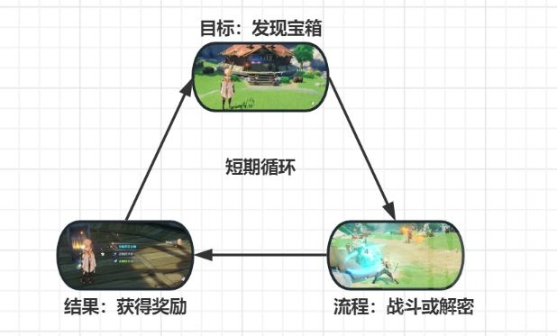
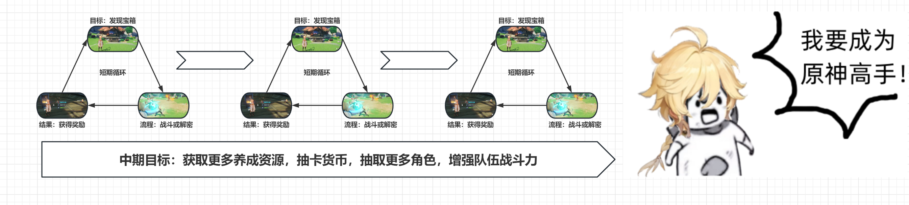
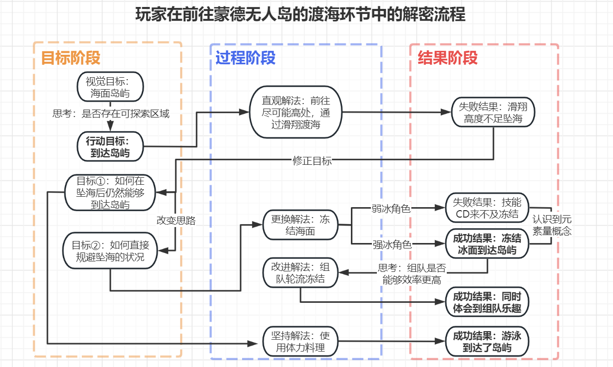
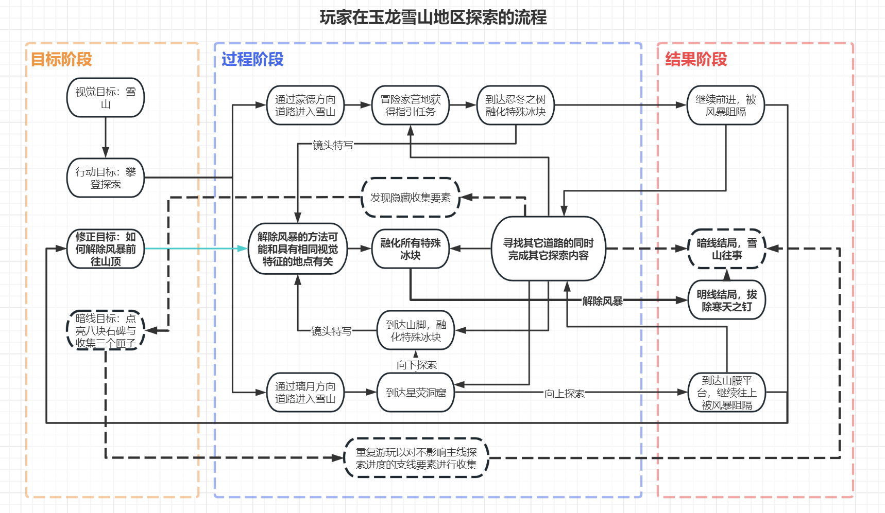
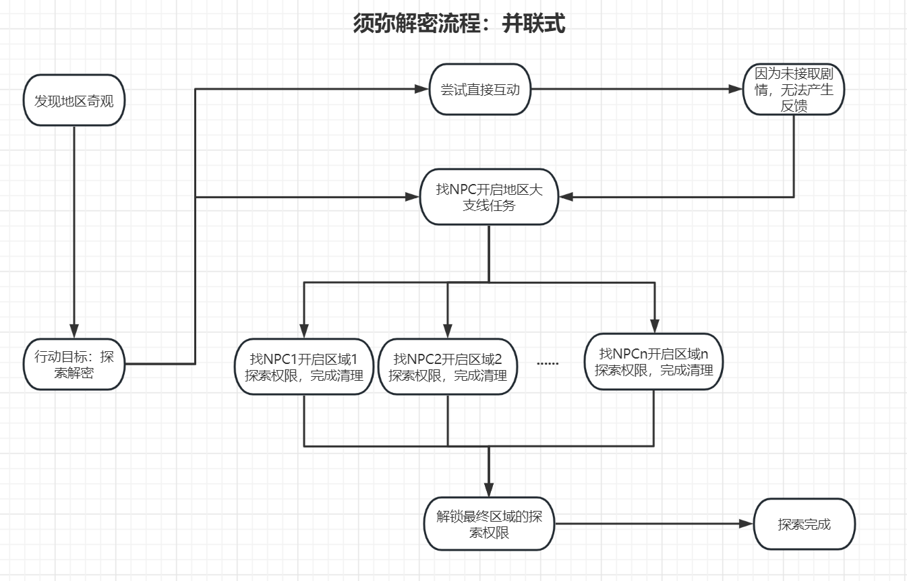
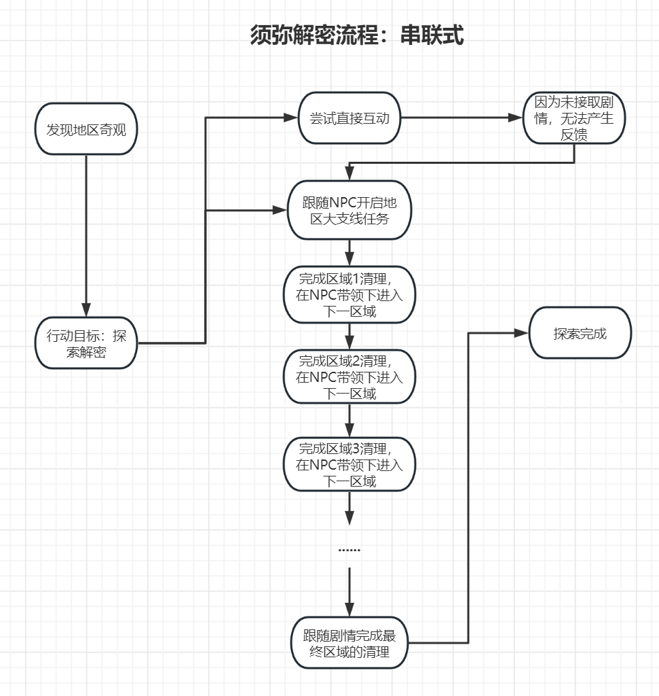
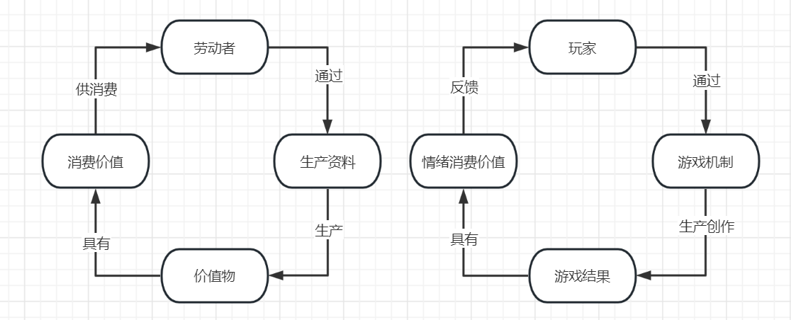
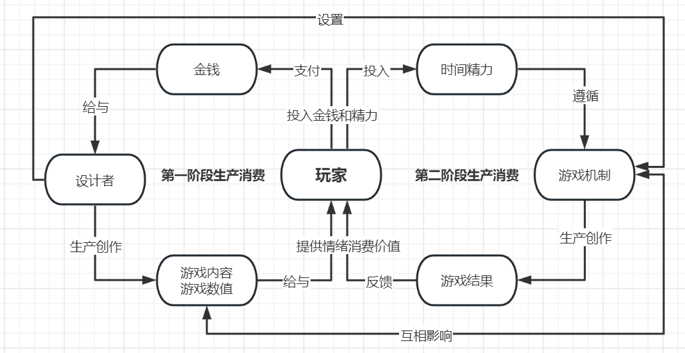
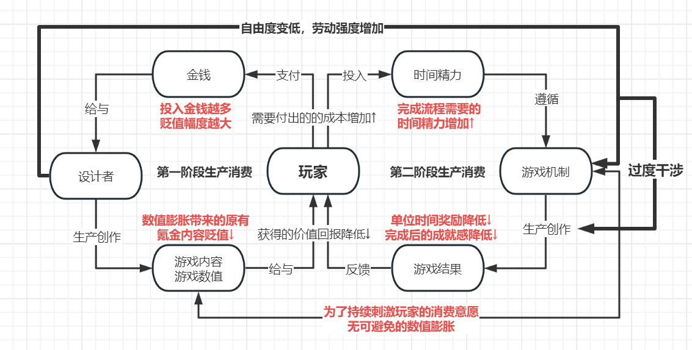

# 到底不好玩在哪里 —— 论米家游戏逐渐消失的吸引力
+ [来源：发布时间2023-09-06 21:11](https://bbs.nga.cn/read.php?tid=37637531)

## 前言
本来打算早些时候就开始写的，但是第一次写的时候发现还没有开始切题，字数就已经逾千，显然不是一个可以很快完成的东西。而4.0版本马上就要开放了，虽然3.X的游戏内容费拉不堪，但万一4.0就支棱起来了呢，那我辛苦写半天的东西不都成了放屁。

现在看起来，除开场外接连不断的花边新闻，4.0版本即使不至于江河日下，也是没溅起多大水花，最多只是一个无功无过的版本。这也是原神自3.3版本之后给我最大的印象——每个版本都是无功无过，枯燥乏味。

写在讨论之前需要说明，我并不是这方面的专业人士，只是出自兴趣把这边文章写完了。文章又臭又长而且其中的观点相当主观，参考的资料是一些平时我觉得很好的游戏相关从业者的科普和杂谈，所有观点出处在征求原作者同意后我会附上出处，放在文末，有兴趣的话可以查找来看。

如果仍然有兴趣，那就开始吧。

## 空泛无物的游戏性与反直觉的设计
**在讨论一个游戏的游戏性之前，需要区分的是不同玩家对于游戏的不同需求。** 

有的玩家体验的重心是核心玩法和关卡设计；

有的玩家偏爱角色塑造和剧情内涵；

有的玩家喜欢考究世界观和细节设定；

有的玩家看重游戏的音乐和画面表现；

不同的玩家对游戏能提供的情绪价值的需求也是不同的，因此经常出现意见分歧，例如[不理解为什么这么烂的游戏性还能有人玩下去还要当孝子] [不懂这些人在喷什么，我玩得好好的非要看他们吐黑泥，晦气]。

现在的游戏随着技术的进步，已经可以扮演番剧，电影，小说等更多的角色。但是对我而言(同时应该也是对大部分玩家而言)，一个游戏最重要的部分仍然是game play的环节，出色的画面，音乐，剧情可以锦上添花，但绝非决定性因素。如果玩家想要寻求别的体验，大可以直接找电影或者书来看，而非去玩游戏。

不能否认的是，原神在初期展现出的game play内容是具有相当大的吸引力的。广阔的大世界，精美的建模，完善的物理法则，新颖的元素反应机制。我们先对原神最大的特点，也就是大世界探索的内容进行分析，当我们在探索大世界的时候，我们在玩什么呢？

在任何的游戏过程中，我们遵循流程应该是目标——过程——奖励的循环，放在原神的大世界探索过程中，表现的形式可能是：

目标：我看到了一个宝箱/可能产出宝箱的机关，我想要获得宝箱；

过程：我打倒了守卫宝箱的怪物，我解除了宝箱的机关；

奖励：我获取了宝箱内容。

**也就是著名的核心循环(LOOP CORE)** 

这样一个一个小的循环，又可以构成更大的目标循环；成为我们中期目标的过程

最后达成我们的长期目标，推进剧情发展，通关游戏里所有的挑战，成为原神高手

早期的原神内容设计中，目标设置往往是直观可见的，而互动方式也几乎限定在很少的几种方式：击杀怪物，(用不同属性的攻击)点击机关然后产生反馈，跟随仙灵然后冒出一个宝箱。相比某经常提到的开放世界主机游戏，原神赋予了角色更高的性能与华丽的效果，但是在大世界的互动方式的设计上却更加贫瘠。

当你发现一个游戏的玩法过于贫瘠想要丰富内容的时候，你会怎样去改进？

如果没有奖励或奖励过少，则游戏模式被人称为“惩罚性”。如果目标不明确，则很容易产生“开放世界式的漫无目的”弊端。如果挑战失衡，则容易被人称为“难以上手、难度曲线不平滑”。

或许你可以想到这些

**目标的优化：**
+ 1.目标明确化(将目标设计得更为明确，玩家能清楚地知道自己想做什么，目前进度如何)；

**玩法的优化：**
+ 1.增加玩家达成目标的途径，给予玩家更多选项(我可以和怪物战斗，也可以潜入偷走宝箱)；
+ 2.增加解密过程的乐趣，给予玩家更多正面反馈(设计精妙的谜题/爽快的战斗过程，平衡难度让各个阶层的玩家都能享受到游戏乐趣)；

**奖励的优化：**
+ 1.增加玩家能获取的奖励，提高玩家动力(你每个箱子给我50原石，那须弥就是设计最好的地区)；
+ 2.增加玩家能获取的奖励类型(如果原石和狗粮对玩家的吸引力不足，那添加武器图纸呢，增加角色用的武器幻化&外观装饰呢)

等等等等

**玩家：yes or no？** 

**米哈游：or** 

以上三个环节任选一处进行优化，都能大幅增加玩家的游戏体验，然后米哈游选择了：

**通过模糊化游戏目标和游戏过程之间的联系让玩家不能直接发现问题解决方法，将解谜方法和任务相绑定增加玩家玩家的学习成本，从而延长玩家在游玩过程中花费的时间。** 

在后续的版本中，我们可以看出设计组对解密机关和玩法的进行丰富的努力，稻妻追加了雷种子翔虫和浪船，须弥增加的各种机关种类和世界景观更是琳琅满目。遗憾的是，其核心设计思路并没有任何改变，我用[角色点击机关触发反馈]和我用[森林中的小精灵留下的古老道具弹一首歌弹得植物心花怒放然后给我让开了路]并没有本质区别，反而徒增了玩家的学习成本。

举一些例子：
当你在璃月看到一块巨大的琥珀石头，你会想到去攻击它，然后又想到重型武器攻击或许可以削减更多的耐久度，而事实也正是如此，你打开石头获得了宝箱；

你在雪山看到一块冰，你会想到用火属性的攻击来融化它，事实也正是如此；后来你又发现了颜色奇特的冰无法直接融化，但是附近有显眼的红色石头，你打破了石头后身上附着了红色的特效，你明白了什么，这一次你的攻击成功融化了冰块。

由此可以看出原神早期的解密设计的特点：虽然互动方式简单，但解密过程基本都是符合直觉，玩家通过观察得出的结论往往是正确的。而且你随时随地都可以直接去解决这些机关，这也是开放世界探索的乐趣所在。

**而进入了须弥之后，游戏的画风是这样的：**
+ 你在自由探索的过程中发现了一个山洞，你发现门口有藤蔓阻挡，
+ 你尝试去攻击藤蔓，无果；
+ 你尝试用火属性攻击点燃藤蔓，无果；
+ 你尝试在附近寻找机关，无果。
+ 后来发现要解除这个机关，只需要你跟着剧情走，解锁了新的道具后听NPC的指示就能解除了。
---
+ 你在沙漠中闲逛时发现了一块造型奇怪的石头，
+ 你用重型武器攻击，无果；
+ 你用下落攻击，无果；
+ 你换出了钟离用长按E技能，无果。
+ 后来发现只需要你跟着剧情走，用新的小道具按照它的提示就可以互动了。

刨除华丽的装饰，新版本中大部分解密的核心逻辑仍然是最基本的[点击机关——获得反馈——进入下一阶段]的循环，不同的是设计师进一步限制了玩家的自由度，需要跟随任务流程才能获得互动的权利，将过程限制在[必须按照我设计的任务流程和探索路线才能完成]的方式中。

*以往在解密环节中受挫时，玩家会想* 

> 会不会是我的方法不对？

*而现在只会想* 

> 是不是我漏掉了任务，缺少了互动用的道具，没找到设计师给我安排的那条路？

*长久下来，对于玩家的探索欲望是的打击是毁灭性的：* 

> 这里有一个机关，但是会不会需要做任务的时候才能解除？万一我自己花时间研究半天结果一开始就是不能互动的怎么办

> 反正我自己去探索也只能摸个皮毛，最后还是得跟着任务走，那大世界有啥好探索的，抽空去跟攻略吧

玩到须弥后期的花海，虽然一个天地交接的奇景大剌剌地放在那里，但是我已经没有任何探索的冲动了。

设计优秀的解密环节如同一道精妙的难题，解开后你会满足于自己的智力成就；而米哈游的解密设计，越来越接近简单枯燥又繁冗的家庭作业，本身难度不高，但是要求你按照它给你的答案完完整整地抄下来。哪怕做完了，大部分人也只会感慨一句终于写完了解脱了。

有人会说：所有的玩法的核心逻辑不都是 **[互动-反馈]** 吗？欲加之罪何患无辞？那我们按照同样的 **[目标——过程——结果]** 的流程，对原神早期的地图设计来进行分析：

首先是蒙德的无人岛：

**目标阶段：**
+ 玩家发现遥远的海面有一座岛屿，但是地图上没有标记，产生[那边会不会有可以探索的区域]想法；

**解决过程：**
+ 玩家可能尝试直接滑翔过去，但是会在中途坠海。
+ 考虑解决方法：使用料理延长飞行距离/在海中泡着等体力恢复料理的冷却时间；
+ 用冰系的角色铺冰渡海，发现不同角色的冻结时间不同，了解到元素量这一概念；
+ 组队铺冰渡海，享受社交与合作的乐趣。

**结果与反馈：**
+ 玩家到达了岛屿，惊喜地发现自己的猜想是对的，参与后续的解谜并获得奖励。

**画成流程图的方式如下：** 

在蒙德尝试渡海到达无人岛的解密中，玩家从一个视觉目标出发，自主地开始行动。在行动遇到失败时，根据失败的过程对初期目标进行修正，然后思考出多种解决途径，构成了整个循环流程。而达成目标后的奖励不仅仅是解密获得的宝箱，也包含了成就感和满足感。

**然后是我心中原神解密地图设计的巅峰，龙脊雪山地区：**

**目标阶段：**
+ 醒目的雪山地标，如果从蒙德区域出发的话很容易经过协会营地，可以简单获取区域信息以及接到帮助乔尔寻找父亲的支线任务以及[山中之物]引导任务；

**解决过程：**
+ 沿着离开营地后的路线前进，会直接到达雪山重要地标之一的忍冬之树，与之互动会获得关键线索；
+ 继续沿着路线前行，会到达七天神像，神像背后是上山的通道，但是会有风暴阻隔，玩家不得不去探索别的路径；
+ 沿着另一条地图上标识明显的道路进行探索的话会到达星荧洞窟，这一区域展示了精美的美术风格，当往上探索时，同样会遇到风暴；
+ 如果往下探索，则会遇到另一处机关(这个地方也设置了足够难度的挑战)，解除该机关后会触发和忍冬之树相同的动画，玩家会猜测这个动画是否和解除风暴有关系，+ 从而自主去寻找第三处具有相同美术特征(蓝色花朵)的区域；
+ 这一阶段玩家可以按照自己的喜好来探索整个解禁的区域，而不会被限制路线，即便不能登上山顶，也有足够多的内容可以体验。

**结果与反馈：**
+ 在解除三处机关后，风暴果真如玩家所料地解除了，前往顶部时是一个线性的解密流程，包含了最终的奖励和龙脊雪山的真相。

**我们同样用一个流程图来展示龙脊雪山地区的解密过程：**

事实上这个流程图偏向理想化，玩家实际上的探索流程可能不尽相同，但是即使交换部分环节的位置，最后的结果也是大差不差的，稍作分析，我们可以发现一些有意思的地方：

**引出最多箭头的环节：即执行的时候容易引发各种各样的结果的环节，** 是玩家寻路和自由探索的部分，玩家只需要按照自己的意愿对雪山地区进行探索，自然就会发现各种线索，推进过程和进入下一环节；

**最多箭头指向的环节：也就是进行各种行动的时候最容易导向的结果(最不容易错过的环节)，** 其一是发现**解除风暴的办法** ，无论沿着怎样的路线进行探索，都很难错过解除风暴的方法的答案，而一旦进入该环节，直到完成明线结局前都是单线流程。因此虽然结构错综复杂，进入主流程后却几乎不会走上岔路。其二是雪山地区的隐藏结局，即揭开国家灭亡的原因，无论是真结局还是玩家自由探索的过程中收集的线索都很容易指向这个结果。

**流程环节间的联系呈现网状结构：** 虽然雪山地区的流程结构看起来很复杂，但是不管你在哪一个环节时离开，又从哪一个环节重新开始，都可以很顺畅地回到这个流程继续进行推进。

整个雪山地区的解密中，虽然有[山中之物]的任务作为引导，但是对于玩家探索的路径几乎没有任何限制。得益于出色的视觉引导，玩家可以清楚地掌握自己的位置和进度，完全通过自己的想法来推动整个流程。一明一暗两条任务线埋藏在雪山的地图之中，而随着最后寒天之钉升上天空，玩家打开埋藏的密室，雪山的古老故事也完全揭开。

作为对比，我们同样也对须弥地区的解密过程用流程图来分析，相较龙脊雪山错综复杂的网状结构，须弥地区就简单多了，我愿称之为**并联式与串联式**

有人要说话了：**哎，你分析蒙德无人岛和雪山就每个区域地名行动目标都详细写出来，分析须弥就区域1区域2指代一笔带过，故意带节奏是吧？**

并不是，原因其一是虽然无攻略完整地跑完了整个流程，但是每个区域给我留下的印象都不是很深刻，只记得按照NPC的提示做这个做那个了，虽然没有注明具体任务和区域名字，但是玩过的玩家应该一眼就能看出这两种流程代表作是哪两个任务；其二是须弥解密设计的一些特点，导致不方便对其环节进行划分：

+ **目标和流程的模糊化：** 在早期的解密过程中，玩家可以在视觉引导下自发获得一个目标，通过探索流程获得结果后再去修正这个目标。而须弥的解密过程中，玩家很难通过自己的目标去驱动整个过程，没有接取任务时寸步难行，接取任务后就会进入往复循环：完成一个区域目标后，下一个区域目标随即产生。同时缺乏参照物和进度指示，在须弥的解密中你很难判断自己处于流程的哪一阶段；

+ **反直觉的互动方式设计：** 相较前几个地区简单但是直观的机关形式而言，须弥很多机关的互动方式是比较反直觉的，很多时候玩家根本不知道点击各种机关会有什么结果，只能先把所有机关点一遍再揣测设计师想让玩家达成的效果。在将视觉目标和行动目标关联起来时会遇到困难；早期解密的重心在于确定目标后流程的推动与结果的产出，而须弥区域在弄清楚[这个地方到底想让我干嘛]的环节上花费的时间会更长；

+ **流程环节间的联系呈现线性或并排结构：** 虽然须弥的地图大，解密流程长，但是在流程结构的复杂度上大打折扣。好处是只要跟着任务走，最后一定能完成流程。坏处是玩家自己自由探索得出结论的乐趣性会大打折扣。对于设计师而言，须弥的流程设计工作显然更简单：无需考虑环节之间的互相影响，无论是哪种流程，增加一个环节都不会对整体结构产生影响(流程图中省略号的部分，想塞多少塞多少)，也就是米哈游引以为傲的[工业化产能]和[量大管饱]。而于玩家而言，并联式的流程还好，无非多几个蓝色支线，在串联式的流程中，一旦离开流程就必须要求下一次精准回到相同的节点才能继续推进，无疑进一步增加了负担，降低了自由游玩的乐趣。

+ **单位游戏时间可获得的奖励降低：** 虽然玉龙雪山在开放时期曾因为寒冷值和怪物强度为人诟病，但是宝箱数量和质量也是最丰厚的。璃月之后，地图收集要素的数量不断增加，奖励却没有实质性增加(神瞳甚至降低了)，而解密流程掺杂剧情过场动画，玩家需要投入的时间成本不断增加，单位时间可以获得的奖励等同是降低了。

**相较于后期千篇一律的跟着任务点点点的流程而言，早期的解密流程强目标而弱引导，给予玩家更多的主动性和解决方案，其重心内容在于玩家自主发掘解决方法的过程，因此完成解密后玩家也能获得更多的成就感。到了须弥版本，虽然米哈游提升了视觉效果和互动过程的复杂度，但是核心循环上的设计却更加贫瘠，最重心的部分不再是玩家自身的行动，而是根据安排好的剧情和步骤按部就班地走完整个流程，玩家更多是作为设计师和剧情NPC的提线木偶在行动。新版本中的玩法设计，在目标/流程/结果三个角度来评判，都不如早期的产品。**

也就是为什么我一直有一个观点，原神的地图设计，在雪山地区就已经是巅峰了。

想必很多玩家都有一个体验，进入须弥之后，玩游戏仿佛变累了，乐趣也减少了。是的，如果你这么觉得，那正是米哈游设计思路的转变带给你的结果。在核心互动逻辑没有任何进步的同时，米哈游大幅增加了玩家在其他环节上的劳动强度，剥夺了玩家的自由度，并且降低了单位时间能获得的奖励，玩家的满足感理所当然会降低。有的人可能会觉得探索完整个赤王陵，还不如当初到达蒙德的无人岛的时候来得快乐，也是再正常不过的事情。

当然，以上所有的讨论都只是针对原神在大世界探索和解密方向的设计思路转变而言；原神另一个独特的核心玩法是战斗系统中队伍搭配与元素反应，如果开发得当，这个系统可以赋予游戏相当的深度，只不过这个优势，在更早的时候就已经被设计组摒弃了。

## 先果后因，自下而上的设计理念
如果以获取成本(5星角色和武器的总星数)为一个坐标轴，以角色性能为一个坐标轴，划分出四个象限，对角色性能进行区分，你会如何分类？

或许你可以得到大致这样的结果：
+ 高星高性能：6命夜兰，12命神申，雷2九6；
+ 高星低性能：不方便说；
+ 低星高性能：班尼特，行秋；
+ 低成本低性能：进不了主流队伍构筑的角色，事实上后出的四星角色除了少数专辅大多划分在此。

如果稍加分析，不难看出原神策划对于强度的把控是相当到位的，玩家获得的角色强度和投入成本是一个很明显的正相关曲线。能够提供破格强度的低成本角色基本都是开服产出，并且权重在引入新的机制后有所下降(除了被称为外置命座的专辅，开服后新出的四星能有足够登场率的大概只有久岐忍)。

对数值的把控能力是游戏策划的必修课，过于强势的控制则会扼杀游戏深度。而原神的制作组似乎一直在向玩家传达自己的态度：

**你要按我设计的方法来玩，角色的位置必须是我一开始安排好的，我不给的，你不能要。**

+ 迪卢克大招火鸟吸附，虽然触发方式合乎情理，强度没有太超标，甚至能让玩家吹一波真实的物理引擎，但是因为是策划意料之外的产物，因此很快被修复；
+ 火出圈的钟离事件，策划宁愿把钟离加强成核动力轮椅也不愿意给他正常的输出能力，因为给钟离的定位就是辅助；
+ 草系反应的效果相较早期的反应复杂又繁琐，甚至添加二次反应和角色专属反应，但是只精准惠及部分属性；
+ 专武和圣遗物效果写小作文，精准避开老角色。

诸如此类，不剩枚举。

(很喜欢派蒙的一句话：前面的区域，以后再来探索吧)

虽然反复精算优势区间成功限定了玩家能获得的收益，久而久之玩家也会发现策划的意图。如果一个角色的实际强度是决定好的，玩法是决定好的，甚至反应能触发几次都是决定好的，那留给玩家可以自己钻研发挥的空间还剩多少呢？看似具有无限可玩性的元素反应系统实则可供开发的玩法相当有限，有的只是策划一开始就准备好的标准答案，玩家的努力只决定到达这个答案的时间而已。

(这个反应能不能触发，谁可以触发，或者说，充的钱达到多少可以触发.jpg)

**先决定好呈现给玩家的结果，然后在这个结果的基础上来设计游戏内容**，正是米哈游策划的一贯思路，也就是俗称的先射箭后画靶，而这一思路并不只反映在战斗系统上。

+ **卡池的档期安排可以决定戏份**，先决定卡池角色，后写剧情。为了配合卡池让角色在剧情中登场，稻妻的鬼王可以陪稻妻的属下回璃月拿毕业证，神社巫女可以去须弥斗蘑菇，须弥的神官也可以去蒙德参加风花节，至于蒙德本土某骑士——安排的档期还没到；

+ **角色身上的符号可以决定剧情**，先设定角色的主要TAG，后为了展现这个TAG的目标为角色设计剧情台词。万叶出场必定是为了表现自己的豁达，菲谢尔出场必定是为了表现中二，散兵背负着被背叛的过去，因此所有经历都往背叛上释义。先想好几个桥段再填充其它内容，导致角色剧情沦为完全靠情节驱动的产物；

+ **机关的投放数量可以决定地图的设计**，先决定要放多少机关和宝箱，后为这些机关设计场地。偌大的建筑物可能看不出设计理念，没有实用功能，毫无考究乐趣。但是一定有放置各种方碑开关的场所和刚好让仙灵光球绕一圈的通道；

+ **角色的技能可以决定怪物的设计**，先决定要针对淘汰哪些角色，后投放对应性能的怪物。因为玩家有可以大范围聚怪的角色，所以刚好出现了外观轻巧漂浮在空中却唯独无法被牵引的怪物；因为盾辅强势，所以刚好出现了打到护盾就会强化自身的骑士。

带着目的性去设计游戏并非是错误的，相反，游戏制作的一切要素应该都是有目的性的。如何通过这些要素引导玩家达成设计者想要达成的目的正是游戏设计的难点所在，好的引导应该做到合乎情理而不露声色。然而原神种种引导带给玩家的只有割裂与混乱的体验。更重要的是，你可以明显感觉到，这些设计的存在不是为了给你提供更好的游戏体验，而是催促你赶紧掏钱。

**当游戏里的一切要素都只急功近利地为策划既定的目的而服务的时候，原来这些要素承载的正常功能便不复存在。游戏系统失去了研究的深度与乐趣，大世界不再让玩家有探索的冲动，而角色的剧情塑造也很难引起玩家的共鸣。**

## 持续流失的价值与主体的异化
让我们再回到第一章节的话题，来讨论游戏的本质是什么？

我们经常称游戏为第九艺术，如果要区分于对文学，音乐，戏剧的鉴赏行为。玩游戏最大的不同，便是玩家通过主观行为，能对游戏中的内容进行改造。

**也就是我想说的观点，游戏的本质其实是一种包含了付出与回报的劳动行为。**

你可能不同意这个观点，我玩个游戏是为了快乐的，非要和你们整得像上班一样斤斤计较才有意思？

没关系，即使你不同意这个观点，我们也可以抛开这个结论，只讨论游戏与劳动行为中有共同特点的部分。

一般的的体力劳动行为：
**[劳动者]使用[生产资料]生产[价值物]**

玩家玩游戏的过程：
**[玩家]遵循[游戏机制]玩游戏获得[游戏结果]**

但是不同于传统的劳动工作，游戏机制的设置是游戏设计师所完成的，而玩家在游玩过程中获得的也并非具有公认价值的成果。因此，玩家在游玩过程中的价值交换，也要区别于现实中的消费行为而相应区分为两个阶段

+ **第一阶段** ：玩家通过买断或者其它付费行为，获得游玩游戏的权利或者游戏中的数值(生产资料)，这一阶段，设计师与游戏厂商作为生产者而玩家作为消费者；
+ **第二阶段** ：玩家付出时间与精力游玩游戏，遵循游戏机制(生产资料)获得奖励与其它反馈，这一阶段玩家既是生产者，又是消费者。

(实际上随着互联网的发展，在游戏之外获得的社交关系也是一种价值，但是原神本身的舆论环境过于复杂，此处暂不展开讲，只讨论游戏本身的内容)

因此，我们在讨论一个游戏是否值得游玩时，往往是在讨论这两个环节中消费的内容是否具有足够的价值。如果只以物质上的价值标准来判断的话，当然玩游戏获得的回报一文不值，然而有一点事无法量化的，就是玩游戏的过程中带给我们的精神层面上的满足感。

+ **第一阶段的期望**：我花费金钱去抽取游戏中的角色和专武是否值得？相对比将钱花在购买其他东西(无论是其它游戏中的或者现实中的)而言？

+ **第二阶段的期望**：我花时间玩这个游戏是否获得了足够的快乐？比起其它娱乐活动，在原神中推进剧情与探索度，最后获取的奖励与结果是否能带给我精神上的满足感？

~~(社交价值：我玩米家游戏是否能脚踩友商获得人上人的待遇)~~

事实上这两个消费阶段并非完全独立而是互相作用的。第一阶段中获得的氪金数值可以极大改善玩家在第二阶段中的体验，减少时间精力的投入；玩家在第二阶段中能获得的游戏体验也会影响自己对第一阶段中消费内容的价值的评判。**但是无论是第一阶段还是第二阶段的循环，玩家作为主体的位置都是毋庸置疑的。**

在原神早期时，精美的大世界与角色建模为玩家提供了足够的审美价值，即使不付费去抽取限定角色也可以获得相当程度的游戏内容体验。这一阶段中玩家获得的回报是远大于付出的，因此原神虽然有开服时的节奏，但是仍然在短时间内积累了大量的用户与口碑。

然而任何事物都都边际效益，随着时间的发展，玩家终究会对风景玩法出现审美疲劳。为了刺激玩家的持续消费，原神在各方面都在寻求改变。一方面推出更强的角色和专武，增加第一阶段中玩家消费的内容价值；同时推出新的地图区域，在玩法机制中不断进行新的尝试，以求在第二阶段的消费中玩家能自主获得的价值增加。

然而事与愿违，正如前文所说，反复精算数据来划分角色的优势区间终究有一个极限。要想维持[新角色越来越值得买]的表象，数值膨胀是必然结果。为了衬托新角色的性能，怪物的强度与血量水涨船高。新角色带来的并不是玩家消费内容价值的提升而是原有角色(生产资料)价值的贬值，一旦玩家意识到自己充的钱只会加速这个贬值的过程——深渊怪物血量越来越厚，大世界守护宝箱的怪越来越难清。消费意愿必然会大幅降低。

而米哈游在玩法上寻求的突破也未能达到预期的目标。在两个生产消费的循环中，玩家本应该是无可置疑的核心部分，而作为第一阶段的生产者，游戏厂商本就不应该过度干涉第二阶段的生产过程。但是米哈游在大世界玩法上的倒行逆施(参考前两章)，**等于是变相降低了玩家在生产过程中的主体性，将本属于玩家作为主角进行创作的权利转移到了自己身上；不进反退的大世界探索体验，极大地降低了了玩家的本应该在游玩过程后获得的乐趣。**

第一阶段中玩家获取的生产资料价值不断贬值；第二阶段玩家作为主角的权利被剥夺，劳动强度提高的同时获取的回报降低，也就自然觉得越玩越不好玩了。

了解了这一点，就能理解为什么对米哈游恶评最高的是高氪用户/深度玩家而非轻度用户与路人，以及游戏退坑用户的回踩率会这么高。因为原神的游戏内容带给玩家的消费价值是不断降低流失的，付费本质上反而加速了这一过程，而在以上所说的两个消费环节中投入的付出越多，米哈游带给玩家的负反馈就来得越快越强；

同时也能理解米哈游坚持大力买量去寻找新用户也不愿意给老玩家更多福利的原因：虽然米哈游的游戏内容很容易让老用户陷入倦怠，但是对尚未体验过的新用户仍然充满吸引力。相比需要花大量资源去优化游戏才能维持其满意度的老用户(如果是囤积资源很多的老用户，还不一定给你爆米)，新用户距离到达乐趣消退的时间点还很远，消费潜力显然大得多。

## 无意义的负反馈与匪夷所思的傲慢
如果你是一名游戏设计师，你在设计游戏时想要带给玩家怎样的体验？

+ A：在可能的范围内尽可能地精心打磨游戏细节，为玩家提供更好的体验；

+ B：在可能的范围内尽可能地制造难度与痛苦，增加玩家pay to win的动机。

以上是比较**买断制游戏和内购制免费游戏** 时比较为人乐道的两个说法，实际游戏设计中，并不是非黑即白，单机游戏也需要设计一定难度的障碍，给玩家制造痛苦来提高玩家攻克关卡后的兴奋阈值；内购制免费游戏也需要打磨内容，获得认可后才能提高玩家的充值的欲望。

**当我在探索稻妻区域时，发现了一个奇怪的细节：** 

+ 稻妻区域的雷种子飞行互动，手柄键位是LB+X，单独的X是攻击键位(须弥的四叶印也是一样的键位)；
+ 因为键程的原因，在快速点击时，手柄很容易出现LB没有触发X先行触发的情况，造成角色想要拉翔虫却按到下落攻击直接掉落的情况；
+ (实名fk垃圾X盒精英2，换了两个手柄，肩键都有点问题，还只能线下网点送保)

与此同时，在飞行状态下其它的三个圆键都没有类似的功能重叠隐患，甚至有完全闲置的Y键，也就是说，如果米哈游愿意，是完全可以杜绝这种会带来负反馈的体验的。

**当然这只是手柄玩家诸多反人类设计中不足为道的一点，其它更明显的地方比比皆是：**
- 手柄登录界面无法开门，需要用键鼠点击后再换回手柄操作；
- 手柄和键鼠之间不存在热切换，需要再设置里切换，而切换后原有设备就会立刻失效，因为副本中无法打开菜单，如果在副本中遭遇手柄没电的话，甚至只能强制结束游戏进程再重进(我玩过的游戏里，不支持手柄键鼠热切换的真的是屈指可数了)；
- 手柄摇杆存在最小范围，在需要调整视角完成的解密中(如海岛菲谢尔城堡的视角调整解密)，手柄总是出现多推一下超过了，少推一下不够触发的状况；
- 手柄选择活动菜单时每次的按键对应功能都不一样，一般统一的标准是十字键左右和肩键切换初级菜单，摇杆和十字键上下切换菜单内容。而原神这些切换的按钮时而用肩键时而用摇杆时而用扳机键，时而A键时而X键时而Y键领取奖励，使得每次活动都苦不堪言。

**有人会说天天用手柄打游戏的才几个人啊？至于鸱鸮怪叫吗？那我们再来看一些不限于手柄用户也会遇到的问题：**

+ 掉落物和大世界物体互动按钮混杂，导致拾取掉落物和抓晶蝶时经常点到烹饪或者神像；
+ 要求特定属性的角色来解密，但是切换队伍和角色强制读条，极大降低探索流畅度；
+ 每次更新大到离谱的数据包，而据解包大佬说里面有大量过期活动的素材；
+ 任务角色互相占用，最后来回推任务带来的割裂感远大于直接放弃任务；
+ 联机游戏时队友不离开副本就无法解散队伍；
+ 圣遗物无法保存套装；

**(当然了，远不止这一点，去主版用[反人类][反直觉]等关键词检索帖子，搜索的结果几页都翻不完)**

**以及一些有人觉得算不上问题但却多少有些奇怪的地方：**
+ 2.8的海岛解密，存在调整开关改变地形的谜题，但是对于调整后的结果没有直观展示，需要玩家来回奔跑查看；
+ 渊下宫的昼夜切换装置，过长的动画时间(实际上这些动画还并非实景展示，而是每次都用另一个日舆的模型进行的即时演算生成)；
+ 秘境中各种分散的宝箱，让探索时注意力无法完全集中，担心漏掉宝箱；
+ 角色的闪避攻击跑动攀爬都依靠精力条，但却没有一般动作游戏中停止动作后精力条快速恢复的设定，让没有普攻闪避特化的角色的动作系统变得很鸡肋；
+ 草属性只和部分属性有反应，但其中却没有直觉上关系最紧密而且弱势已久的岩属性；
+ 不明所以的怪物AI和技能设计：流血狗的原地发呆和空气墙后跳，圣骸兽大到离谱的碰撞体积，雷丘丘王的大跳和冲刺距离；
+ 各种头重脚轻的地形，攀爬时经常被中途阻隔，但是细看又不是为了为了让你不走这条路，仔细找一下依然可以爬上去；
+ 神瞳和其它可在小地图上显示的收集道具，即使是隔着墙壁或者在不同分层的地图，也会展示出来，让你怀疑是不是就在身边；

*列举这些设计上的问题并非想说明这些问题有多严重，这些问题并没有导致让游戏玩不下去了，而是想谈一下这些问题存在的一个共同点：* 

**所有这些带给玩家负反馈的问题，并非是设计师有意设置的游戏难度障碍，而是因为没有注重细节打磨而产生的瑕疵。**

相比对抗设计师带有目的性设置的难度障碍而言，在解决这些无意义的瑕疵的过程中玩家会感受到更大的负反馈。在遭遇到无法跨越的难度障碍时，玩家会思考是否自己具备解决障碍的能力，即使受挫也会寻找其它解决途径或者提升自己的数值；而在遇到这些非设计师主观设置的障碍带来的负反馈时，玩家更多会觉得 **[我明明没有犯任何错误，为什么要遭到这种惩罚？]** 

当游戏尚能提供给玩家足够的消费价值，玩家最多只会觉得这些问题是可以忍受的小瑕疵；但是当玩法和剧情无法给玩家带来足够的乐趣，而这些糟糕的用户体验又给玩家制造更多的痛苦的时候，还会有多少玩家愿意买单呢。

*更重要的是，这些混乱不堪的细节管理背后，透露出的米哈游的态度：*

- **要么米哈游根本就没有测试部门，因为这些细节瑕疵都是只要亲手玩一下很容易就能发现的问题，在一开始就不应该活到正式版本的游戏中；**
- **要么就是米哈游认为这些问题根本就不是问题，没有花资源去修复来改善玩家游戏体验的必要。**

米哈游在这些会带来负反馈的细节的管理水平，可以说是灾难性的。相较于在某些设计上昭然若揭的目的而言，原神在这些细节上又缺少最基本的目的性与逻辑。很多设计不像是一个成熟的游戏厂商细思熟虑的产物，反而像是 **[我觉得这里应该有这么一个东西，所以就加进去了]** ，米哈游引以为傲的工业化流水线，粉丝鼓吹的量大管饱的游戏内容，有多少是有经过细致打磨，有配得上用户付费的质量的呢？

虽然米哈游是国内行业首屈一指的大公司，但是在项目管理方面，更像是一个超大号的同人社团，其核心思路并非 **[提供给用户他们所需要的东西]** 而是 **[将自己觉得好的东西端给用户品尝]** ，至于这些内容会给玩家带来怎样的体验，似乎从来不是他们考虑的范畴，看着用户 **[按照我喜欢的方式来玩游戏]** 才更像是他们的乐趣所在。我本身是很反感用形容人的性格的词语去形容一个公司，但是米哈游在某些方面的做法展现出的态度确实带有匪夷所思的傲慢，毕竟很多优化并非是 **[做不到]** 而是 **[不屑于去做]** 甚至 **[故意不去做]** 。

在退坑一段时间后听到关于limengan的言论时，我竟丝毫不怀疑其身份的真实性，这位可能是米哈游元老员工的言论，和我印象中米哈游的形象，竟是如此吻合。

## 结语
比起一时剧情的低谷或者游戏内容的枯燥，游戏细节中有意无意透露出的傲慢才是我最后放弃原神的原因。未来米哈游可能最终能打磨出足够有趣的玩法，单薄的剧情也可能会在引入更有能力的编剧后得到改善，但是某些公司基因是一脉相承无法改变的，在可以预见的未来里，用这种无法改变的态度去做出来的游戏，带给我的负反馈一定会大于我可以获得的满足感。

## Q&A
可能会有人对这边文章的内容有质疑，所以在最后我再写几个[根本没人care但是我还是写了的Q&A吧]

**Q：你寄吧谁啊，在这里指指点点，你比米哈游的专业策划还懂？**

A：我寄吧谁也不是，只是从很早就玩过这个游戏，充过一些值，在这个游戏口碑最差的时候为它辩护过的普通退坑玩家。我以上所有的讨论和分析仅仅是从我个人的体验出发而写，参考的是我自己觉得说得对的资料，论点能说服的是我自己和有类似感受的玩家。整篇文章非常主观且偏颇，如果米哈游的策划懂中懂，我的观点不过是班门弄斧，能佐证游戏里这些体验不好的内容都是设计组有意为之，那就再好不过了；如果米哈游的策划是一群草包，文章里又有那么一两条说得对的地方，能给读者提供一点新的视角，也算是有价值。正如我一开始说的，我不是这方面的专家。

**Q：说了这么多，就逮着原神做得不好的几个地方薅，原神有那么多优秀的地方不提？原神和米哈游的作品仍然是流水收入的佼佼者，大家都不懂就你懂是吧？**

A：是的，原神即使充满质疑，相比竞品其质量也是毋庸置疑的，文章中提到的设计上的问题不仅是是原神，更多的游戏都存在甚至更严重，而这些游戏甚至都没有被讨论的价值就消失在玩家的视线中了。哪怕原神的流水腰斩再腰斩，也是二游这个赛道很多游戏看不到尾气的存在。即便是永远维持3.3-3.8水平的内容产出，愿意留下来买单的玩家也可以让李猛干之流一辈子衣食无忧。

但是横向对比是没有意义的，逆水寒弯道超车并不会让原神玩家遇到灭顶之灾，原神玩家天天嘬明日方舟也不会嘬下来一块肉。流水相较同行的高低具有参考价值但绝不是全部。就像本文的标题一样，本文的目的是讨论[原神变得没以前好玩的原因]，而非[原神为什么没友商的游戏好玩]或者[原神为什么不好玩]。文章中基本没有提到别的游戏，只是就事论事地讨论原神自身在玩法设计上的变化与不足。正是因为原神的玩家之多，流水之高，所以我认为原神现在的游戏内容质量和某些问题的处理上并没有匹配它应有的水准，它本应当更好。

**Q：我玩了这么久原神，从来就不觉得你说的这些问题是问题，是否有些过于主观臆测了？**

A：是的，这篇文章本来就是一篇主观的，片面的，未经考据的，不足为参考的文章。就像我一开始所说的，不同玩家对于游戏的价值诉求不一样，评价原神的时各个方面得分的权重也会不同。例如如果你把原神的大世界当成是赛博手办柜的话，那我上面所提的所有问题都不存在。文章只是从game play的角度出发，分析了一些大世界玩法设计角度上原神存在的问题。即便是同样在意玩法设计的玩家，喜好的风格不同也可能导致对原神的评价完全不同。换一个角度，解读的结果可能就完全不同，是再正常不过的事情。

**Q：我觉得你说得都没到点子上，被车得最多的3.X剧情和粉丝群体是原神争议最大的点，但是文章中为什么只字不提？**

A：同上，本篇文章只从game play的环节的角度出发，讨论为什么部分玩家玩原神正失去游玩的乐趣，不想在其它方面上做更多展开。正如前文中提到的，除了游戏内容本身的消费价值，互联网带来的社交价值也是很重要的一个组成部分。事实上，对于长线运营的手游，这部分的价值可能比其它价值加起来还要高得多。但是要分析其社交价值，就要讨论不同人群的立场，拥护者和反对者的态度，每个人追求的情绪价值，最后很容易变成屁股大战，那没个完了。

而至于3.X的剧情分析，早就有珠玉在前了。何况也真的有人喜欢这段剧情不是么，那么多散草99二创给我都甜晕了。人民群众喜欢，我不喜欢，我算老几。

**Q：退坑了还写这么一长串，娇妻型米黑是吧？**

A：虽然我说米哈游本应做得更好，但是不代表我在期待它做出更好的游戏内容好让我回来玩，就像结尾说的，比起一时的内容质量低谷，原神长久表现出对玩家的态度才是我最后弃坑的原因，而我并不指望米哈游会改变这种根深蒂固的公司文化。

虽然原神在相当一段时间内给我提供了乐趣，但是从没有哪个游戏让我如此肯定自己不会回头再捡起来玩，而以后也不会有尝试米哈游其它作品的想法。当然我不会到处劝人别入米哈游全家桶说什么米哈游罪大恶极，要是有身边的朋友想玩，我最多只会尊重祝福。

而这片文章更多的是写给自己看，毕竟早在2.8版本对于游戏内容就积累了很多想法，在撰写和编辑的过程中看着自己以往的模糊想法逐渐变得条理清晰也是一件很有意思的事情。在游戏外研究原神带来的乐趣一点也不比在游戏里研究玩法少。

**如果你是仍然在玩这个游戏，并且觉得这个游戏很好米哈游很好的玩家**：希望你知道在不吹捧米哈游的用户中，有人是真的玩了这个游戏并且觉得这个游戏不好玩的(借用我前最好的朋友的签名，我不仅玩，我还玩得比你好)，而不是人人都是云玩家跟风黑居心叵测友商打压；

**如果你是犹犹豫豫玩这个游戏，觉得有缺点但是又不至于弃坑的玩家**：希望这篇文章里的观点(当然不一定对)能帮你找到一些看问题的新角度，找到游戏里带给你负反馈的根源，权衡是否能接受这些缺点，在游戏与生活中找到一个平衡点；

**如果你是已经弃坑，对米哈游恨之入骨天天看乐子的玩家**：或许这才是现在里茶馆的主要人群吧(当然我也是)，也就是还对游戏有那么一点意难平(当然不一定是放不下，可能是被气得意难平)才会继续待在这个版面看米哈游的花边新闻，毕竟知道前任生活不如意那当然是爽的。然而原神也好米哈游也好仙家军也好里茶馆也好，这些圈子终有淡出生活的一天，终究都会变成漫长人生中很短的一段(文案到底怎么整出这么好的活的)。无需拿赛博案底贬低自己。**哪怕游戏中的冒险结束了，现实中依然要冒险；不再有精力在网上对线了，也还要继续和生活对线，祝一路顺利。** 

## 随笔
最后的最后，放一篇随笔吧：

古龙笔下中的林仙儿，国色天香，让无数男性趋之若鹜。

林仙儿可以和乞丐睡，可以和店小二睡，唯独不和真心爱自己的阿飞睡。

在林仙儿看来，乞丐有乞丐的价值，店小二有店小二的价值，这些人都可以在自己需要时候帮上自己。

是阿飞没有价值吗？

不，林仙儿比谁都清楚，阿飞比这些人都强得多，是自己最大的基本盘。但是阿飞爱自己死心塌地，即使自己不满足他他也不会离自己而去，反而让阿飞得不到自己，才能维持住这种掌控。

在故事的最后，林仙儿似乎终于明白阿飞对自己的重要性，她向阿飞低头，为自己的所作所为忏悔，向他允诺自己的爱情与阿飞想要的家庭。

而阿飞已然醒悟，留下了那句话：

**“我只奇怪一件事，我以前怎么会爱上你这种女人的！”**

直到这时候，阿飞才彻底脱离了林仙儿的掌控，完成了自己蜕变与成长。

或许会有人为林仙儿惋惜，直到最后失去了阿飞才知道悔悟。

然而倘使阿飞这一次仍旧原谅并接受了她，她会洗心革面吗？

大概是不会的，因为直到满盘皆输前，林仙儿仍然幻想阿飞爱自己爱到无法自拔，自己稍施手段，阿飞就会为自己鞍前马后。只要有机会，林仙儿一定会回到过去的生活。

而米哈游对待玩家的态度，就如同林仙儿对待阿飞。

米哈游可以慷慨解囊用数十万美元请油管主播玩游戏，可以一掷千金病毒式广告营销；

可以在国外投放争议的视频内容让角色极尽媚态，可以为PS平台定制独一无二的游戏优化。

唯独不会做的，是好好钻研玩法，撰写剧情，打磨细节。给自己最大的收入来源，给付费最多的玩家群体提供配得上他们付费的游戏体验与福利回馈。

是米哈游觉得这些用户无关紧要吗？不，米哈游比谁都清楚自己今天的地位来源。但是这些用户比谁都死心塌地地追随自己，即便自己什么都不做也不会失去这些用户。相反，在那些被提到最多的问题上承认自己的错误，反而可能会让这些用户眼中自己的光环消失。与其将资源花在改善老玩家的体验上，不如花给那些需要自己付出才会有回应的群体。

即使大量付费用户流失，只要还有新的用户流入，老玩家对于米哈游而言就没有去讨好的价值，即便真的有一天反对的声音大到米哈游不得不向玩家短暂低头——或许是发一点主线奖励，或许是小改一下立绘，或许是多加一篇传说任务——等到这些反对的声音消失，一片歌舞升平之后，米哈游仍然会用一如既往的态度对待玩家。

像极了林仙儿允诺给阿飞的岁月静好。

## 引用
关于文章中对于[游戏的劳动属性]的观点参考了这位大佬在知乎上的回答，大佬的回答对于游戏设计与消费环节中各种符号的解读鞭辟入里，有兴趣可以了解一下，大有裨益。

[游戏设计是为自己设计，为玩家设计，还是为了钱而设计？ - Taoist Punk的回答 - 知乎](https://www.zhihu.com/question/30983410/answer/2343482073)

另外关于游戏中动机的产生和流程的构建参考了这篇回答，也非常有价值

[为什么如今的即时制游戏大多采用“积累眩晕+处决”的战斗机制? - 张口淡的回答 - 知乎](https://www.zhihu.com/question/574012165/answer/2812932432)
