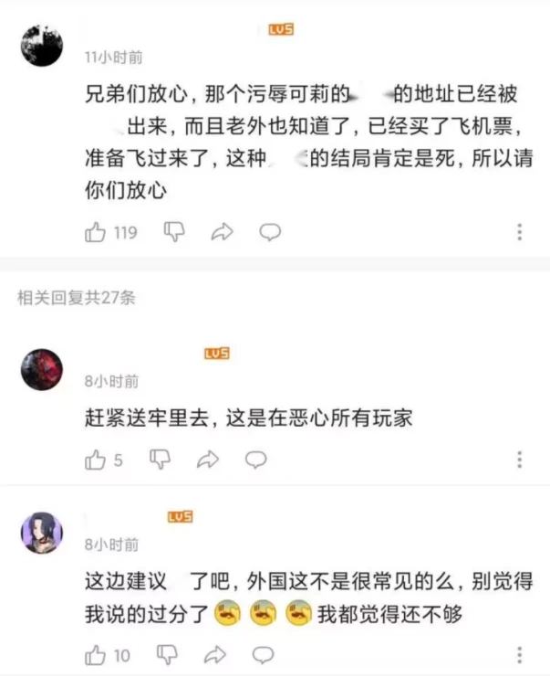
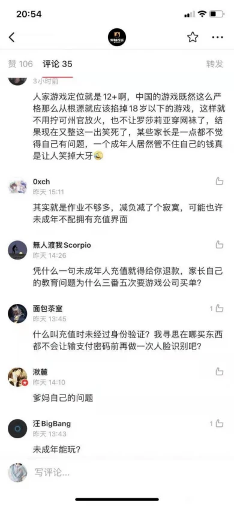

# 原神玩家集体记忆名录万字文
+ [来源：发布时间2023年08月23日 09:01](https://www.bilibili.com/read/cv25928014)

## 前言
本文是我利用自己的闲暇时间所作，从我个人的观察角度去描述原神玩家的部分行为，我不负责对原神玩家的行为做道德判断。如果你自己做了道德判断，那是你自己的事情。

由于原神玩家厌恶各种蔑称的使用，并且会无差别的攻击使用这些蔑称的人，所以诸如“原批”“穹轨”“米卫兵”这类米哈游玩家的蔑称是不会在正文里用来指代某些原神玩家。也不会出现“正常的”“不正常的”等词汇用来形容原神玩家。除了特别需要说明的群体才会使用专有名词，其他地方一律使用“原神玩家”代替。所以读者需要自己结合语境来判断文章中一些地方的“原神玩家”具体指的是哪些人。

文章中需要举例说明某项事物时，会涉及到其他相关群体，所以冒犯是可能会发生的事情。我对事件的描述不一定完全准确，毕竟我不是站在上帝视角去观察整个事件的经过。某些事情有亲身经历，但是没有全程跟踪。所以我描述的内容与实际情况，或你个人所了解的信息有所出入，这都是能够预见的事情。你并不需要相信我说的话，你要遵从自己的内心，相信自己的判断。

因为我是想到哪写到哪，又懒得对整篇文章进行润色，所以文章写的很啰嗦，整体结构也会显得混乱，这是我的写作水平不足导致的。我的文章是可以跳过的，这点要好好利用。当然也可以都不看。

## 南通附中
一位原神玩家在B站上传了一部视频，视频中学生在舞台上表演，而台下坐着学校的领导。在学生表演结束之后，台下的一位领导站起来对节目进行点评。对节目多有批评，要求学生在之后对节目进行调整。后来我们知道，这位训话的领导就是这所学校的校长，而学生正在为学校的校庆排练节目。这种领导“训话”的场景我们在学生时代时常能看到，已经习以为常，这样的视频在互联网一般是不会引起什么水花的。不过既然是原神玩家上传的视频，那就说明这个视频里有我们注意不到的细节。

确实，视频里的一处细节让敏锐的原神玩家捕捉到了。

就是学生在表演时，舞台背后的大银幕会播放学生剪辑播放的视频。校长训话的时候，银幕恰好暂停在草神纳西妲这一幕上。结合校长训话时所说的“这是日本文化”这一句，在原神玩家社区里顿时引发了剧烈的化学反应。在原神玩家那里，说《原神》是日本文化是不得了的事情。《原神》传承中国传统文化，在海外搞文化输出，还得到了国家的肯定，是正儿八经的中国文化。更何况学生在节目中表演的节目是须弥的“花神之舞”，须弥是阿拉伯文化和波斯文化的结合，也不是什么日本文化。校长的这一番言语是对《原神》的亵渎，使原神玩家感觉受到了极大的侮辱。于是愤怒的原神玩家纷纷在评论区表达自己的不满。

在指责校长之前，原神玩家先起手列举了《原神》的功绩，《原神》不仅融合了许多中国传统文化，普及了传统文化知识，还在海外进行文化输出。云堇的《神女劈观》在海外收获了许多外国人的好评，登录央视的网络春晚，弘扬了中国传统戏曲文化，获得了国家的认可。说完《原神》的功绩后，原神玩家就开始指责校长的错误，而且是往大的方向说。校长说《原神》是日本文化就是在与国家作对，是在污蔑国家和外交部的重点文创项目，是明目张胆地在反对中国传统文化。指责错误是不够的，原神玩家还需要让校长知道自己的厉害，让他知道招惹到原神玩家是要付出代价的，于是立即动员起来举报这位校长。

之后原神玩家是质疑校领导接待日本访客的合法性。校领导接待日本访客确有其事，原神玩家展开想象，很快就断定这名日本人就是“日本鬼子”，至于原神玩家为什么这么快就确定，在整个事件发生的过程中原神玩家是没有提起的。顺着这个思路，那么校领导接待日本人那就是接待鬼子，带到学校就是在给鬼子引路。接待的时候表现的那么热情，一定是精日、媚日。如此谄媚很有可能是西方安插在中国的间谍。紧接着就是玩家社区内部各种自媒体开始转发并针对这件事情发表自己的看法，顺势煽动玩家把这所学校和校长一起批倒批臭

经过这一套组合拳，基本上原神玩家就在B站的舆论中占据了优势。只要把事情上升到政治正确的高度，那么在这件事件发酵的过程中，就没有哪个原神玩家敢对这件事情的性质产生怀疑的，如果有，那么他的原神玩家身份可能就会被集体剥夺。如果你有观察过原神玩家在处理类似的事情时，往往都会将问题扩大化，拔高事情的严重性。一个原神玩家可以将自己与他人的争执上升到对全体玩家的冒犯，而且往往能够得到其他原神玩家的支持。

在这件事情还没有尘埃落定之前，这件事传出了外网，虽然不知道是谁传出去的，但是八成跟原神玩家脱不了干系。因为他们是最喜欢向外网广播国内玩家社区节奏相关信息的群体，没有之一。这件事传到了外网成了新闻，有不少的外国人对此进行了讨论。得到了这一消息的原神玩家顿时欢呼雀跃，感叹距离校长赔礼道歉也不远了。看原神玩家这种反应，这件事是他们传出去的就八九不离十了。

然而，原神玩家高兴的太早了。事件的热度冷却很快，校方对此事并没有什么回应，也许是不知道这种事情该怎么回应。毕竟校长训话是每年的必备节目，往年都没什么问题，只是到原神玩家这里就好像犯了死罪一样。至于外网那边，虽说上了新闻，却也没有出现什么外国人前往中国找校长要说法之类的消息。学生的节目经过改动后还是如期上演，原神玩家在骂完了以后，气也消了，然后装作无事发生。之前的举报并没有得到什么回应，可能归口的管理部门也不知道怎么处理，毕竟原神玩家很多对校长的指控是无中生有、无凭无据的。总不能听信原神玩家的一面之词就处理了吧？

## 暗示引导
回顾一下整件事的经过，我们能够发现导致事件爆发的关键因素是“校长说《原神》是日本文化”，然后原神玩家才会有接下来的一系列行为。在这次事件的整个过程中，成千上万的原神玩家都在说自己确实看到了校长在说《原神》是日本文化。

但是他们真的看到了吗？

在目前我们能够看到的视频中，我们能够看到校长在训话，舞台上的银幕定格在纳西妲出现的那一幕，校长也确实说除了“这是日本文化”这句话。但是并没有出现校长有表达过“《原神》是日本文化”意思，也没有说出“原神”这两个字。因为校长并不是因为看到了草神这一幕才开始了自己的训话，而是在观看了学生的节目之后才开始。后来随着事件中披露的信息逐渐增多，许多人都发现学生表演的节目也并不是“花神之舞”，银幕上播放的视频是学生自己利用许多二次元文化作品和音乐剪辑而成，而不单纯只是《原神》的剪辑视频。

看来原神玩家在这次事件中产生了不少幻觉。这个视频从上传到B站开始，其标题和简介就在暗示《原神》是日本文化。原神玩家在结合视频内的大银幕上的草神和校长的训话的内容之后，很容易就会得出校长说《原神》是日本文化的观念。这种观念在原神玩家社区内的讨论后，再加上玩家社区内的自媒体迎合原神玩家的需求，这种观念得到进一步的强化。于是我们就看到成千上万的原神玩家即使没有玩家的看过视频，也会异口同声地在批判校长的错误。

原神玩家的这种观念影响了自己对校领导接待日本访客的态度。原神玩家丑化日本访客为“日本鬼子”并不是出于“仇日心理”，而是为了让校领导接待日本访客的行为失去合法性，那么你们校领导谄媚日本人的行为就是板上钉钉的事情，进而论证校长说《原神》是日本文化是错误的。你们都在接待日本人了，凭什么说《原神》是日本文化呢？

事实上原神玩家并不仇日，他们本身就浸染二次元文化，对二次元喜爱有加。对米哈游的赞美之一就是说米哈游很懂二次元，游戏内二次元浓度越高，原神玩家就越喜欢。原神玩家还把日本有10%的人口玩《原神》作为一种成绩来炫耀。《原神》在日本的流水是原神玩家与其他手游玩家攀比的筹码。日本人对《原神》的夸赞对原神玩家则如甘甜的美酒沁人心脾。

然而原神玩家在进行丑化之前，没有调查清楚这位日本访客的身份。这位日本访客名叫“古屋光司”，是日本山梨学院教育集团理事长。曾在《人民日报》（2021年12月7日03版）刊文。能在《人民日报》第三版刊文的日本人自然也不会是原神玩家声称的“日本鬼子”，至少国家看来不是，用原神玩家的话来说这是得到“国家认可”的日本人。除非原神玩家也去质疑《人民日报》的合法性。

由于当时的原神玩家并没有了解到这一信息，所以在整个事件的过程中原神玩家都在不断的重复对日本友人和学校领导的污蔑和攻击。其实在这个过程中也不是没有人提醒原神玩家，只是当时的原神玩家已经失去了理智，对这样不利于集体团结，动摇集体意志的信息，会自动过滤掉。在狂热状态下的原神玩家，说理是说不通的，他们只会遵循同一个信念，向着同一个目标前进。只能等他们发现自己的行为没有取得任何作用时，他们自己就会反应过来，然后装作无事发生。

在原神玩家社区的历史上，这样的暗示并不是第一次出现。可莉事件时，原神玩家其实已经知道了在明日方舟吧发鬼图的是贴吧的一名用户，然而当有人声称这名用户名叫“崔具宙”时，并且罗列了一份“崔具宙的名单”，原神玩家对此丝毫不怀疑，立刻就去把名单上的B站用户给办了。

服装修改事件时，原神玩家也已经知道了举报的人是在豆瓣的《原神》组，上面的用户名以及她们声称自己举报了《原神》的言论还很清楚。然而当有人罗列了一份这些举报《原神》的“女拳”在B站的账号名单时，原神玩家也对此深信不疑，成千上万的原神玩家不由分就冲了这些B站所谓的“女拳”用户。

崩三玩家也和原神玩家有相同的症状。当有人说爱莉希雅的动画短片被叔叔限流时，在同一时间，成千上万的崩三玩家都声称自己看到了短片播放量出现了负增长，于是开始对叔叔进行审判。当有人说叔叔限流短片是为了推高《纸嫁衣》的热度时，崩三玩家就直接给《纸嫁衣》判决有罪，成千上万的崩三玩家都高呼《纸嫁衣》抢走了应属于爱莉希雅的流量，于是动员起来集体给短片刷播放量，并给《纸嫁衣》差评。令人匪夷所思。

在这个暗示的影响下，每个参与其中的原神玩家都很确信自己在做正确的事情，对自己“施暴者”的身份而欢呼。那这种暗示能起到作用，并不是它有强大的迷惑性，而是它迎合了原神玩家的想象。

## 世界法则
对原神玩家的观察中，可以发现原神玩家的行为特点。

+ 第一，动机明显。原神玩家并不会隐藏自己的动机，甚至会直接告诉你，让你知道自己是因为什么被他们团建的。

+ 第二，喜欢集体行动。原神玩家基本上不会单打独斗，不管是针对个人，还是针对某个组织和群体，他们都会四处摇人扩大自己的优势。另外为了让更多的人看到自己的战功，他们会广泛宣传让更多的人看到受害者的惨状。

+ 第三，易受引导和暗示。原神玩家往往会在行动之前或行动的过程中，受到某些信息的影响，而致使行动偏离方向。受到影响的程度取决于这些信息符合原神玩家对现实想象的程度。而信息的真实程度则影响路线的偏离程度。

+ 第四，反直觉。原神玩家对于事物的判断有自己独特的逻辑，有些你认为是反直觉的事情，在原神玩家那里就是符合直觉的，而且有合理的解释，但你却并不能完全理解原神玩家的言语。

我们在看到纳西妲对着散兵说出“在须弥，囚犯也有接受教育的权利”时，直觉会告诉我们这不合理，因为剧情中的恶贯满盈的散兵在纳西妲的帮助下获得了重新来过的机会，而且还可以在不接受关押的情况下在须弥自由活动，这怎么看都不像是一个囚犯该有的待遇。

但是散兵既作为囚犯，可以享有受教育的权利，也可以享有自由在原神玩家那里是可以共存的。理由就是中国的法律规定囚犯享有受教育的权利，至于中国的法律有没有规定囚犯需不需要接受关押就不在原神玩家讨论的范围内了。只要中国的法律规定囚犯有受教育的权利，那么须弥的囚犯有受教育的权利也是合情合理的。如果你反对，那你就是在质疑法律的权威性。

同样的案例还有之前闹得沸沸扬扬的“浮力大于重力”“植物与人抢空气”“五分熟猪排”“剧毒的蟒蛇”“瘴气遇明火会爆炸”等等。这些在常人看来是反直觉的东西，都能在原神玩家那里得到“合理”的解释。

首先“浮力大于重力”的全文是“浮力大于重力，船就能浮起来。”这个是《原神》某个剧情任务中的一个选项，它的前文是“为什么船能浮在水面上？”根据初中所学的物理知识，船浮在水面上的状态是“浮力等于重力”的。原神玩家则根据选项中“浮起来”这个运动状态坚持认为船能浮在水面上是因为“浮力大于重力”，不然船是无法浮起来的。

其次“植物与人抢空气”是《原神》剧情中纳西妲的一段台词，全文是“高大的树木完全遮蔽阳光，植物与人类抢夺空气，整个须弥都会不再适合生存”。对于大多数中国人来说他们这辈子面临的生存压力不是植物呼吸作用消耗了氧气，相反，在读书时课本上说亚马逊热带雨林是地球之肺，不仅不会认为植物会抢夺空气，还会认为植物在给人类制造氧气。所以就不会产生植物在抢空气的感觉。而原神玩家则认为植物会进行呼吸作用，会消耗氧气，所以就会和人类抢夺空气。比如在密闭的空间里，盆栽放多了，又没有阳光进行光合作用，这个时候植物的呼吸作用就会大于光合作用，消耗的氧气会大大增加。如果有人待在里面，植物就会和人类抢夺空气。另外，就算不是密闭的空间，只要植物遮天蔽日，会导致空气上下不流通，植物呼吸作用产生的二氧化碳就会沉降在树根底部，也会和人类抢夺空气。

第三，“五分熟猪排”也是《原神》里的一个桥段，其全文是“这家店的「烤肉排」用的都是当日新鲜运来的清泉镇猪肉，推荐五分熟，能嚼出天然回甘的肉香。”这里反直觉的地方在于中国人对猪肉的传统烹饪方式是将猪肉烹至全熟，很少会吃五分熟的猪肉。而且猪是杂食动物，体内感染寄生虫的概率高，为了身体健康将猪肉烹至全熟是安全的做法。不过原神玩家认为德国有吃五分熟猪肉的传统，而原神里的蒙德原型是欧洲国家，所以剧情中食用“五分熟猪排”是符合现实逻辑的。

第四，“剧毒的蟒蛇”同样也是《原神》纳西妲的一段台词（怎么又是你），其全文是“就好像我们要对「剧毒」的蟒蛇慎之又慎，但它蜕下的皮，也只是一具空壳。”众所周知，地球上的蟒蛇无一例外都是无毒的，这就是“剧毒的蟒蛇”反直觉的地方。然而原神玩家认为文本中的“蟒蛇”加了括号，所以这里的“蟒蛇”并非人类认知中的蟒蛇。更何况《原神》是架空世界，存在有剧毒的蟒蛇也并没有任何问题。金庸先生笔下的蟒蛇都有毒，那《原神》里面有也是合情合理。

最后，“瘴气遇明火会爆炸”这个来源于《塞尔达传说·王国之泪》中开头塞尔达公主与林克在地下的剧情演示，剧情中塞尔达公主举着火把行走在瘴气之中。然后原神玩家认为这么做是不合理的，瘴气的主要构成成分是“沼气”，在封闭空间里沼气遇明火就会爆炸。原神玩家认为“瘴气”的主要成分是“沼气”，是根据《王国之泪》日版剧情的字幕来断定的。日版的《王国之泪》剧情中的字幕“瘴気”这两个字上面的平假名“しようき”，和日语“沼気”的读音是一样的。所以就有了“瘴气”是“沼气”的观点。不过“瘴气”在我国不管是词典的释义，还是民间的传统观念都不存在瘴气的主要成分是沼气的解释。看过老版《三国演义》的观众都有印象，诸葛亮南征的过程中有遇到过瘴气，这里的瘴气指的是“对人体健康有害的气体”。而且《王国之泪》中有相关的游戏设定具体解释了游戏内的“瘴气”是能够腐蚀武器夺取生命的雾霾，而非沼气。

## 黑丝男孩
这个“黑丝男孩”指的是《原神》上线的男性角色，穿着黑色丝袜，名叫林尼。

最近在原神玩家社区吵得沸沸扬扬。这个案例跟上面的案例的性质也差不多，只是牵扯到了“性别对立”这个话题，让这个问题的激烈程度急剧上升。

不喜欢林尼的原神玩家认为男人穿黑丝不是正常的穿着，《原神》的设计师这么设计目的是为了讨好玩家群体里的“小仙女”，更极端一点的人则会认为林尼这种穿着是男娼的着装，证据就是它和另外一个角色菲米尼的形象与一本日本的r18漫画里的角色十分相像。支持林尼穿着的原神玩家认为林尼的穿着在欧洲的历史上曾经流行，很多名人流传下来的画像都是穿着丝袜的。而枫丹的原型是法国，林尼作为枫丹的角色，穿黑丝是符合历史，符合逻辑的。

但需要注意的是，米哈游曾明确表示《原神》是架空世界。现实中的事物会在游戏内有投射，但是并不一定就完全相同，这一点也是原神玩家的共识。如果枫丹是以法国为原型来制作的，那林尼的穿着在枫丹就不具有特殊性，只要原神玩家在游戏内再找到几个这么穿的角色，或者npc。那么林尼是不是正常穿着就有定论了。

可惜原神玩家目前还没有找到，正反双方都有理由去证明自己的观点是正确，但就是无法说服对方。不过他们之间还是有相同之处的，那就是双方的审美标准。认为林尼的穿着没有问题的原神玩家并不一定就喜欢这样的穿着。回顾一下论证林尼的穿着是合理的那些原神玩家所使用的论据都是用欧洲历史上男性群体中丝袜的流行来证明林尼穿着的合理性。但并没有认为现如今的男性有林尼这样的穿着打扮是合理的，他们并不会用自己也这么穿来证明林尼着装的合理性。

不论是反对林尼穿着的人还是支持林尼穿着的人，他们的审美还是倾向于当代的主流审美标准，即不会认为林尼的穿着符合当代对男性审美的标准。如果它符合当下的审美，那原神玩家就会用实际行动去证明自己观点。在汉服运动早期，很多汉服爱好者穿汉服上街被路人投以异样的眼光，在互联网上也不被理解，但还是会身体力行来表达穿汉服是正常的。经过汉服圈长时间的努力，逢年过节在大街上看到穿汉服的也不会觉得奇怪了。至少是习惯了这样的景观。而那些认为林尼穿着正常的原神玩家，却并不会有这样的觉悟。

当然，人的审美取向是自由的，也不排除“黑丝男孩”符合某些原神玩家的审美标准。只是在这场争论中，这些人比较边缘化，对于议题的走向没有什么影响。只需要顺从，并表示尊重。

## 文化输出
回到南通附中的事件中，原神玩家在事件的过程中指责校长时，会拿着《原神》融入了传统文化来证明《原神》不是日本文化。即便《原神》里杂糅了许多其他国家的文化，那《原神》的内核依旧是中国文化。从某种程度上讲，《原神》里确实有不少中国传统文化元素，只要玩过的人都多多少少能够感受到《原神》里有许多文化符号的灵感是从中国取材的。

借助传统文化来表现自己的游戏内容，这在游戏界也不是什么新鲜事。大家所熟知的《王者荣耀》在这方面就经营了许久，与传统文化联动已是家常便饭。不管是和敦煌研究院、中国三峡博物馆，还是中华书局等，都是《王者荣耀》曾经合作过的对象。也曾以节目的形式，登陆了央视的网络春晚。不过与传统文化联动的次数再多，对玩家来说腾讯的主要目的还是想借助传统文化的影响力来更好的卖皮肤，《王者荣耀》并没有因为联动了传统文化就被玩家抬高到高雅文化的层面。这不难理解。

于是我们能看到这样的景观，《王者荣耀》每年都在寻求与传统文化联动，借助传统文化的表现形式出现在主流社会的视野里。而《王者荣耀》及其玩家被互联网的其他亚文化群体攻击时，或者在主流媒体上出现某些负面新闻时。玩家却并没有利用《王者荣耀》与传统文化的联系来辩护。给自己的游戏披上一层“国家认可”的保护层。他们更在乎《王者荣耀》的下一款皮肤是哪个英雄，售价多少，外观如何。更关注自己在游戏内的体验。其原因自然是王者荣耀玩家不需要传统文化来证实自己玩《王者荣耀》的合法性，是腾讯需要联动传统文化去扩大《王者荣耀》的影响力。

和《王者荣耀》的思路一样，《原神》同样也需要借助传统文化去扩大自己的影响力。大伟哥在接受央视采访的时候说：“我们自己去复盘《原神》，为什么能够在全球取得这样的成绩？其实就是因为我们在创作和宣传的过程中加入了大量的中国的传统元素，并且又用一种新鲜的方式向全球的用户去展现我们传统文化的魅力”。一直被原神玩家津津乐道的《神女劈观》就是在这种思想的指导下诞生的，获得了海内外好评的同时，也登录了央视的网络春晚。让原神玩家自豪不已。

在早期的原神玩家社区，其内部的成员与外界的争论基本上是围绕“《原神》是否抄袭”这个议题展开的。对于那个时候的玩家社区成员而言，否定“《原神》抄袭塞尔达”是社区成员的首要任务。这个时候的原神玩家社区成员对社区文化的建构还是处于“洗清《原神》污点”的阶段，任何所谓的“污点”原神玩家都要给它找到合理的解释。但在进入《原神》公测的时期，原神玩家社区文化的建构就开始进入了“塑造《原神》优点”的阶段。只要有一切能够利用起来塑造《原神》优点的地方，原神玩家就会紧紧抓住不放，以此为基础写一堆小作文和制作几十甚至上百期都不在话下，而“传统文化”就是其中之一。这不仅仅是因为《原神》本身蕴含有传统文化，更重要的是《原神》时常出现在主流媒体的视野中，只要能利用传统文化与主流社会牵扯上关系，原神玩家就不会像王者荣耀玩家那样只在乎自己的游戏体验。而是会利用《原神》与传统文化的联系来证实《原神》文化输出的合法性。

原神玩家文化输出理论的前期建构工作是从角色身上的传统文化符号入手，毕竟先得有传统文化，才能够进一步上升到文化输出，这是理论的基础。比如璃月的建筑是对中国传统古建筑的完美传承。蒙德所展现的思想是传统道家的“无为而治”。另外钟离、甘雨、申鹤的服饰形制、服饰纹样，都能够从传统文化中找到形态相似的参照物。也就有了钟离服饰是“龙袍”“中山装”，甘雨服饰是“旗袍”，申鹤服饰纹样是“忍冬纹”等观点的出现。这些观点的共同特点就是在视觉上让原神玩家联想到所锚定的传统文化符号，不论它们是否真的是同一种东西。另外《原神》部分角色的设计思路参考了一些传统文化符号，比如魈的面具参考了“傩面”，云堇的服饰参考了“京剧”“戏曲”等。这些也都可以被用来证实《原神》这款游戏具有浓厚的中国传统文化元素。

除了需要从视觉上锚定传统文化，还需要在精神内核上去证实《原神》具有中国传统文化的价值理念。首先原神玩家确定了一个基调，那就是《原神》本身所具有的人文精神之丰富是前所未有的。尽管米哈游宣称《原神》是架空世界，但是人文精神是来自中国的传统文化，你仍然能在游戏里找到现实世界中找到许多中国的文化符号，并切实感受到自己置身于中国的传统文化之中。比如游戏里的原创节日“海灯节”让无数的原神玩家都感受到了现实世界中无法在“春节”中感受到的“年味”。 

其次《原神》里部分角色就是传统文化的具象化表现。钟离被推出来宣传是中国传统仁人君子的人格化身，是集中国历代古代帝王所有优秀品质于一身。“魈”是以所有守护中国人民，为中国人民而战的英雄为原型而作，是保家卫国的象征。而后推出的胡桃具有浓厚的道家思想，是中国传统文化中“生死观”哲学思想的完美体现。云堇自不必多说，她是中国传统戏曲文化的集大成之作，代表了中国传统戏曲文化未来发展的方向。如此种种，不胜枚举。

最后原神玩家还会积极地从主导文化那里挪用一部分文本来塑造《原神》的价值体系，马克思主义、人民史观、社会主义等皆在《原神》所表现的价值体系之内。原神玩家通过挪用主导文化的文本，曲解《原神》原有剧情的含义，建构自己心目中的提瓦特世界。也就有了“夜阑”的原型就是我党民国时期在上海的女特工这样的说法。《原神》只有拥有独属于中国的文化和价值观，这样的输出才是原神玩家追求的“文化输出”。原神玩家社区里那些层出不穷的解析《原神》传统文化相关文章和视频都是给《原神》文化输出做的注脚。

而在有了文化输出这面大旗之后，原神玩家就会利用这面旗帜来把《原神》推向更高的地位。而这个过程总是伴随着与其他游戏社区的冲突，因为原神玩家抬高《原神》地位的方式不仅仅是论证《原神》为什么配得上这个地位，还要证明其他游戏不如《原神》。比如《王者荣耀》也喜欢搞点传统文化联动，还把自己的节目弄上央视网络春晚。按照原神玩家的逻辑，这也是国家认可的表现。可即便如此，原神玩家也没有对《王者荣耀》与传统文化上的联动表示过认可，而是想方设法的证明《王者荣耀》没有文化内涵，至少没有《原神》有文化内涵。包括王者荣耀玩家在内的手游玩家群体，他们往往是被动参与到原神玩家设置的议题当中。如果参与了原神玩家的议题，难免引发不必要的争吵，而且会因为人数上的劣势而陷入到单方面挨打的境地。然而就算你不参加，原神玩家也会在玩家社区里重复讨论这个议题。

## 国家背书
大伟哥的在面对采访时的表现是十分谦虚的，从他的话语中能够看到他是认为《原神》有现在这样的成绩，是因为融入了传统文化。可见大伟哥是想表达是传统文化成就了《原神》。不管是真心话的还是客套话，至少大伟哥的态度是端正的，如果要利用传统文化进行宣传，那传统文化必然要摆在首要位置，这样会显得传统文化之于《原神》的重要性。而原神玩家则不会去考虑这一点，原神玩家认为传统文化因为《原神》的宣传得到了更多的曝光度，也因此得到了弘扬和发展。 

早些时候《原神》联动张家界、桂林景区，原神玩家就很自豪的宣称《原神》在宣传祖国的大好河山，让更多人领略祖国风景之美。在“魈”这名角色上线之后，原神玩家就表示，许多中国人是通过“魈”才知道“傩戏”这项传统文化的存在。在《神女劈观》火热的时间内，原神玩家就认为米哈游通过借用传统京剧文化中的美术特征，以此来吸引更多的人学习并了解京剧文化，给传统文化增加了曝光度。所以对原神玩家来说《原神》有给群众普及传统文化知识，进行文化扫盲的功能。原神玩家在这场扫盲运动中受益匪浅。

原神玩家对传统文化与《原神》之间的关系的看法直接作用于他们的文化输出理论上。在原神玩家看来，在中国，从有历史记录开始《原神》的文化输出是没有任何一部文化作品能够企及的高度，是处于前无古人，后无来者的层面。几十万外国人凌晨收看《原神》的版本前瞻，试问还有谁能做得到呢？毫不夸张的说中国在文化形象上的正向塑造全都是依靠《原神》才能够实现。于是我们发现，原神玩家的文化输出里，我们国家在其中扮演的角色并不突出，原神玩家很少会谈到我国对《原神》的文化输出起到什么作用。往往是强调《原神》在文化上的建树，和在海外文化输出的成就。

在另一边，《流浪地球》的导演郭帆在接受采访时说道：“科幻是需要国家背书的，因为我们国家可以了，我们的科幻才可以成立”。“我们唯一的现实支点是什么？就是我们国家的力量。我们在新闻中看到航天员出舱，玉兔登月，看到我们的天宫，看到火箭的发射，一直都是这些力量在帮我们背书——因为现实中他们就在那儿，所以观众在电影中看到这些东西的时候，才不会感到意外。”这样理解国家与文艺创作的关系，在原神玩家那里是很少能看到的，对于原神玩家来说《原神》能否进行文化输出并不依赖国家背书的，甚至不需要依赖传统文化。在原神玩家对文化输出的解释中，有这么一条解释“文化输出，重要的是输出，而不是文化。你的文化产品走不出去，谈何输出呢？”，由此可以看出在原神玩家社区的文化输出爱好者那里，喜欢输出更甚于喜欢文化。

但这并不是说国家的背书对原神玩家不重要，从“刻晴”出现在央视的2020年度图鉴表上开始，原神玩家就认为《原神》已经获得了央视的认可，而央视又是国家媒体，那就是获得了国家的认可。后来《原神》出现在《国家文化出口重点项目名单》上时，原神玩家认为“文化出口”就是“文化输出”，于是确定了《原神》的文化输出是得到了国家的认证。于是我们才能经常看到原神玩家说《原神》的文化输出得到了国家的认可，足以说明国家的背书对原神玩家的重要性。只不过原神玩家着重于理论的建构，其次才是背书。国家是否背书并不影响《原神》文化输出的合法性。因为在国家还没给《原神》背书的时候，原神玩家已经给《原神》建构了一整套文化输出理论。

## 挟洋自重
《原神》的文化输出的实现除了需要传统文化以外，还需要外国人在接触《原神》以后给原神玩家带来正反馈。这种反馈可以是海外流水、社群夸赞、线下活动、实体广告等等。然后这种反馈又被国内的自媒体以各种形式输入到国内的原神玩家社区里。被原神玩家用来建构自己的身份，和作为《原神》文化输出的佐证。原神玩家社区里的烤肉up所制作的视频，其内容也无外乎这些东西。

原神玩家的文化输出这套理论是建立在《原神》融入了中国传统文化的基础之上，而后通过与外国人产生了互动，得到了外国人的正反馈才得以实现。如果得不到外国人的正反馈，原神玩家的文化输出理论就缺失最重要的支柱。你仔细想一想，为什么原神玩家只把某些角色推出来当做文化输出的典范，而有些角色却没有这种待遇。并不是这名角色身上没有什么传统文化的痕迹，只要原神玩家想，就算这名角色是以日本浪人的形象为原型创作的，也能够给你解释成中国武侠精神为内核。显而易见，有些角色没有吃到文化输出的红利，只是因为原神玩家没有在外国人那里找到对这名角色的正反馈。

所以比起国家的背书，外国人的正反馈才是原神玩家急切追求的事物。原神玩家外网的消息要比其他手游玩家社区要灵通，原神官方新发布的视频原神玩家自己还没有看完的时候，“外国人看《原神》新视频”等相关咨询就纷纷出现。因为原神玩家社区里有专门搬运外网消息的自媒体在运作。在原神玩家社区里，尽管那些自媒体的视频没什么技术含量，视频内容也不是自己的，文案可能也不是自己写的，但是它获取的流量一直比《原神》的同人创作稳定。在B站，外国人夸奖《原神》的视频可以轻易获得几十万的播放量，而一部耗时费力精心制作的二创视频有几十万播放量已是十分不错的成绩。这在原神玩家社区是最为常见的景观。

曾经有《原神》的同人创作者抱怨自己的作品没有得到自己预想中的关注，部分原神玩家也在抱怨看二创的人越来越少。出现这样情况原因并不是出在创作者身上，也不是二创作品太多了看不过来。同人创作者可以利用二创作品在玩家社区的社交价值来塑造自己的身份和获得玩家群体的认可，玩家从中得到的是精神上的享受。而外国人的褒奖能塑造整个《原神》的形象，受益的是《原神》和原神玩家群体。原神玩家需要外国人的褒奖来建构自己的身份，而二创作品的最大收益者是创作者个人，它给原神玩家带来的身份认同远不及外国人的夸奖来的强而有力。玩家社区内的二创作品再多能留下来的经典作品凤毛麟角，而“环大陆好评”却是可以成为一直用来炫耀的身份标签。

而这种身份标签也就成了原神玩家用来建构鄙视链的一环。原神玩家瞧不起《王者荣耀》的众多理由中，其中一点就是它没有外国人玩。一款游戏的外国玩家数量是原神玩家用来判定游戏优劣的重要指标，数量的多少决定了游戏质量的高低。按照原神玩家自己的说法，因为外国人从小都接触各种3A大作，其游戏审美水平一定会比国内的主机天龙人要高，他们都觉得好玩，给了很高的评价，那这款游戏就是好游戏。原神玩家在评价《原神》的时候总是少不了拿各种外国游戏媒体的评价和奖项来佐证《原神》的优秀。

不过，当原神玩家在外国人那里得到负反馈时，原神玩家就不会无条件的接受，而是会坚持自己对《原神》的看法，或者寻找出现这种负反馈出现的解释。比如说《原神》在没有获得tga奖项之前，原神玩家是认为tga是野鸡奖，没有什么含金量。因为tga曾经给《美末2》颁布年度最佳，含金量已经大大降低。而当《原神》获得了年度最佳手游奖时，原神玩家就认为tga是游戏界的奥斯卡，含金量是不容置疑的。但是你让原神玩家把《原神》与《codm》摆在同一位置，原神玩家是不愿意的。因为原神玩家认为《codm》是依靠《cod》这个ip才得到的奖，和《原神》这种原创ip是不能够相提并论的。于是你就会发现，tga给很多手游颁发过年度最佳手游奖，但是在《原神》获奖之前，这个奖项是没有任何含金量的。即使在《原神》之后，那些获奖的手游也没有含金量。

这么看，外国人的看法对原神玩家来说，不说是亦步亦趋，但也是至关重要的。但这有一个前提条件，那就是这种评价是否有利于《原神》，如果不能，那外国人就会在这个时候被原神玩家忽视。比如原神玩家最喜欢夸赞《原神》的地方就是音乐，认为《原神》有国内最好的音乐团队，音乐的品质在国内是最顶级的，毫不逊色国外优秀的游戏作品的音乐，处于游戏业界前列。还喜欢开音乐会来回馈玩家，试问国内还有哪个游戏企业能做得到呢？原神玩家喜欢看那些“外国人夸赞《原神》音乐”“外国人鉴赏《原神》音乐”的视频。这些视频存在的意义就是《原神》的音乐得到外国人认可的证明。

然而对于国内其他游戏的音乐，原神玩家就看不上眼了。比如原神玩家就瞧不上《王者荣耀》的音乐，尽管腾讯请了外国的大师级人物，如汉斯季莫、久石让等来为《王者荣耀》作曲，但是你的音乐是外包的，做得再好也不如《原神》。另外原神玩家对《明日方舟》音乐的态度也是如此，《明日方舟》的音乐也是由外国人作曲，还获得了“好莱坞音乐传媒奖”的提名，但是你的音乐不是自己的团队做的，就是不如《原神》。在这些例子中，外国人在原神玩家这里就不重要了。

不过，原神玩家渴望得到外国人的认可，从某种程度上讲是因为在国内的游戏圈得不到自己想要的地位。自《原神》撕裂国内游戏圈的舆论以来，原神玩家一直处于游戏圈鄙视链的下端，不仅仅是主机圈的玩家群体看不起，连手游圈的玩家群体也不待见。四年以来长期遭受这些玩家群体的歧视。但是原神玩家之间报团取暖并不能满足自己追求认可的需求。那么既然在国内寻求不到认同，那自然会向国外去寻求认同。这就是原神玩家寻求外国人认同的背景，而这也导致了原神玩家社区产生一种观念，那就是“如果米哈游是日本/外国公司就好了”。这种观念的产生，是原神玩家认为国内的游戏圈普遍崇洋媚外，如果米哈游或者《原神》换一个国籍，那么国内的游戏圈就会更加宽容的对待这款游戏，以及它的玩家群体，就不会有那么多的节奏，玩家社区也会越来越和谐。不过，这种观念更倾向于一种玩笑，因为这个观念与原神玩家建构的文化输出相矛盾，《原神》不可能一边作为中国文化的代表，一边又可以不是中国国籍。

## 文化扫盲
《原神》融入传统文化的行为，提高自身的文化内涵，在某种程度上引起了玩家的共鸣。原神玩家以此来建构自己社区文化的同时，也会用来建构自己的身份。从原神玩家第一次提出米哈游是在做“文化扫盲”开始，原神玩家便开始建构自己的身份。在之前提到原神玩家声称许多人是因为“魈”的出现才了解了“傩戏”，“云堇”及《神女劈观》的登场也把京剧文化带入到更多人的视野中。但我们需要明白的是《原神》利用传统文化制作的这些内容，主要面向的群体，还是原神玩家本身。所以原神玩家提出的“文化扫盲”中扫盲的对象，主要群体就是原神玩家，而不是不玩《原神》的群体。这就意味着在进行“文化扫盲”之前，原神玩家对传统文化的了解程度是处于“文盲”的状态。

于是“文化扫盲”就给原神玩家带来了一次身份上的转变，从对传统文化不了解的状态，转变成了解的状态。从无感且被动地接受传统文化的状态，转变成喜欢且主动去了解传统文化的状态。这种身份上的转变，增强了原神玩家的凝聚力，给了原神玩家非常大的自信和勇气。在外界指控“魈”的面具不是“傩面”而是日本的“能面”时，原神玩家能够据理力争，用实物来证实这就是“傩面”。在外界质疑“云堇”和《神女劈观》是否是京剧文化时，原神玩家能利用戏曲各界的名角重新演绎《神女劈观》的方式来给《神女劈观》背书。在当时原神玩家还能够勇敢的批评京剧吧吧务组缺乏对京剧文化的了解。这在“文化扫盲”前是从来没有过的行为的。这种勇气的来源不是自己对京剧的了解程度，而是自己的身份，以及背后的原神玩家群体的支持。

 “文化扫盲”既是一个过程，也是一个结果。原神玩家在“文化扫盲”的过程中获得了新的身份，传统文化成了原神玩家在网络社区里的身份标签。这也解释了为什么外界在质疑《原神》里传统文化的真实性时，原神玩家很容易就会被激怒。我们能在“忍冬纹事件”“南通附中事件”等与文化相关的事件中发现原神玩家表现的易怒和狂热。因为传统文化是原神玩家建构身份和社区文化不可或缺的组件，你质疑《原神》传统文化的真实性就是在否定原神玩家的身份，更进一步讲是在否定《原神》文化输出的合法性，原神玩家怎能不愤怒呢？

然而，尽管原神玩家从《原神》的“文化扫盲”中获得了新的身份，但是原神玩家对传统文化的兴趣并不长久，他们对传统文化的热情是随着米哈游的营销活动而起伏的。当米哈游利用传统文化来宣传《原神》时，原神玩家社区对于传统文化的讨论就开始激增，玩家社区内各种自媒体有关解析《原神》传统文化的视频和文章等相关内容比比皆是。而当宣传减弱时，原神玩家的注意力就会逐渐从传统文化身上离开，转而去关注其他游戏相关的内容。直到米哈游下一次营销活动开始前，传统文化在原神玩家社区内只会处于一种无人问津的状态。

和京剧吧里的京剧文化爱好者，以及其他依托互联网组建的传统文化爱好者圈子相比，原神玩家并不能像他们一样对传统文化保持长久的热情，这些传统文化爱好者组建成圈子是一种主动行为，而其身份的获取是通过对传统文化的学习、练习、实践得来的。没有通过“文化扫盲”就获得身份的原神玩家来的那么简单。早期原神玩家社区的形成，依靠的是社区成员对二次元文化以及《原神》的喜爱而聚集在一起，而不是传统文化。即便是在原神玩家社区急剧扩张的时期，所吸纳的成员也大多是二次元群体或泛二次元群体，也不是因为喜欢传统文化才汇聚于此。时至今日，原神玩家玩家依然喜欢强调自己玩家群体对二次元文化的热爱。

原神玩家对传统文化的接受程度，得是在二次元文化的审美标准下，以二次元的表现形式展现的传统文化符号才更容易得到原神玩家的喜爱。根据原神玩家的考据，“钟离”服饰的原型为“中山装”，但是“钟离”真的这么穿，原神玩家是不愿意看到的，而且也不好看。如果“魈”的面具不是现在的模样，而是直接照搬它的参照物“傩面”，那还会得到原神玩家的喜爱吗？原神玩家可以反复观看收听《神女劈观》几遍甚至几十遍，可以参加《原神》每一次的漫展，被《原神》的每一段剧情感动，但当你让原神玩家收看cctv-11，完整的看几场京剧演出，恐怕也是勉为其难的。

当然，没有人可以颁发“传统文化爱好者”的身份证件，在互联网上，这只不过是一种虚拟的社交身份。原神玩家只要能够自我认同这个身份，每天心念口诵，那即使没有表现出对传统文化的热情，任何人也不可以剥夺这个身份。

## 禁军之墙
回望南通大学附属中学事件的整个过程，就能够注意到一处细节，就是当这个事件被传入外网，就能令原神玩家欣喜若狂，如久旱逢甘霖。在原神玩家身上出现这样的反应并不奇怪，原神玩家社区里一直有着外网“米禁军”的观念，即认为外网的原神玩家是战斗力最强的原神玩家群体，集忠诚和勇猛于一身。

这种观念的形成的具体时间已不可考，早在2021年8月的可莉事件时，这种观念就已经形成。在当时，有不少的原神玩家笃信可莉事件已经传入外网，外国人已经怒不可遏，急不可耐地要来中国解决“崔具宙”。当得知“崔具宙”先生在匈牙利时，原神玩家当即宣称欧洲的原神玩家将手持申根前往匈牙利干碎“崔具宙”。不管现实中的崔具宙有没有真的被干碎，至少在国内的互联网上它已经被干碎了。

原神玩家对外国人的这种特殊感情，也使得他们比外国人对《原神》的各种节奏还要敏感。在2022年初的时候，原神官方发表声明宣称要修改国服游戏内的四位女角色的服装表现，其他服务器则不受影响。在外国人还没有反应过来时，原神玩家已经认为此举会引起“友邦惊诧”。同时宣称审核部门做的这项决定会限制文艺作品的创作自由，毁灭中国游戏的未来，届时《原神》的文化输出的成果将被破坏，有损国家形象。

原神玩家明白，国内与外国的原神玩家是存在文化差异，和信息不畅的情况。在国内发生的节奏即使洪水滔天，也未必就能引起外网的响应。但是为了凝聚国内的原神玩家社群，有时候不得不选择性的摘取、夸大、甚至虚构一些外网信息来给国内的原神玩家社区营造一种众志成城的氛围。原神玩家大多是通过接收自媒体加工后的信息来了解外网的世界，这些外网信息能得到原神玩家的认可，无关乎它的真实性，而是它恰好满足了原神玩家对外网世界“米禁军”的想象。

在原神玩家还在四处宣传《原神》几十个国家登顶的时候，我们能够发现这些登顶的国家中，除了欧美国家之外，有不少是非洲或者东南亚的国家。而在《崩坏星穹铁道》150多国下载榜登顶的时候，这里面有一些是人口很少，国土面积很小的国家。在数量上，第三世界国家还是多数的。但是在原神玩家所接受的外网信息，其来源还是以欧美或日本为主。由此，就能得知原神玩家所构想的“米禁军”的成员是由欧美国家和日本的原神玩家组成，而不是第三世界国家的原神玩家。因为原神玩家对“米禁军”的想象取决于自己所接收的外网玩家社区信息，原神玩家不可能去想象自己从来没见过的事物，不然原神玩家就会去想象宇宙的某个角落，一个高级文明为了玩《原神》正以十分之一的光速向太阳系赶来。

根据原神玩家对“米禁军”的描述，“米禁军”至少包括这些特征：1.对米哈游和《原神》保持忠诚。2.能够大量给《原神》消费。3.能主动维护玩家社区的秩序。4.玩家之间和谐友爱，守望相助。5.战斗力强悍，出师无往不利。6.群体成员众多，遍布五洲四海。这样完美的玩家群体不像是自发形成的，只会是一个结构完善的，管理高效的组织。或者宗教团体。以米哈游目前的影响力，可以确定外网的原神玩家社区并不存在这样的组织，即便存在它的规模也不会很大。所以“米禁军”不是具体的、真实的存在，而是原神玩家自己虚构的“幻象”。

这样的“米禁军”更接近于原神玩家理想中的自我。现实中的原神玩家想要成为“米禁军”，却又长期处于想成为而又无法实现的状态。想要维护玩家社区却又内外交困，外面恶毒的“米黑”总是杀不尽灭不绝，时时刻刻都在找机会攻击玩家社区。而盘踞在社区内的“老东西”不肯爆金币又不肯安安静静去死，对社区内的维护米哈游的积极分子嗤之以鼻，整天想着看米哈游的笑话，随时准备开香槟。穷则思变，原神玩家并不会选择坐以待毙，于是原神玩家社区出现了“仙家军”这样的松散组织。

但“仙家军”毕竟不是“米禁军”。“仙家军”的形象基本上都是“米禁军”各项特征的劣化版。本质上与原神玩家没有区别，但在表现形式上又有别于其他原神玩家，处于一个不上不下的层次。这是必然的，“米禁军”是原神玩家向着完美的方向去塑造的，而“仙家军”则是实践的结果。“仙家军”的目标在未来，因为他们无法在现在实现自己的目标，只能每天重复去做他们认为能够让社区变好的事情，坚信只要穿过充满荆棘的泪谷就能达到梦寐以求的“应许之地”。然而“米禁军”却已经在大洋彼岸建立起了自己的“地上天国”。这就解释了为什么原神玩家不会掩饰自己对外网原神玩家社区的羡慕，夸赞外网社区的和谐友善，无时不刻都在期待“天国”的降临。

## 广播纪元

想象归想象，“洋来了”的故事讲多了，即使是忠实的原神玩家也会产生动摇。于是聪明的原神玩家转变了自己的思路。既然双方存在语言不通的情况，致使外网不能很好的理解国内的原神玩家的诉求，那就化被动为主动，自己把国内节奏的相关信息搬运到外网的原神玩家社区里。比如可莉事件的时候，原神玩家就曾化身“执剑人”威胁“崔具宙”说自己要把可莉事件的相关信息传播到外网，也确实真的这么做了。另外，现在已经被原神玩家除籍的八个蛋老师曾经主动把幻塔工作室泄露身份证的事情搬运到外网，着实恶心了不少幻塔玩家，但却让原神玩家兴奋不已。

就在今年七月末，一位原神玩家在外网的红迪社区发文控诉中国的原神玩家社区，其内容主要为指控NGA和贴吧等原神玩家社区对散兵这名角色的仇恨行为，包括但不限于

+ 1.扭曲散兵的剧情故事，污蔑散兵的人设。
+ 2.挑起玩家之间的性别对立，攻击女性玩家。
+ 3.骚扰、攻击、人肉散兵的粉丝和米哈游的编剧。
+ 4.向政府单位举报散兵等。

显然，这篇文章是自《原神》3.3版本散兵登场以来的节奏的延续。这篇文章的背景就是散兵这名角色从3.2版本登场开始就撕裂了原神玩家社区，导致了原神玩家之间的对抗，在3.6版本双方的矛盾被彻底激化，同时还牵扯到了另一名曾经得到原神玩家万千宠爱的角色纳西妲。双方针对散兵这名角色，以及牵扯其中的纳西妲进行了旷日持久的斗争，包括但不限于撰写文章、视频吐槽、人身攻击、散布谣言、绘制鬼图、人肉搜索等等。

原神玩家这么喜欢把国内的节奏搬运到外网，是出于对“米禁军”无条件的信任，希望能够得到外国人的一臂之力。当然外国人不会真的来中国互联网出征，也不会线下真人快打。原神玩家需要的仅仅是外国人能够跟着一起骂几句，然后原神玩家社区的烤肉博主再把这些话剪辑做成视频，再配上一个吸引眼球的标题，立即能让原神玩家欢欣鼓舞，觉得自己不是一个人在战斗。

寻求外国人的帮助，这就意味着原神玩家认为自己无法依靠自身的力量去改变玩家社区的现状，至少是处于想改变而无法改变的状态。需要有能力且道德水平更高的势力来介入。但这又体现出原神玩家矛盾的一面，在之前有写到米哈游修改角色服装一事，原神玩家认为此举会引起“友邦惊诧”，担心这种信息传到国外影响国家形象。但是原神玩家自己向外网广播国内社区的负面信息时却不会有这样的担忧，反而认为外国人需要，也必须知道这些事情。从可莉事件、服装修改、再到最近的南通附中、散兵文章一事，原神玩家都在马不停蹄地向外广播国内原神玩家社区的负面消息。

到这里我们就能发现，每一次国内原神玩家社区的节奏传入外网，原神玩家都会很兴奋。说明在原神玩家那里处理国内的玩家社区节奏是远远要优先于他们的文化输出的。虽然原神玩家每天都在宣传《原神》在海外的文化输出，但是原神玩家自己在传播中国传统文化方面却并不积极。

比如这次原神玩家在外网撰文控诉国内的原神玩家社区，肯定不是在宣传中国传统文化，而是希望能引起外国人对自己的文章的共鸣，然后网络升堂审判国内的玩家社群。外国人对中国的敌意越强，文章作者的目的就越容易实现。如果外国人因为《原神》的文化输出而对中国的印象产生了改观，那作者在外网撰文的作用就大打折扣了。所以那些喜欢往外网广播国内玩家社区负面信息的原神玩家反而是最不希望《原神》文化输出能够实现的人。

## 开除国籍
原神玩家为什么一定要把南通附中的校长批倒批臭是因为《原神》被原神玩家拔高到“政治正确”的层面，并以政治正确的标准来加以衡量。当校长说《原神》是日本文化时，他的行为就不只是对原神玩家的冒犯，而是犯了政治错误。这是在否定《原神》文化输出的合法性。而《原神》又是国家钦点的重点文化输出项目，你否定它的合法性就是在否定国家的合法性。进而定性为“卖国”“反华”。

在原神玩家社区早期的形成阶段（2019年6月《原神》第一个pv公布到2020年9月公测）。这样的话术还并没有出现在原神玩家社区内，当时玩家社区在维护《原神》时所使用的话术还是以反驳“《原神》抄袭论”为主，而不是直接开始质疑你的政治立场。当时的玩家社区成员是以《崩坏3rd》的玩家群体为主，而且米哈游还没有开始积极地向主流社会靠拢，用作品去强调自己的社会价值，其制作的作品内容更倾向于二次元文化。所以在这个时期是不会有给原神玩家社区成员借题发挥的可能的。

这种话术的形成是在《原神》公测之后，具体来说是在《原神》的钟离上线之后。这个话术的建构分三步走，首先原神玩家先建构其“文化输出”的理论，利用传统文化作为连接《原神》与主流社会的桥梁。然后将《原神》与国家利益挂钩，反复强调《原神》在海外文化输出，塑造大国形象，赚取大量外汇，缴纳巨额税收。最后将《原神》上升至政治正确的层面，直接指控你反对《原神》就是反华。

在原神玩家看来，大多数二次元手游和主机玩家群体内部长期消费的产品都具有浓厚的外国文化，很少会讲中国故事，都是被外国文化输出的对象，这些游戏产品不太“正确”。比如《明日方舟》没有中文配音（曾经没有），龙门独立（指香港）。《碧蓝航线》有日本船（二战时期的那种），给日本军舰捐款（三笠公园）。《阴阳师》是纯纯的家乡味道（日本文化）等。主机玩家群体就更不用说了，玩的基本上是国外的游戏。而且这些人普遍都对原神玩家抱有敌意，瞧不上《原神》，贬低原神玩家的爱好。玩外国人的游戏，攻击国产游戏，这是不能接受的，必须予以打击。一般来说原神玩家使用常规的攻击手段，从游戏设计的角度去评判游戏的优劣，对付其他二次元手游是绰绰有余的，毕竟大多数二次元手游在质量上都不尽如人意。但原神玩家则很难在主机天龙人那里占到便宜的。因为原神玩家自己建构的游戏鄙视链，它的基础就是天龙人的游戏鄙视链。你怎么能用我的鄙视链来对付我呢？

所以每当原神玩家与这些群体产生冲突时，这套话术就开始发挥它的作用。“反原就是反华”，当这样的指控被扣在那些反对派身上时，这些人就顾不上去思考《原神》有什么问题了，而是会反驳原神玩家对自己的反华指控。但是反驳是没用的，“反原就是反华”这句话在原神玩家那里倒过来也能够成立，就是“你支持中国那你就要支持《原神》”，如果你要反驳原神玩家对你反华的指控，那你证明自己支持中国就得证明你支持《原神》。于是这里就有了“你要反对《原神》那你就得支持《原神》”的矛盾。原神玩家只要把对游戏本身的讨论转换成对政治立场的讨论，那么对《原神》的攻击自然就会被化解。

 “反原就是反华”这种观念就是典型的非此即彼，它被建构出来的目的就是用来扫清社区内外的反对派。所以对待《原神》的就只存在“支持”“反对”两种态度，不存在“中立”或者“关我屁事”的态度。一些对《原神》不抱有敌意的游戏自媒体，发表对《原神》的看法，即使表达的观点大多都倾向于《原神》，只要有一点不能让原神玩家满意都会被原神玩家扣上“游戏公知”的帽子。你仔细观察B站上的那些讨论《原神》游戏设计，或相关问题的视频，无论其观点是否准确，是否符合客观实际，只要有表达出对《原神》任何的不满，或者认为游戏内存在不合理之处，其up或多或少都有遭到过原神玩家的攻击.

当然，也不只是《原神》，你讨论《崩坏3rd》《崩坏星穹铁道》游戏设计的相关问题也很容易被原神玩家定点打击。比如《崩坏星穹铁道》这个游戏除了部分主线剧情不能自动战斗以外，大多数玩家在大多数时候都是选择自动战斗和两倍速来完成战斗的。《崩坏星穹铁道》的游戏策略更多的是在游戏对局开始之前完成，因为玩家大多数时候思考的是怎么配队才能更顺利的挂机通过。在战斗机制上，《崩坏星穹铁道》没有许多传统回合制游戏都有的机制，比如“防御”“空过”“回合内使用道具”等。所以就被不少回合制游戏爱好者认为战斗内缺乏策略性。确实，米哈游制作《崩坏星穹铁道》的着重点在于世界观架构，角色塑造，剧情演出上，在战斗玩法上是做了减法的，所以才有了现在看起来比较简单的回合制战斗，玩起来感觉无聊是正常现象。这一点原神玩家明白，但是你不能点破。你点破它就是对原神玩家的冒犯，是对原神玩家人格的侮辱，那么对你的无差别攻击就如同山呼海啸般袭来。

## 化境飞升
原神玩家很乐于在主流媒体上看到《原神》的身影，不管是媒体采访也好，还是刊登在某个报纸上，还是登上某个电视台的节目，对原神玩家来说都是至关重要的。即使是主流媒体在节目中使用了《原神》的背景音乐，也能让原神玩家激动万分。然而，这些都有一个前提——不能是《原神》的负面信息。像小孩偷偷使用父母的钱在《原神》里氪金抽卡之类的新闻，原神玩家是不愿意看到的，如果看到了就会大肆批判父母没有看好孩子，觉得父母要求厂商退钱的诉求是无理取闹，宣称未成年人氪金和游戏无关，责任全在父母身上。

主流社会对于未成年人偷用父母的钱在游戏里大量消费的态度一直都是不支持的，父母有权利要求厂商全额退还消费金额。包括对直播行业里未成年打赏的态度也是如此，没有讨价还价的余地。就算是腾讯，《王者荣耀》收到家长要求退还孩子的消费申请，也得全额退款。各直播平台也遇到过未成年人打赏然后被要求退款的现象。

我们都知道未成年人缺乏自控力，很容易出现冲动性消费。从那些未成年人在手游里氪金的新闻可以发现，这些孩子的父母，大多工作忙碌很少有时间去陪伴孩子，只是把手机扔给孩子自己消遣时间，怎么会及时发现孩子花了那么多钱呢？如果能够及时发现，那这种新闻也不会出现。就像原神玩家的父母也不全都知道自己孩子对米哈游比对待自己还要热情。所以为了减少这种情况的发生，铁拳才会让游戏厂商自己加强对未成年人消费的管控和限制。那些大肆批判家长的，认为责任全在父母的原神玩家大概也没有成为父母，自然也不会站在父母的立场上考虑。

从这里我们就可以看出一些端倪，原神玩家不是任何时候都会与主流社会的意见保持一致，有时候是会发表反对意见。在上面写的南通附中的事件，附中的校领导接待日本友人来访，这个在主流社会里是常规的接待礼仪，而对于原神玩家来说这不是礼仪，而是谄媚的，有损国格的。接待日本友人当然不会有损原神玩家的利益，只是这个学校的校长对原神玩家出言不逊，那我们原神玩家也就顾不得那么多了。另外主流社会对于网络暴力的态度一直都是反对的，而在可莉事件，以及数量众多的原神玩家团建事件中，原神玩家常常都会使用网络暴力来达成自己的目的，而且不会认为这些行为有什么不对，认为这是一种必要之“恶”。

原神玩家这样的表现在过往的历史中也能够找到，在2021年8月30日国家宣布加强游戏的防沉迷模式的时候，米哈游也随即宣布跟进，公布了自己的防沉迷措施。收到此消息后原神玩家立即感受到前所未有的恐惧，引发了原神玩家强烈的抵抗，一时间整个原神玩家社区都在声讨该项政策。反对的声音主要有三类，第一是认为加强防沉迷系统是不合理的，应该取消。第二是对铁拳表示强烈的不满。第三是阴阳怪气“闭关锁国”，“大清药丸”等等。另一件事就是在上面有提到的角色服装修改的事，这件事发生在2022年1月5日。米哈游因为不可抗力因素修改了四名角色的服装，原神玩家知道后也出现了相似的反应，愤怒地表示“你们都玩的真人，却不允许我们玩纸片人”。

原神玩家有这样的反应自然是从自身的利益出发，防沉迷加强了，如果自己已经成年那还好说，对自己没什么影响，反应也不会那么激烈。如果自己未成年，那自己的游玩时间就会减少，要等到成年才能正常玩游戏这自然是无法接受的，所以才会极力反对。而修改角色服装一事自不必多说，玩《原神》很重要的一部分原因就是为了收集和养成自己喜欢的女角色，很多人就是冲这个来的。你把角色改难看了，这无疑是会影响我的游戏体验的，而且谁能保证你以后不继续修改其他角色呢？这也是让原神玩家感到恐惧的地方，他们担心铁拳会毁灭他们热爱的二次元文化。

主流社会一直都认为网络游戏会让人沉迷，给游戏加上防沉迷系统是早在2007年就有过的措施，现在只是升级加码了而已。而和谐游戏内的角色服装等内容，也是常规操作。部分二次元手游的软色情内容是游戏的卖点之一，而软色情在主流社会是难登大雅之堂的，因此“和谐”是这些二次元手游几乎都有过的经历，《战舰少女r》《少女前线》《碧蓝航线》《崩坏3rd》等等就受到这样的照顾。在提到的这些二次元手游还没有出现的时候，经历这些的是日本动漫，下架、封禁是每年都会发生的事情，在当时部分日漫痴对日漫被封的反应要远比原神玩家还要激烈，经历过的人都略有耳闻，在这里就不展开讲了。

如此看来原神玩家和主流社会之间也不像他们说的那样亲密，对于主流社会的价值取向也不是照单全收。可以确定的是在《原神》以正面形象出现在主流社会的视野时，原神玩家会认为《原神》得到了国家的认可，拿到了丹书铁券。这个时候的原神玩家自然就会保持着对主流社会的认同。而当《原神》以负面的形象出现在新闻媒体上，以及国家推行政策，例行公务触及到《原神》，或原神玩家的切身利益时，原神玩家就会放下自己的姿态，以自己的个人利益为主。这个时候的原神玩家就会反对铁拳的介入了。

## 共趣小鬼
以上看来，原神玩家追求主流社会的认可，仅仅是希望能够得到主流媒体夸几句，上几次电视这种程度。而自己挪用主导文化的文本来建构《原神》的价值体系，“人民史观”“共产主义”等各种名词信手拈来，却也只是停留在个人趣味这一层面。原神玩家更愿意将时间花在讨论游戏内的“人设”“剧情”“攻略”等上面，或者思考今天该去挑衅哪个游戏玩家群体上面，也不会花时间进行理论学习和讨论。就像明日方舟玩家喜欢在社区内讨论游戏里的整合运动是不是无产阶级革命运动，塔露拉是不是无产阶级革命家等等，这更倾向于“共产趣味者”的角色扮演，不是在进行学术讨论。

如果原神玩家是认真的在讨论学术问题的话，那原神玩家的严肃讨论未免过于抽象。比如在讨论米哈游是不是“资本”时，原神玩家认为米哈游不是资本公司，因为米哈游还没有上市。高层也不是资本家，而是生意人、企业家。做游戏不是为了赚钱，而是因为热爱二次元，实现自己的梦想。米哈游的员工都是因为热爱才选择工作，公司内部不存在加班的现象，福利非常好没有任何剥削。这样的观点在原神玩家社区俯拾皆是。

这些观点的出现当然不是通过论证得出的，不然原神玩家也不会对“剩余价值”避而不谈。至于员工是不是因为热爱才选择在米哈游工作，这个难以定论，但可以肯定的是李猛干老师是热爱自己的工作的，不然也不会选择跟玩家对着干。原神玩家这么做主要是为了与“腾讯”“网易”等互联网企业划清界限，给米哈游树立一个高层有梦想有追求，员工和谐友爱，对二次元保持热情的企业形象。

但是趣味毕竟只是趣味。就像原神玩家热衷于通过二创去解构《原神》来满足自己的需求，解构主导文化也只是为了满足自己对共产趣味者的角色扮演。不管是解释“钟离” 的原型是“教员”，《原神》的剧情是对“人民史观”的阐释，还是一本正经地论证米哈游是不是资本。表现出《原神》并不只是单纯的二次元手游，而是具有很多现实意义。但无论原神玩家如何的共趣，他们都不会脱离二次元这个范畴。

然而这种意义只是暂时的，不论是原神玩家还是明日方舟玩家，还是其他的二次元手游玩家，他们更希望自己的社区文化是以二次元为主导地位。你如果有留意原神玩家对自己社区文化的表达，你就会发现原神玩家很喜欢强调自己二次元文化的优越性，同时认为其他游戏厂商没有米哈游懂二次元。比如《幻塔》早期就经常被原神玩家嘲讽不懂二次元，设计的角色不够“色”，至少是没有《原神》“色”。另外《幻塔》的主角可以捏脸是厂商不懂得设计二次元角色投机取巧的表现。而二次元文化的“圣地”——日本，其制作二次元游戏的产商也常常被原神玩家嘲笑日薄西山，已经拿不出什么优秀的二次元游戏了。《原神》已经击败了日本二次元。

前段时间key社被腾讯收购的时候，不少原神玩家冒出来表示腾讯根本不了解二次元文化的内核，就算收购了key社也不代表以后就能拿出好的作品，key社已经是旧时代的残党，而米哈游则代表了新时代。只有米哈游这种热爱二次元的企业才能抓住二次元文化的内核，给玩家带来精神上的享受，而腾讯只会利用二次元来赚钱。

原神玩家的社区文化是以二次元文化为核心，除此之外都只是附庸。他们常常会强调《原神》的二次元文化特性以及米哈游对二次元文化的理解和热爱，并以此为豪。原神玩家这种展现玩家社区文化的特殊性，与主流社会保持独立性和抵抗性等是亚文化群体的典型特征。虽然喜欢在玩家社区里“键政”，展现自己“共产趣味者”的姿态，但这种行为倾向于个人展示自己的趣味，并不意味着他们就愿意被主导文化收编，成为社会秩序的一部分。

原神玩家可以接受来自主流社会的夸奖，但是拒绝干涉。比如之前豆瓣原神组举报《原神》女角色服装的事情，原神玩家就对此表达了强烈的不满。还有就是有人举报“恶人正机”，原神玩家也非常愤怒，认为这是恶意举报，占用公共资源。原神玩家表面上看起来是反对“举报”这种行为，实际上是潜意识里充满了对铁拳的恐惧。

当然，这并不是说《原神》等二次元手游有问题，国家从来没说过不允许玩二次元手游，也不反对二次元文化。国家只是对二次元文化产品里的部分内容的表现形式进行“规范”，使之符合自己的要求。然而这样的“规范”却影响了二次元用户的核心体验。原神玩家在夸赞《原神》的时候，美术、剧情、玩法、技术等等，原神玩家都能一本正经地写上几篇小作文来论证《原神》方方面面都达到了国产游戏的天花板。但是游戏内角色服装一改，原神玩家就立刻意识到自己的社区文化有被倾覆的风险。原神玩家明白，漂亮的美少女是《原神》不可或缺的事物，美少女要是穿起来不“色”了就不能满足自己的精神需求。

尽管现在原神玩家社区的人员成分复杂了，玩家群体的性取向也变得多元化，但不要自顾自的认为美少女对原神玩家就不重要了。《原神》开服时期“刻晴”就凭借着出色的人设吸引了许多喜欢异性的原神玩家入坑，之后推出的甘雨、胡桃、优菈也都起到这个作用。而到了稻妻版本，宵宫、雷神、八重神子等在人设上也让原神玩家非常满意。即便到了现在，《原神》频频推出男性角色和黑丝男孩，原神玩家仍然没有失去对美少女角色的渴望。原神玩家来玩《原神》可不只是为了体验开放世界和剧情演出，更重要的是为了自己喜欢的角色。角色厨要求米哈游加强自己喜欢的角色，为了自己的角色搞二创和各种活动，这些行为可不只是简单的用“娱乐消遣”就能解释的。

## 大国叙事
原神玩家对铁拳感到畏惧，是因为原神玩家明白《原神》终究只是一款二次元游戏。尽管挪用主导文化的文本来塑造《原神》的价值体系，但是《原神》本身的叙事和主导文化叙事是风马牛不相及。从米哈游在主流社会的宣传重点来看，《原神》里面值得拿出来宣传的还是与传统文化元素相结合的部分。比如《神女劈观》。而没有传统文化的那部分，米哈游则基本不会在主流社会大肆宣传。比如某个撕裂原神玩家社区的高人气角色。原神玩家明白，想要保存《原神》的二次元文化特色，和主流社会保持较为安全的距离才是最好的选择。不然到时候原神玩家可不能再用《原神》是二次元文化来给其他角色的恶行辩护了。

所以这就表现出了《原神》作为二次元文化产品的劣势，和优秀的主流文化产品相比，它在价值观的表达上，以及受众群体的广度上存在缺陷。在今年《流浪地球2》上映的时候，原神玩家拿《原神》与《流浪地球2》做了对比，得出的结论是两者都是各自领域里工业化的代表，都是各自领域里首屈一指的作品。顺便感叹一下米哈游的不易，痛斥友商的打压。但是在对比的过程中，有一个地方是被原神玩家忽视的，就是作品表达的价值观。

《原神》的剧情是发生在一个名叫“提瓦特”的架空世界中，游戏里的“国家”根据原神玩家的说法都能在现实世界中找到原型，比如“璃月”的原型是“中国”。它们在游戏中体现的是经过融合加工后的抽象符号，故事里的表现也与现实世界相去甚远。而今年春节档上映的《流浪地球2》，在电影中世界各国团结在一起组建联合政府共同面对太阳危机。尽管各种重要的、危险的、困难的任务都有其他国家的人参与，但是电影主要描写的还是中国人在面对危机时承担的责任和使命。导演郭帆曾表示：“我们对土地的感情，会让我们带着我们的家离去，这是我们非常独特的一种浪漫。”制片人龚格尔说：“这部电影的情感来自刘慈欣的原著，从个人到家国的传承，故事里人物的动线、逻辑都来自中国的本土文化，就是写中国人自己的故事。”我们能够发现《流浪地球2》的“大国叙事”是中国“人类命运共同体”的思想体现，是更高大的大国形象。

但是这样的“大国叙事”在《原神》里是看不到的。我们并不能在《原神》里看到一个完成工业化和现代化的中国，而是一个二次元文化加工后的“璃月”。不过呢，原神玩家可以建构《原神》的文化输出理论，把《原神》包装成中国文化输出的先锋，然后将其嵌入到国家的“大国叙事”中。《流浪地球2》的“大国叙事”体现在电影内，而《原神》的“大国叙事”体现在游戏外。

于是我们能经常看到原神玩家在社区内不断地重复《原神》对外国人的影响，成为一个楔子楔进到西方国家的叙事中。《原神》不只是传播了中国的传统文化，同时还改变了外国人对中国的刻板印象，巩固了我们国家在国际社会的舆论阵地，影响了国际政治。至于这些是否真的如原神玩家所说，仅靠一部作品就能够实现的。则需要谨慎怀疑。

从这里我们也能够看出原神玩家与流浪地球的观众的差别。流浪地球的观众不会对铁拳产生畏惧心理，反而希望铁拳能够拥抱这部作品，而铁拳也确实这么做了。流浪地球的观众不用费心思去建构价值观体系，也不用去构想话术来讲解《流浪地球》的精神内核。他们只需要安静的享受作品，因为每一位观众都能直接在作品里直接感受到制作组所要传达的思想。而原神玩家处心积虑却只能感动自己。

## 后记
以上对原神玩家的描述，只是对原神玩家在互联网上展现的部分行为所做的描述，这些人是原神玩家社区的活跃分子，沉默的大多数我是看不到的，也不会让我看到。所以我也能够想到有人看到以后会说，这并不是原神玩家的全部，你对原神玩家行为的描述是片面的。确实，以我个人的能力，是没有办法做到面面俱到的，这么说不无道理。

原神玩家更偏向于亚文化群体，倾向于用消费来表达自己的诉求。社区经过几年的发展，其群体在米哈游和部分玩家群体的努力下已经分化成好几块自留地。虽然他们都认同“原神玩家”这个身份，但他们不一定认同彼此，可能还有新仇旧恨。毕竟每个原神玩家的追求的“自我”并不相同。于是我们能够看到原神玩家彼此之间并没有想象中的那样团结，他们会互相猜疑、互相攻击。我们能够看到原神玩家社区有许多个小团体，每个小团体又都圈养一个或几个up来为自己的群体发声，而up之间又为了社区地位，彼此之间互相竞争。造成这种局面也许不是原神玩家想要的，但一定是李猛干老师想看的，看着玩家们为了一个角色尖叫抓挠，好不快乐。

所以并不存在一个标准能够准确地评价原神玩家。你说原神玩家都喜欢二次元也未必准确，很多人玩《原神》只是看中它在互联网社区中的社交价值，能够获得自己在现实生活中从来不会得到的关注，并不一定是因为自己喜欢二次元。你仔细观察那些直播《原神》的up，是不是真的喜欢玩这个游戏是能够感受的出来的。有些人是为了流量，有些人是米哈游商单的要求。

如果要对原神玩家群体进行一个系统性的划分，只是进行到一半就会发现他们会比《原神》角色的命座还要分裂，这个如果有时间我会尝试着写一篇。但这是以后的事情了。

