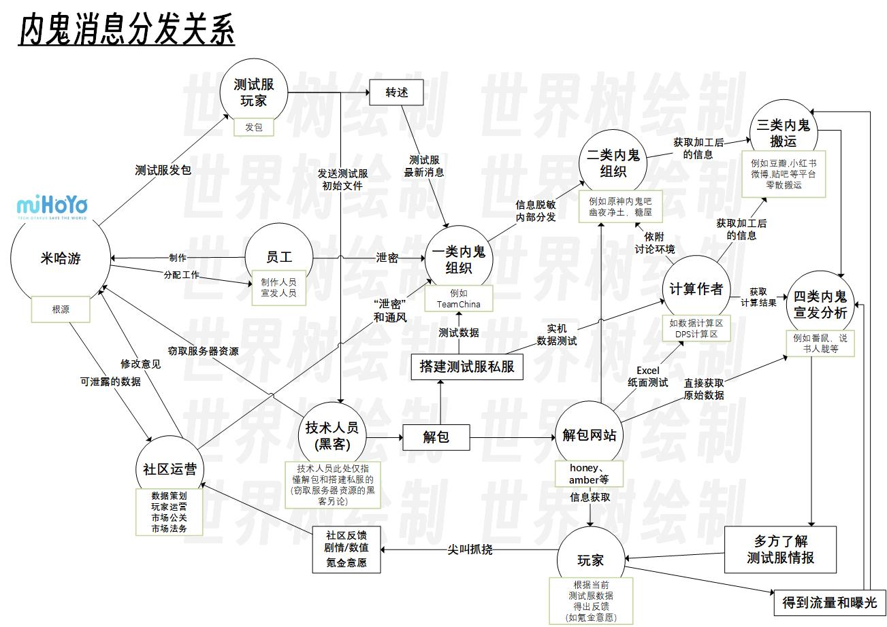
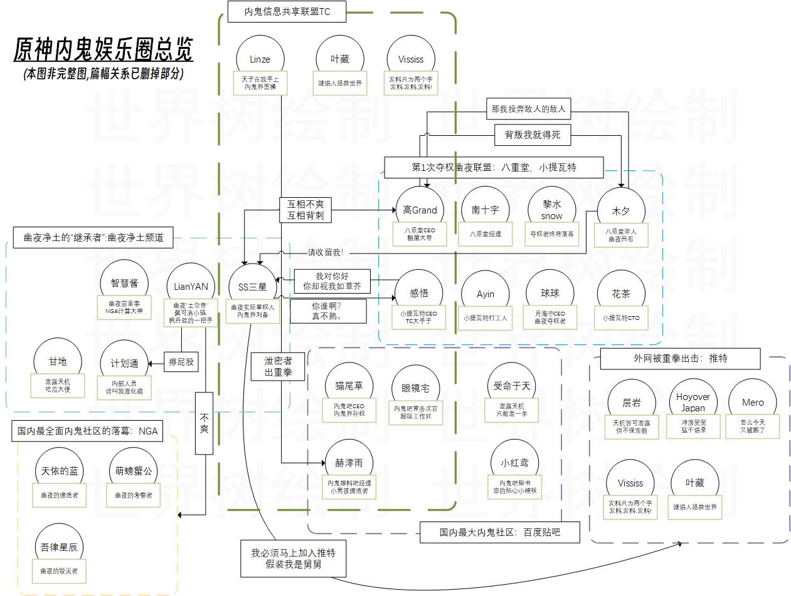
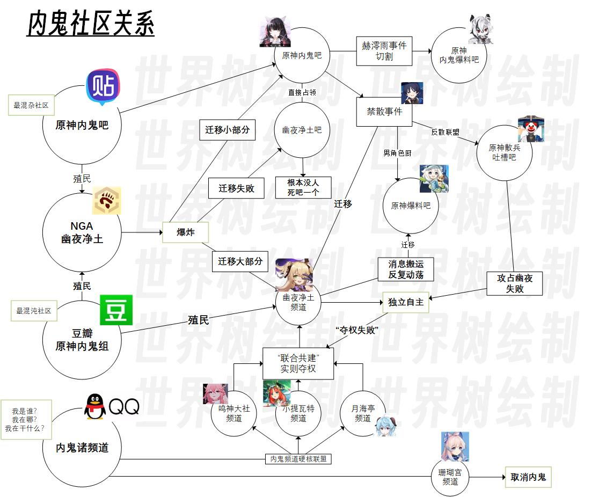
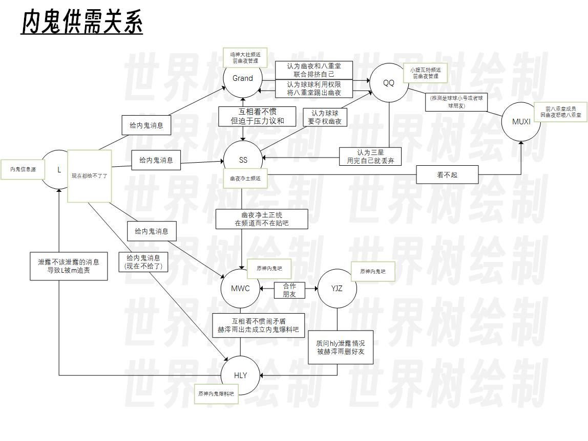

# 原神内鬼八卦娱乐圈

> 来自匿名邮箱的投稿. 由世界树整理.

## 阅前须知

尽可能放低预期，经过长达3天的整理，笔者发现这份来自匿名的资料并非想象中的大瓜，而是一份类似于娱乐圈八卦新闻一样的随笔。

各位吃瓜群众请把这份当成一份饭后乐子就行，因为资料零碎且夹杂大量无用(无法证实可信度)信息，所以世界树不再浪费空间保留截图，决定直接文字叙述。

## 概览

**原神内鬼现象**，指的是游戏《原神》不在正式服务器或者官方公告上的内容衍生出的一系列社区讨论。

原神内鬼自开服以来直到现在，经历过初始，发展，稳定，波动，波动后稳定五个阶段，目前正处于波动后稳定的阶段。

本文主要围绕原神的内鬼社区，以八卦娱乐圈为例进行解释和分析。

## 原神内鬼分发的逻辑

原神内鬼的内容大部分是米哈游公司原神组制作，少部分是内鬼以及内鬼众根据米哈游制作的内容衍生出来的二次创作内容。

本段将会根据<泄露关系>，<分发关系>两部分完整叙述上图所示内容。

### 泄露关系

#### 概述

未来1个版本的泄密 **九成** 来自测试服玩家泄露和测试服解包，可信度较高。

未来2个版本及其以上的泄密 **六成** 来自“内部人员”自述或者转述，另外 **三成** 来自现测试服内容推测， **一成** 深测服玩家泄密，可信度一般。

大版本卡池的计划会在测试服版本的前3个版本敲定最终规划，但是在X.0版本前会有一个基本方案。X.0泄露的卡池规划基本来自内部初期的卡池规划(后续会依照实际进度修改)。

#### 官方内鬼可能存在，但不会公开存在。

在米哈游内部，这种“官方”泄密是不会写在纸上的。这种“泄密”一旦被离职或者在职的捅出去，将会是业内巨大的笑话。所以这部分泄密有，但是不会留下任何证据。所以这种泄密类似于“非官方的官方泄密”（可参考《是，大臣》中非官方的官方报道）。

据推测，一般是某几个策划和运营，互相沟通然后将数据“泄露”出去，观察玩家和社区对于未来版本的反应。这种泄密一般是可控泄密。

#### 不可控泄密比可控泄密严重

米哈游内部几千人，管理难度极高，无控制泄密的程度远比有控制的高。例如著名的《288文件end压缩包》和《米哈游员工个人手册》都属于无控制泄密。这些是需要米哈游紧急公关封杀的无控制泄密的经典案例。

#### 但米哈游在一些关键节点上的泄密是在一定控制范围的。

例如TeamChina的核心几位成员都被米哈游法务找过。米哈游与TC的核心成员Linze二者曾达成私下协议，TC的内鬼行为米哈游法务可以睁一只眼闭一只眼，但米哈游提出的条件是米哈游必须保留阻止某些不能泄漏的测试服计划的权利。所以也就有了赫澪雨将TC仅供内部传阅的内鬼文件发到公开的贴吧，随后Linze被米哈游法务约谈警告，从而导致赫澪雨被TC部分人切割。

官方对内鬼社区也有一定的掌控，总体处于一种 **不想管，但要求需要管时能管** 的力度。如官方曾在今年4月通过腾讯QQ 频道运营联系幽夜净土，八重堂以及小提瓦特的管理人员；或者是米哈游会对推特部分内容发DMCA以完成指标，但绝不会赶尽杀绝，大部分被封号的内鬼都可以更换推特号“复活”，即便米哈游已经掌握了足够起诉他的证据。

#### 员工个人泄密比想象中的严重

而另外一大泄露行径则是通过部分“厨子”员工和角色厨子的私下交流。员工可能会将公司内部的角色规划，联动计划等消息通过特定群体的群聊等途径进行传播。例如在2.X版本之前的男性风系长枪角色的厨子群中，“厨子们”比一些专业内鬼更早得知了属于该角色的专属圣遗物将要在未来版本中推出的消息，消息来源是群内一名米哈游员工（自称）。

#### 测试服玩家泄密

原神内鬼消息泄露的主要部分集中在测试服玩家泄密中，其中包括测试服玩家向技术人员发放测试服内容包，测试服玩家向他人转告测试服改动内容，测试服玩家实机录制测试服内容（这种一般被称为“不怕死的”和“勇士”）。

而违反测试服协议内容向第三方泄露原神测试服内容，根据米哈游测试服保密协议需要向米哈游支付50万违约金。（50万勇士从此得名）

#### 保密协议内容(非原文)

>双方确认保密信息的所有权及其他相关权益属于甲方或应享有该权利的合法第三方。 除本协议另有明确约定外，乙方不得以任何方式使用或基于本协议向甲方主张任何权益。  乙方未履行本协议或不按照约定履行本协议的，除继续履行义务外，还应当向甲方支付违约金50万元。 违约金不足以赔偿甲方由此造成的直接和间接损失。 甲方有权继续向乙方索赔赔偿（包括但不限于律师费、诉讼费、拍卖费、鉴定费、差旅费等）
>
>乙方同意，如乙方未能履行本协议项下的保密义务，甲方作为游戏的权利方，有权永久封禁其游戏账号，并将乙方账号的实名信息添加到游戏账号中并注入黑名单，拒绝向乙方提供甲方及/或甲方关联公司提供的任何游戏相关服务。 若因乙方违约而导致甲方账户封禁处罚而产生任何争议，乙方将承担一切法律责任和赔偿责任。

### 分发关系

在<泄露关系>中，大概分析了原神社区内鬼内容的大部分泄露源头。接下来会分析原神社区内鬼内容的分发关系。

#### 一类内鬼

例如，TeamChina群组(以下简称TC)是目前国内最大，最主要的内鬼内容集散基地。以Linze，Vissis为首，包括原神测试服玩家，原神二手舅舅，私服搭建人员，解包技术人员等人。

一类内鬼组织的工作主要是：**解包，私服录制，内容整合** 。

一类内鬼组织接收由测试服玩家在米哈游官网特定链接下载的原神测试服包体后，由解包技术人员对其中的美术资源和文字资源进行解压，其中会发布到解包网站，如honey，amber.top等著名网站。

与其同时，私服搭建人员会根据测试服玩家提供的密钥更新最新私服补丁（因为每次测试服后米哈游会修改测试服服务器的验证文件，所以私服的服务器需要补丁才能正常运行测试服玩家客户端的文件），搭建私服完成后会直接在私服运行测试服私服，并录制测试服实机视频分发。

#### 二类内鬼

二类内鬼中有不少成员会在一类内鬼或者衍生群内等待一类内鬼的消息发布。

例如原神内鬼吧，幽夜净土消息搬运版块，QQ幽夜净土消息搬运，鸣神大社频道，推特糖屋，Vissis，TC群组等。

二类内鬼会将消息从私密群聊搬运到公开或半公开社区，方便作者加工分析和玩家阅读。

#### 三类内鬼

三类内鬼并没有明显的组织，而是一部分“散户”。

例如在豆瓣群组，小红书，B站进行零碎搬运的账号。

三类内鬼的作用主要是进一步扩大内鬼内容的受众。

#### 四类内鬼

举个例子，老熟人，懂鼠胧糖丘，本来应该和三类内鬼整合到一起的，由于太过逆天所以单独分类。

四类内鬼主要是根据原神内鬼内容制作并“分析”未来角色的视频，恰流量为主。

四类内鬼一般有分析，但不多。但因为本身没有签署米哈游保密协议，所以基本没办法彻底被封杀。

### 额外关系

#### 计算作者

计算作者一般依附于内鬼社区存在，一般是根据测试服私服的实机测试或者解包的数据对角色的强度进行数据计算。

这一类作者以B站数据计算视频，NGA幽夜净土的数据计算版块，原神内鬼吧的DPS计算分类，幽夜净土频道的数据计算版块等地方为根据地，提供以测试服数据为基准的DPS，充能等数据计算并获得普通玩家反馈修正数据计算。

计算作者的结论一般也会被四类作者直接盗窃去制作视频。（番鼠：你好？）

#### 玩家

玩家是内鬼社区分发关系的最后一层，也是基本盘。

一类二类内鬼依靠玩家获取社区话语权。

三类四类内鬼依靠玩家获取流量收益。

计算作者依靠玩家反馈修正数据，并可能将测试服数据转换成正式服数据并获取收益。

社区运营，数值策划，市场公关等需要根据玩家的反馈调整测试服数据，提高玩家氪金意愿，获取更多的流水和游戏正反馈。

## 原神内鬼娱乐圈
::: details

## 内鬼社区关系图

## 内鬼供需关系图

**暂停更新的部分**
+ 赫澪雨泄露不该泄露的消息
+ 八重堂频道与幽夜净土频道的恩怨
+ 幽夜净土频道内部管理权的多次变更
+ NGA幽夜净土爆炸的真实原因
+ 原神内鬼爆料吧的建立历史
+ Leak群组内鬼的内鬼

**(以上内容世界树不再提供信息，请自行寻找相关资料或询问他人)** 

后续制作的内容已暂停更新，已制作的图将全部放到以上.

吃瓜的各位请散去吧，感谢诸社区对本次瓜的大力关注.