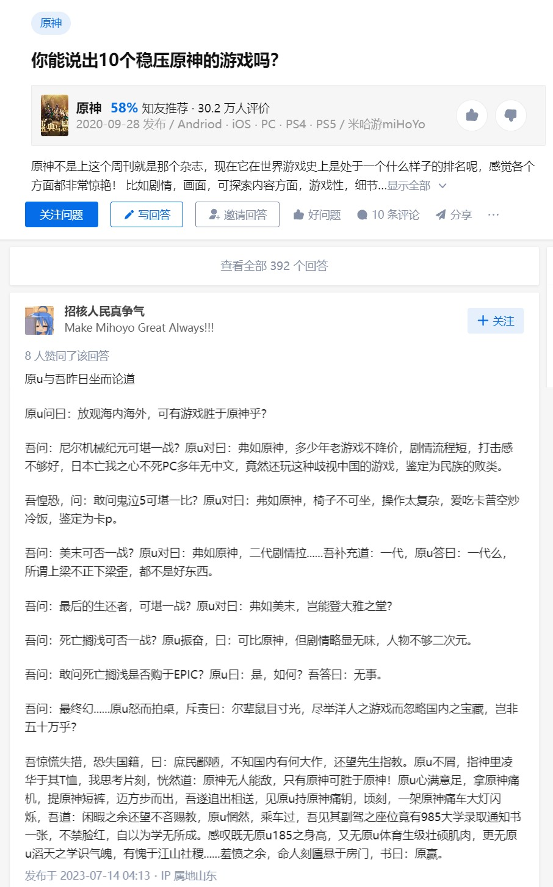

# 你能说出10个稳压原神的游戏吗?
[来源](https://www.zhihu.com/question/555972625/answer/3117753561)

**作者:招核人民真争气** 

原u与吾昨日坐而论道

原u问曰：放观海内海外，可有游戏胜于原神乎？

吾问：尼尔机械纪元可堪一战？原u对曰：弗如原神，多少年老游戏不降价，剧情流程短，打击感不够好，日本亡我之心不死PC多年无中文，竟然还玩这种歧视中国的游戏，鉴定为民族的败类。

吾惶恐，问：敢问鬼泣5可堪一比？原u对曰：弗如原神，椅子不可坐，操作太复杂，爱吃卡普空炒冷饭，鉴定为卡p。

吾问：美末可否一战？原u对曰：弗如原神，二代剧情拉......吾补充道：一代，原u答曰：一代么，所谓上梁不正下梁歪，都不是好东西。

吾问：最后的生还者，可堪一战？原u对曰：弗如美末，岂能登大雅之堂?

吾问：死亡搁浅可否一战？原u振奋，曰：可比原神，但剧情略显无味，人物不够二次元。

吾问：敢问死亡搁浅是否购于EPIC？原u曰：是，如何？吾答曰：无事。

吾问：最终幻......原u怒而拍桌，斥责曰：尔辈鼠目寸光，尽举洋人之游戏而忽略国内之宝藏，岂非五十万乎？

吾惊慌失措，恐失国籍，曰：庶民鄙陋，不知国内有何大作，还望先生指教。原u不屑，指神里凌华于其T恤，我思考片刻，恍然道：原神无人能敌，只有原神可胜于原神！原u心满意足，拿原神痛机，提原神短裤，迈方步而出，吾遂追出相送，见原u持原神痛钥，顷刻，一架原神痛车大灯闪烁，吾道：闲暇之余还望不吝赐教，原u惘然，乘车过，吾见其副驾之座位竟有985大学录取通知书一张，不禁脸红，自以为学无所成。感叹既无原u185之身高，又无原u体育生级壮硕肌肉，更无原u滔天之学识气魄，有愧于江山社稷......羞愤之余，命人刻匾悬于房门，书曰：原赢。

