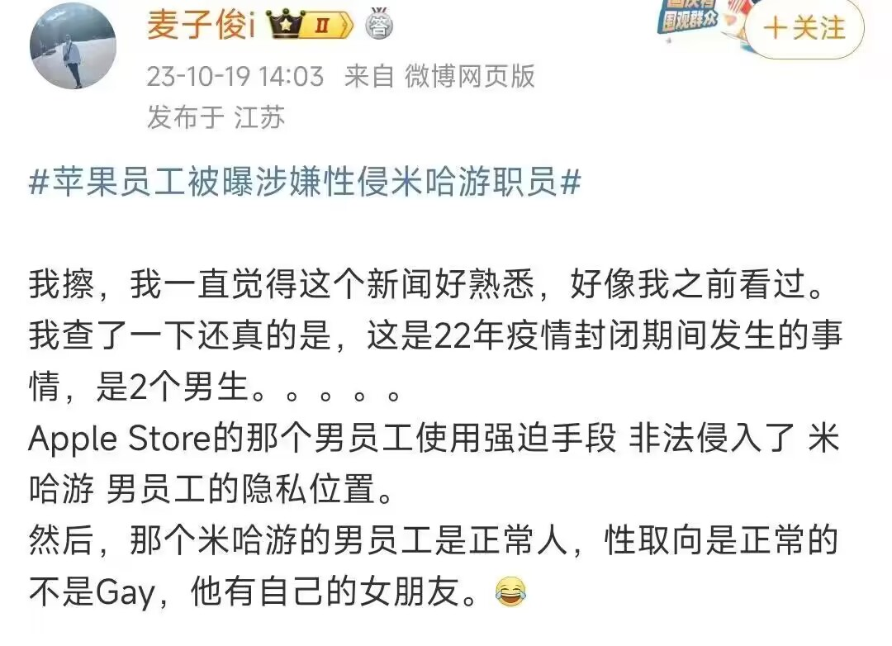

# 米哈游与苹果App Store纠纷
> 来源 : [9to5Mac](https://9to5mac.com/2023/10/18/apple-fires-multiple-app-store-employees-after-probe-reveals-business-misconduct-and-sexual-assault-allegation/)
>
> 原标题 : Apple fires multiple App Store employees after probe reveals business misconduct and sexual assault allegation

## 概述
苹果公司最近因“商业不当行为”解雇了其在中国的 App Store 团队的几名成员。据报道，通过长达一年的内部调查，苹果发现了多种不当行为，包括与手机游戏开发商的不当接触、性侵犯等。其中手机游戏开发商包括米哈游科技公司。

::: warning
**世界树.** 只转载新闻，不对新闻内容进行负责。
:::

## 新闻翻译
> 翻译帮助 : Google Translate

> 作者 : 钱斯·米勒 | 发布时间 : 太平洋时间 2023 年 10 月 18 日 - 上午 10:24

据The Information的最新报道，苹果公司最近因“商业不当行为”解雇了其在中国的 App Store 团队的几名成员。据报道，通过长达一年的内部调查，苹果发现了多种不当行为，包括与手机游戏开发商的不当接触、性侵犯等。

这个故事得到了 Mosyle 的支持，Mosyle 是唯一的 Apple 统一平台。Mosyle 是唯一在单一 Apple 平台上完全集成五种不同应用程序的解决方案，使企业和学校能够轻松自动部署、管理和保护其所有 Apple 设备。超过 38,000 个组织利用 Mosyle 解决方案每天自动化数百万台 Apple 设备的部署、管理和安全。立即申请免费帐户，了解如何以令人难以置信的价格让您的 Apple 车队实现自动驾驶。

这项调查于今年年中左右结束，是由一次“内部审计”引发的，该审计发现了 2022 年的“违规行为”。App Store 中国业务团队的“六名以上员工”参与了调查，今天的报告称。根据调查结果，其中至少五人被解雇。

这些人在几个不同的 App Store 团队中工作：

> 参与调查的员工跨多个部门工作，帮助开发者让他们的应用程序获准在应用商店上架， **为他们提供有关如何增加应用程序收入的建议，并决定哪些应用程序将出现在应用程序商店的主要主页上。此类展示位置会对应用程序的成功产生巨大影响。** 

> **注：** “并决定哪些应用程序将出现在应用程序商店的主要主页上” 应该指的是 **软件在商店的买量行为** 

据报道，调查的一方面是这些员工与游戏开发商及其顾问之间的沟通。据报道，苹果员工接受了“这些团体的免费膳食和夜总会郊游”，以换取在应用商店中的潜在曝光和编辑推广。

The Information 的报告称：“虽然无法了解苹果内部调查所发现的全部事实，但被解雇的员工都无权直接批准或拒绝 App Store 中的应用程序。”

报告援引匿名消息人士的话说：“然而，一些被解雇的员工所担任的角色可能会影响哪些应用程序在 App Store 中展示，但尚不清楚他们是否展示了与他们有未经批准的接触的开发者的应用程序。”

正如报告所解释的那样，苹果公司在此类通信方面有严格的指导方针。例如，App Store 审核和编辑员工“未经事先批准不得与开发人员会面”。参与“开发商关系和业务管理”的员工可以与开发商会面，但不能“接受昂贵的礼物或餐食”。

除了商业不当行为解雇之外，The Information还报道称，苹果公司去年解雇了一名 App Store 员工，该员工涉嫌对 Mihoyo 的一名员工进行性侵犯：

> 这位知情人士表示，除了商业不当行为调查之外，苹果去年还解雇了一名 App Store 员工，原因是他涉嫌性侵 Mihoyo 的一名员工。Mihoyo 是一家中国游戏开发商，以其热门手机游戏《原神》而闻名。被解雇的员工没有回应置评请求，开发商的发言人也没有回应多次置评请求。

苹果在一份声明中表示：

> 苹果公司不对本报告的具体指控发表评论，但希望其全球员工遵守其非常严格的道德和商业行为政策。我们会彻底调查不当行为的报告，并在适当的时候毫不犹豫地立即采取行动，包括终止合同。

苹果在中国的应用商店业务是其服务部门的重要组成部分。然而，该公司经常违反该国的法规。多年来，苹果公司被迫在中国删除了许多应用程序，其中包括数千个未经许可的视频游戏应用程序。最近，它被迫下架了另一轮未注册的外国应用程序，包括 Facebook、Instagram、WhatsApp 和 Twitter。

## 新闻原文
> Chance Miller | Oct 18 2023 - 10:24 am PT

According to a new report from The Information, Apple recently fired several members of its App Store team in China over “business misconduct.” Through a year-long internal investigation, Apple reportedly uncovered a variety of misdoings, including improper contact with mobile game developers, sexual assault, and more.

This story is supported by Mosyle, the only Apple Unified Platform. Mosyle is the only solution that fully integrates five different applications on a single Apple-only platform, allowing businesses and schools to easily and automatically deploy, manage, and protect all their Apple devices. Over 38,000 organizations leverage Mosyle solutions to automate the deployment, management, and security of millions of Apple devices daily. Request a FREE account today and discover how you can put your Apple fleet on auto-pilot at a price point that is hard to believe.

The investigation, which concluded around the middle of this year, was prompted by an “internal audit” that uncovered “irregularities” in 2022. “More than half a dozen staffers” working on the App Store business team in China were involved in the investigation, today’s report says. At least five of them were fired based on the findings of the investigation.

The people worked across a handful of different App Store teams:

> The employees swept up in the investigations worked across multiple departments that help developers get their apps approved to be listed in the store, give them advice on how to increase revenue from their apps, and decide which apps to feature on the App Store’s prominent home pages. Such placements can have an outsized impact on an app’s success.

One aspect of the investigation was reportedly communication between those employees and game developers and their consultants. The Apple employees reportedly accepted “complimentary meals and nightclub outings from these parties,” in exchange for potential exposure and editorial promotion in the App Store.

“While the full extent of the facts turned up by Apple’s internal investigation couldn’t be learned, none of the fired employees had the power to directly approve or reject apps from the App Store,” The Information’s report says.

“However, some of the fired employees held roles that could influence which apps were featured in the App Store, though it wasn’t clear if they featured apps of developers with which they had unsanctioned contact,” the report explains citing anonymous sources.

As the report explains, Apple has strict guidelines when it comes to this type of communication. For example, App Store review and editorial employees “aren’t allowed to meet with developers without prior approval.” Employees involved in “developer relations and business management” are allowed to meet with developers, but can’t “accept expensive gifts or meals.”

In addition to the business misconduct firings, The Information also reports that Apple fired one App Store employee last year who allegedly sexually assaulted an employee at Mihoyo:

> Separate from the business misconduct probes, Apple also fired one App Store employee last year for allegedly sexually assaulting an employee at Mihoyo, a Chinese game developer known for its popular mobile game Genshin Impact, this person said. The fired employee didn’t respond to a request for comment, and spokespeople for the developer didn’t respond to multiple requests for comment.

In a statement, Apple said:

> Without commenting on the specific allegations of this report, Apple expects its employees worldwide to abide by its very strong ethics and business conduct policies. We thoroughly investigate reports of improper conduct and when appropriate will not hesitate to take immediate action up to and including termination.

Apple’s App Store business in China is a crucial component of its Services division. The company, however, often brushes up against regulations in the country. Apple has been forced to remove a number of apps in China, including thousands of unlicensed video game applications, over the years. Most recently, it was forced to pull another significant round of unregistered foreign apps, including Facebook, Instagram, WhatsApp, and Twitter.

## 微博爆料
