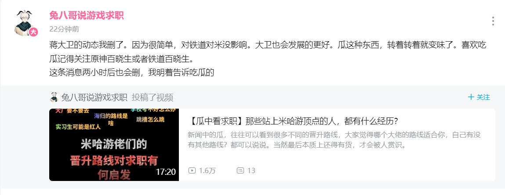

# 蒋大卫离职

## 概述
蒋大卫，米哈游董事，市场总监，《崩坏3》《崩坏：星穹铁道》制作人。

目前于2023年11月8日离职上海米哈游科技公司。

> 引用:[米哈游最有权力的八个人](https://baijiahao.baidu.com/s?id=1777521836614746627&wfr=spider&for=pc)

## 蒋大卫个人简历
蒋大卫，曾在EA担任研发工程师，在2014年4月至2015年6月间加入米哈游担任市场总监，后升任《崩坏3》和《崩坏：星穹铁道》两款游戏的制作人。

同时，蒋大卫也是米哈游新加坡分部COGNOSPHERE PTE.LID.的董事。

## 传言开始
B站账户“兔八哥说游戏求职”2023年11月8日在B站发布一条动态。

随后删除并重新发布动态。
