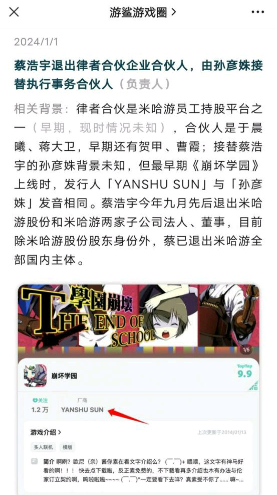

# 蔡浩宇退出所有米哈游相关主体

> 来源:[游鲨游戏圈](https://mp.weixin.qq.com/s/8je3EB-h_UfvyXpR5R_8Hg)

蔡浩宇退出律者合伙企业合伙人，由孙彦姝接替执行事务合伙人（负责人） 

相关背景：律者合伙是米哈游员工持股平台之一（早期，现时情况未知），合伙人是于晨曦、蒋大卫，早期还有贺甲、曹霞；

接替蔡浩宇的孙彦姝背景未知，但最早期《崩坏学园》上线时，发行人「YANSHU SUN」与「孙彦姝」发音相同。

蔡浩宇今年九月先后退出米哈游股份和米哈游两家子公司法人、董事。

目前除米哈游股份股东身份外，蔡已退出米哈游全部国内主体。

