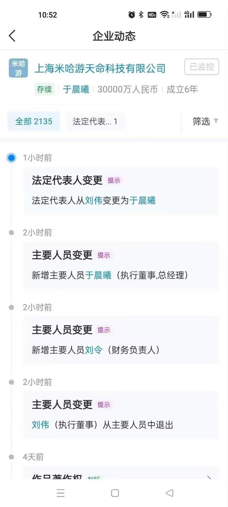

# 米哈游天命法人更换

## 概述
米哈游天命科技有限公司法人由`刘伟`变更为`于晨曦`。

米哈游天命科技有限公司是《原神》的全权运营子公司，拥有《原神》的商标版权和著作权。

## 详细
> 来源:天眼查
> 

### 于晨曦
> [来源](https://baijiahao.baidu.com/s?id=1780098463530807718&wfr=spider&for=pc)
据资料显示是腾讯游戏上海资历最老的一批员工之一。公开资料显示，腾讯游戏在上海最早的办事处可追溯至2002年，当时在腾讯COO曾李青示意下，当时腾讯游戏运营事业部总经理王远在浦东新区陆家嘴上海信息大楼38楼建立过一个办事处。在这里诞生了腾讯游戏首款发行产品《凯旋》。

在智联RPO、软通动力等公司历练后，于晨曦于2011年正式加入腾讯游戏，担任HRD，负责游戏人才招聘。在腾讯游戏期间，他负责组建过《怪物猎人OL》研发团队、《剑灵》代理运营团队“NC项目组”等。

于在2015年年底离开腾讯游戏，加入了一家上海本地强技术背景的电商公司。奈何，该公司技术实力强，但市场运营偏弱，鉴于这种形势他转而又回到了游戏圈。

起初，他的选择有很多也拿到了很多offer，比如是重返腾讯还是加入网易，亦或是加入育碧等外资公司。考虑到之前在大游戏公司的经历，他思来想去还是选择了米哈游。

当时米哈游正在招聘HRD，于晨曦获悉该消息后便前往米哈游沟通。鉴于他本人对游戏行业富有自己的见解，且实际操盘过大型项目团队，很快双方就聊定了。

补充一个细节，当年于晨曦还在腾讯游戏任职时，蔡浩宇有来腾讯游戏上海面试过实习生的岗位。因此，它跟蔡浩宇原本就认识。正式基于这份过往的合作经历，加速了进入米哈游。

2016年正式加入米哈游不到一年时间，于晨曦便升迁了，且获得了不少股份。笔者猜想，在《原神》《崩铁》这两个大体量项目中，于晨曦应该充分发挥了他搭建项目团队的能力。

或许也正是因为他这份战功，才让他接替刘伟成为米哈游各大子公司法人，跻身米哈游最有权力八个人之列。