# 米哈游绝区零全球PR负责人

来源：https://www.linkedin.com/in/johnshen1018

## 概况

John Shen，现任米哈游旗下游戏《绝区零》全球公共关系负责人。

履历，曾任北京蓝城兄弟（Buled软件的运营公司）公共关系负责人等。毕业与北京工商学院，LSE（领英公开信息）

## 2024.4.30更新

2024年4月30日更新，疑似领英已修改简历

## 其他
来源：https://bbs.nga.cn/read.php?tid=40022382

### 被英国认证

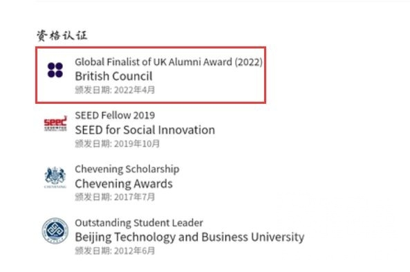

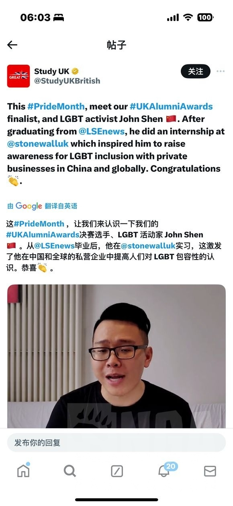

### 推特相关

来自同名推特以及互关同事(存疑)

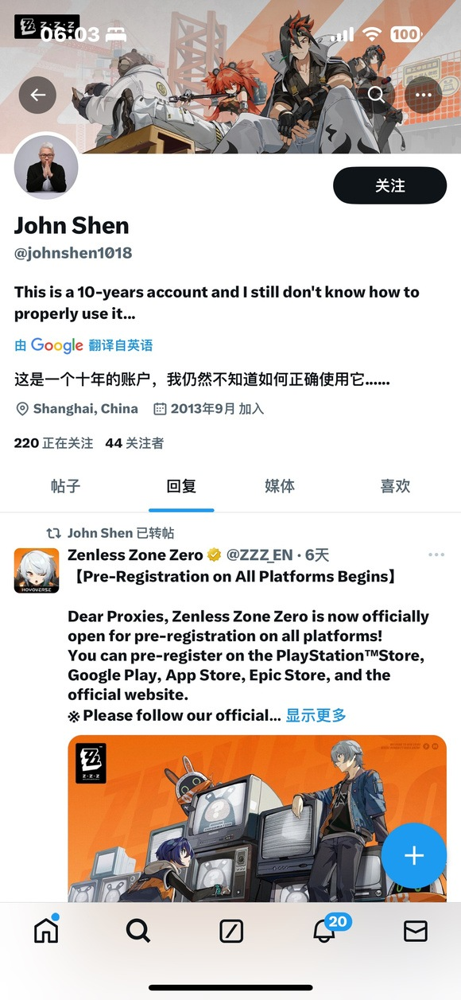

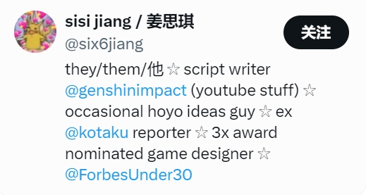

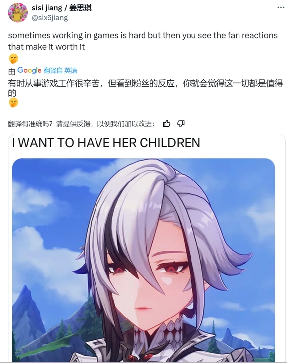

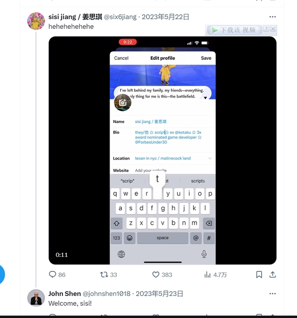

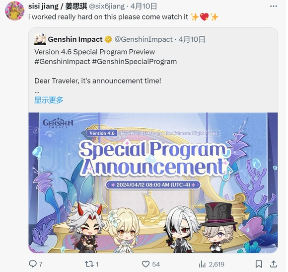

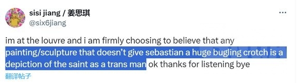

### 2024.4.30更新
推特已锁定

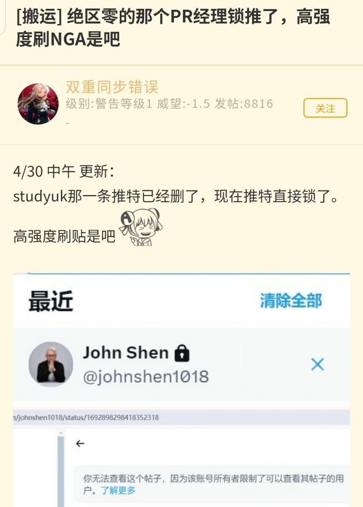

## 补充

来源：https://bbs.nga.cn/read.php?tid=40022273

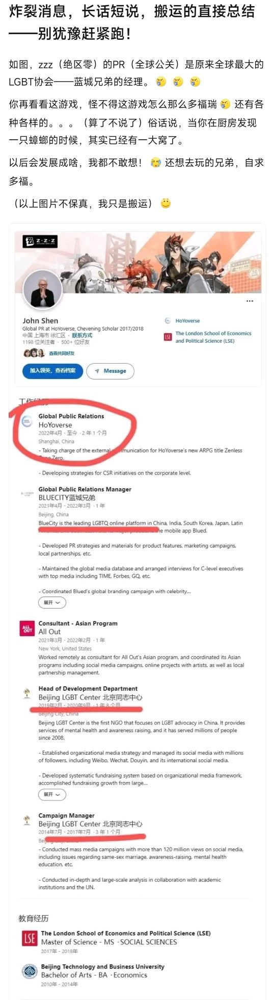

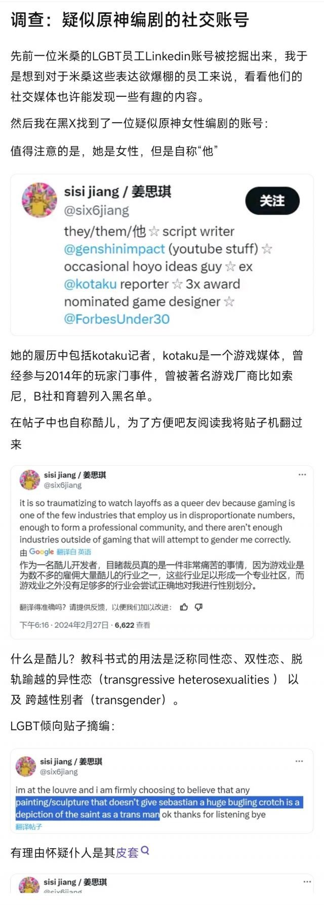
