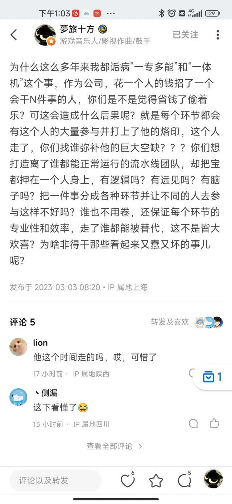
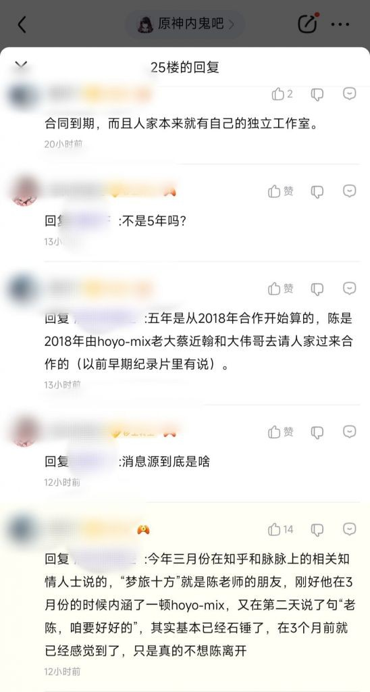
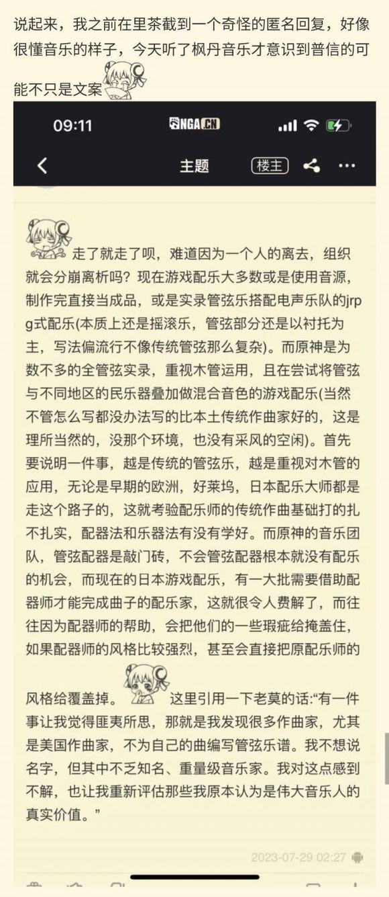
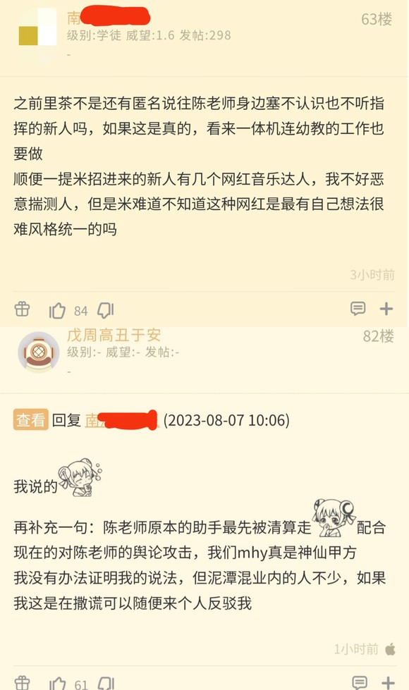
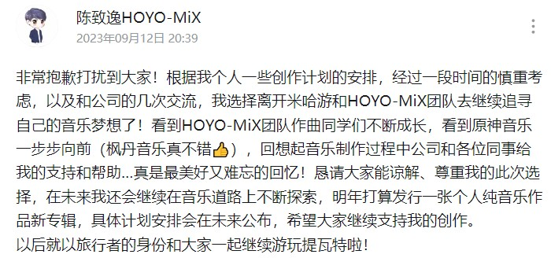
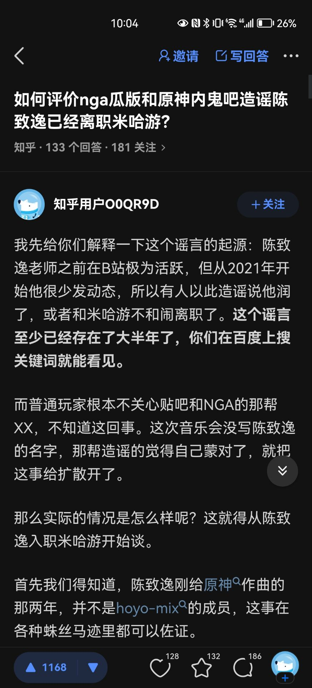

# 陈致逸离开米哈游

## 概括
自须弥版本以来，到近期枫丹版本，原神的音乐制作水平有所下降。而有网友发现最近发布的原神3.8版本的音乐制作人名单里面并没有陈致逸的名字，结合论坛上面的一些流言，推测陈致逸老师与HOYO-Mix的合作合同(2018-2023)到期，疑似已经离开米哈游音乐制作。

2023年9月12日更新，陈致逸HOYO-Mix发布公告，宣布离开HOYO-Mix。

> 编者注: 望陈老师未来越做越好。

## 一些论坛流言截图
**来源:知乎&百度贴吧**
::: details

:::
**来源:NGA**
::: details

:::

## 公告
[陈致逸HOYO-MiX个人动态](https://www.bilibili.com/opus/840456272984670275)

## 知乎辟谣已销号
::: details

:::